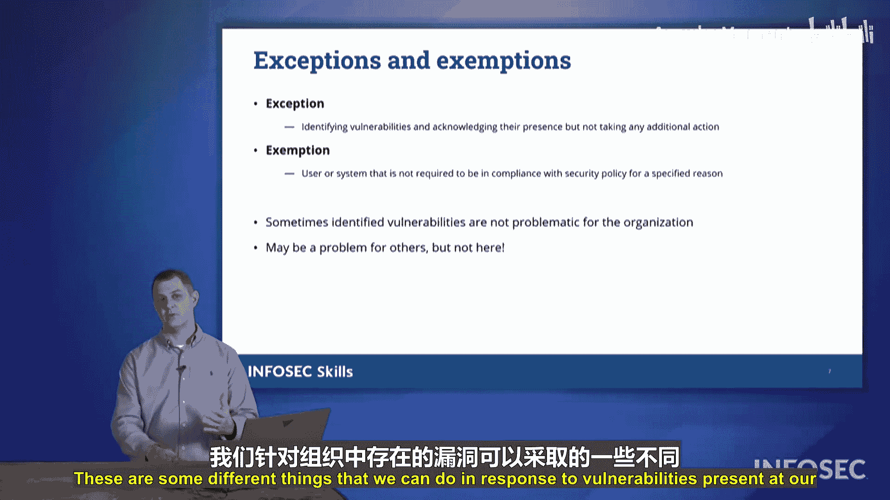

# 056：第11章第1节第4部分 - 漏洞响应 🛡️

在本节课中，我们将学习在组织内检测到系统和网络漏洞后，需要采取的响应措施。我们将探讨从打补丁到制定例外规则等一系列关键步骤，以有效管理安全风险。

上一节我们讨论了漏洞检测，本节中我们来看看如何对已发现的漏洞进行响应和处理。

## 修补系统

检测到漏洞后，首先要做的是修补存在漏洞的系统。我们需要从软件供应商和产品制造商处获取软件更新和补丁，以确保能够以安全的方式继续使用其产品。

**核心操作**：`应用供应商发布的安全补丁和更新`。

## 网络分段

如果无法为某个软件或系统打补丁，则必须将其与网络的其他部分隔离开来。我们的目标是保持该系统可运行，但通过隔离或分段，限制其与网络其他设备或互联网的通信。网络分段是将网络划分为更小部分的方法，这样即使恶意软件在某系统上扎根，也无法蔓延至整个组织。通过分段，我们能够限制安全事件对公司网络的影响范围。

**核心概念**：`隔离无法修补的系统，防止威胁横向移动`。

## 利用网络安全保险

我们还可以利用网络安全保险。网络安全保险本身并不能防止网络攻击，但它可以限制事件对组织造成的财务影响。如果发生了网络安全事件，并且组织已履行了所有应尽的义务，网络安全保单将向组织进行赔付，以限制该网络事件造成的财务损害。

为了维持保单有效性，网络安全保险公司通常会要求组织做到以下几点：

以下是维持网络安全保险政策通常需要满足的条件：
*   定期进行安全测试。
*   制定并记录可证明的安全策略。
*   确保运营符合行业法规，不使自身暴露于风险之中。
*   确保组织员工接受适当的网络安全培训，并能提供相关证明。

事实上，有些人考取Security+认证，就是为了让当前或未来的雇主能够在网络安全保险政策的相关要求上打勾。保险公司希望知道员工具备网络安全意识，并了解各种安全控制措施如何协同工作。

## 实施补偿性控制

我们可能会针对各种威胁和漏洞实施多种不同的缓解措施。有时这些缓解措施本身存在弱点，因此我们需要通过提供更多的安全控制（即某种补偿性控制）来解决这些弱点。

之前我们讨论过需要保护系统以防止未授权用户登录，这涉及特定风险。我们如何防止未授权用户访问系统？我们会使用**密码**。但这里仍然存在一个弱点：有些用户会使用非常弱的密码，攻击者能够猜出这些密码。那么，我们该怎么做？我们通过使用其他形式的身份验证来弥补仅使用密码的弱点，即采用**多因素认证**来克服该安全控制的缺陷。这是在应对已知漏洞时可以采取的另一种措施。

**核心公式**：`基础控制（如密码） + 补偿控制（如MFA） = 更强的整体安全性`

## 验证扫描结果

此外，如果我们进行了漏洞扫描并发现了某些漏洞，在采取纠正措施之后，下一步就是验证这些发现。我们需要确保没有误报。

回忆一下，**误报**是指漏洞扫描器声称发现了问题，但实际并不存在。你可能会白费力气去寻找一个根本不存在的漏洞。

因此，验证发现的方法之一是重新扫描这些漏洞，或者进行审计，仔细检查并确认：所采取的缓解措施是否针对扫描器发现的漏洞？是否纠正了该问题？我们希望通过再次运行扫描来验证这些结果。

在验证过程中，你需要做的事情之一是重新扫描系统。

如果你遇到**漏报**呢？请记住，漏洞扫描的漏报是指你的漏洞扫描器没有检测到任何实际存在的漏洞。

那么你该怎么做？我会准备一个专门用于测试的虚拟机，上面预置了一些已知漏洞。如果我的漏洞扫描器说没有漏洞，我就把这个“漏洞测试机”接入网络，这时我的漏洞扫描器最好能检测出那些漏洞。如果检测不到，我就知道我的漏洞扫描器有问题，因为它没有发现我知道存在于测试机上的漏洞。在这种情况下，我会关闭那个虚拟的漏洞测试系统，收起来下次再用，然后着手解决漏洞扫描器的问题。

## 记录与例外管理

最后，在我们完成漏洞识别并采取纠正措施后，需要记录我们的发现。其中一些发现可能会归为**例外**和**豁免**。

**例外**是指我们承认某个漏洞的存在，但决定暂时不采取行动，因为我们知道这是个问题但目前无法处理。例如，我们可能知道补丁即将发布，已经联系供应商并被告知补丁大约在45天或35天后就绪。而我们内部政策要求必须在30天内纠正所有漏洞。这时，我们就可以创建一个例外，因为补丁会在30天期限后不久发布。我们将记录我们承认此处存在问题，并正在等待即将发布的补丁。

或者，你也可能有**豁免**。豁免是指某个系统被允许不遵守那些规则。例如，我时不时拿出来检查漏洞扫描器的那个小虚拟机，我知道它有漏洞。我们的政策规定网络上不能存在此类已知漏洞，但这个系统是豁免的，它不受规则约束，因为我一直让它离线，除了测试漏洞扫描器时从不使用。我们会记录这些发现，并为此制定一个豁免。

以上是我们在组织内发现漏洞后可以采取的一些不同应对措施。在你的Security+考试中，请注意这些内容。

## 总结

本节课中，我们一起学习了漏洞响应的关键流程。我们探讨了修补系统、实施网络分段、利用网络安全保险、部署补偿性控制、验证扫描结果（包括处理误报和漏报）以及记录发现并管理例外与豁免。掌握这些响应措施，对于有效管理组织网络安全风险至关重要。