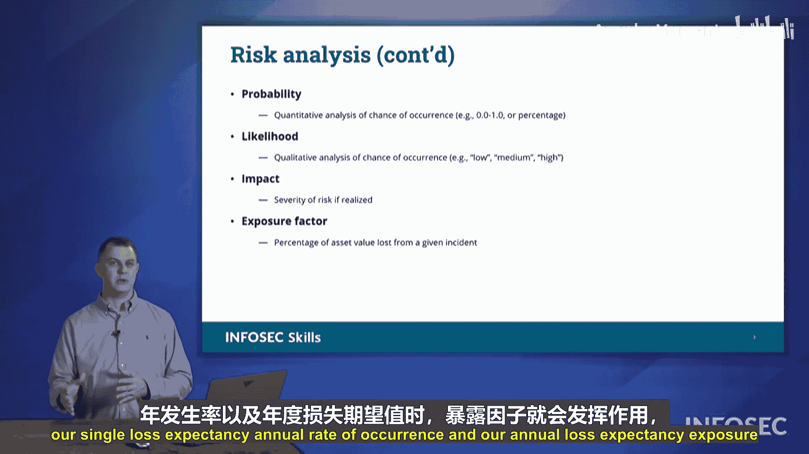

# 057：风险分析 🧮

在本节课中，我们将要学习风险分析的核心概念。我们已经识别了漏洞，列出了威胁，现在开始进行风险分析。

风险分析有两种主要方法：定性分析和定量分析。上一节我们介绍了威胁识别，本节中我们来看看如何评估这些威胁的风险。

## 定性分析与定量分析

定性分析是主观的，它基于经验和直觉。例如，一位经验丰富的同事可能根据过往经历判断某个情况“会很糟糕”，这就是定性评估。

定量分析则关注数字和可测量的数据。其词根“quantity”意为数量，因此定量分析涉及计算概率、成本等具体数值。

这两种方法都能为我们提供风险可能如何发生的信息，但角度不同。

## 风险分析的关键因素

以下是风险分析中需要考虑的几个核心因素。

**概率与可能性**
概率是一个具体的百分比数字，用于描述事件发生的几率。例如，天气预报中“50%的降水概率”意味着预报区域内50%的地区会下雨。

可能性则更偏向定性，基于个人经验和观察进行判断。例如，有人通过观察云层、感受空气湿度后说“很可能要下雨”，这就是对可能性的评估。可能性通常用高、中、低来描述。

**影响**
影响是指某个事件发生后，对组织造成的后果。我们需要评估：事件会如何损害我们？会如何中断我们的业务运营？

**暴露因子**
暴露因子用于计算事件造成的财务影响比例。其计算公式为：

`暴露因子 = (损失金额 / 资产总价值) * 100%`

例如，一扇价值1000美元的窗户，如果更换一块价值500美元的玻璃，那么暴露因子是50%。如果上了保险，只需支付100美元的免赔额就能更换整扇窗户，那么暴露因子就是10%。

在考试中，相关数字通常非常规整，如10%、25%、50%等。暴露因子是计算**单次损失期望值**和**年度损失期望值**的重要组成部分，我们将在后续幻灯片中详细讨论。

## 总结

本节课中我们一起学习了风险分析。我们探讨了两种分析方法：**定性分析**（基于经验）和**定量分析**（基于数据）。同时，我们介绍了风险分析的几个核心因素：**概率**（具体数字）、**可能性**（经验判断）、**影响**（后果评估）以及**暴露因子**（财务影响比例）。这些因素共同构成了完整的风险分析过程。