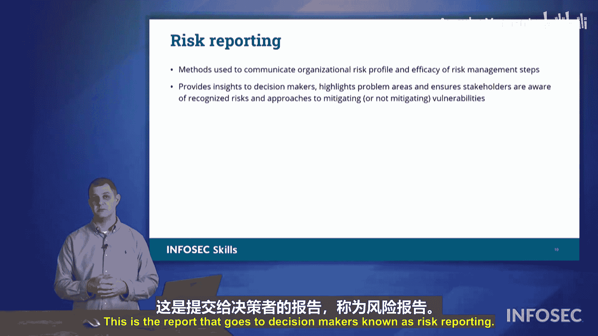

# 058：第58节 风险管理 🛡️


在本节课程中，我们将学习如何在组织中管理风险。风险管理是一个核心主题，我们将深入探讨如何计算和应对组织面临的各种风险。

## 风险识别 🔍

上一节我们介绍了风险管理的概念，本节中我们来看看如何识别风险。首先，我们需要区分漏洞、威胁和风险。
*   **漏洞** 是系统或流程中的弱点。
*   **威胁** 是可能利用漏洞的**威胁行为者**。
*   **风险** 是当我们开始**量化**威胁利用漏洞可能对组织造成的潜在损害。

以下是识别风险的几种主要方法：
*   **漏洞扫描**：通过自动化工具发现系统中的弱点。
*   **渗透测试**：模拟攻击者的行为，主动测试系统的安全性。
*   **安全审计**：系统地审查安全策略和控制的合规性。
*   **自查**：组织内部进行的定期安全检查。
*   **威胁情报**：关注外部信息，了解当前存在的威胁和攻击手法。

## 风险评估 📊

识别风险后，下一步是评估风险对组织的影响。风险评估有不同的执行方式。

以下是几种常见的风险评估类型：
*   **临时评估**：根据需要随时进行的评估。例如，更换网络保险提供商或申请新认证时可能需要进行。
*   **一次性评估**：仅执行一次的评估，完成后不再重复。
*   **周期性评估**：按固定周期（如每季度、每年）重复进行的评估。
*   **持续评估**：一些风险意识强的组织会持续不断地生成风险评估报告，确保随时有最新的评估结果可用。

## 风险计算 🧮

现在，我们来看看如何为特定风险事件计算具体的金额。这是Security+考试中唯一需要计算的数学部分，数字会非常简单。

风险计算涉及三个核心概念：
*   **单次预期损失**：指单个风险事件发生一次所造成的损失成本。公式为：`SLE = 资产价值 × 暴露因子`。例如，更换一扇破碎的窗户需要1000美元，那么SLE就是1000美元。
*   **年发生率**：指该风险事件在一年内预计发生的次数。例如，窗户每年破碎两次，那么ARO就是2。
*   **年度预期损失**：指该风险事件在一年内预计造成的总损失。计算公式为：`ALE = SLE × ARO`。

根据上面的例子，窗户的ALE计算如下：
```
ALE = SLE ($1000) × ARO (2) = $2000
```
这意味着，组织每年预计要为窗户破碎事件支出2000美元。

## 风险登记与矩阵 📈

计算出风险价值后，我们需要将其列出并排序。这通常通过风险登记册来完成。

风险登记册会列出组织的各种风险，并可能根据风险等级、成本或发生频率进行分类。同时，组织会设定一个**风险阈值**，当风险超过这个阈值时，就需要采取行动。

此外，我们常用**风险矩阵**来可视化风险。它根据事件的**可能性**（横轴）和**影响程度**（纵轴）对风险进行评级。

风险矩阵将风险划分为几个等级：
*   **极高风险**
*   **高风险**
*   **中等风险**
*   **低风险**

## 风险应对策略 ⚙️

从风险登记册中识别出风险后，我们需要决定如何应对。组织对每个风险有且仅有四种应对策略。

以下是四种风险应对策略：
1.  **缓解**：实施安全控制措施来降低风险发生的可能性或影响。例如，设置密码、安装防火墙。
2.  **规避**：通过完全消除风险原因来避免风险。例如，决定不将某个系统面向互联网以规避相关攻击风险。
3.  **转移**：将风险后果的责任转移给第三方。最常见的方式是购买保险，或者将关键业务托管给数据中心（将断电、断网的风险转移给运营商）。
4.  **接受**：在权衡成本效益后，决定不采取任何措施，主动承担风险。这通常是因为应对措施的成本高于风险本身可能造成的损失。接受风险时需要记录**豁免**和**例外**情况，说明为何允许该风险存在。

## 风险偏好与报告 📋

组织对风险的总体态度称为**风险偏好**，它决定了组织愿意承担多大的风险以追求目标。

主要有三种风险偏好：
*   **扩张型**：为了快速增长和获取新业务，愿意承担较高风险。
*   **保守型**：满足于现状，希望维持稳定，不愿承担过多风险。
*   **中立型**：在增长与稳定之间寻求平衡，承担适度风险。

最后，安全专业人员需要向组织的决策者进行**风险报告**。这份报告需清晰列出已识别的风险、已采取的应对措施以及组织仍然面临的风险暴露情况，为决策提供依据。

## 总结 📝



本节课中我们一起学习了风险管理的完整流程。我们从**识别**风险开始，然后学习如何**评估**和**计算**风险的价值（ALE = SLE × ARO）。接着，我们利用**风险登记册**和**风险矩阵**来记录和可视化风险等级。面对风险，我们有四种策略：**缓解、规避、转移和接受**。最终，组织的**风险偏好**决定了整体策略方向，并通过**风险报告**将信息传达给决策者。掌握这些知识，是构建有效信息安全体系的基础。