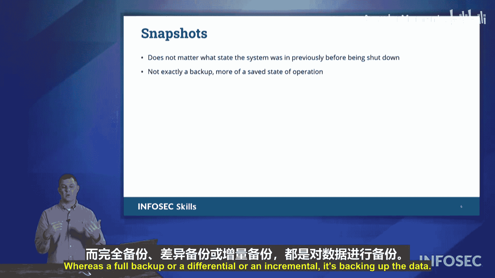

# 059：备份策略

在本节课中，我们将要学习信息安全控制中的一个重要组成部分——备份。备份是一种纠正性控制，其核心目的是在信息丢失、损坏或被破坏时，能够将系统或数据恢复到之前的状态。备份是任何安全策略中不可或缺的一环。

接下来，我们将详细介绍在Security+考试中涉及的三种主要备份类型：**完全备份**、**差异备份**和**增量备份**。

## 完全备份 📦

完全备份是最容易理解的一种备份方式，也是大多数人首先想到的备份类型。

**完全备份**会备份所有数据，无论这些数据之前是否备份过，也无论上次备份是什么时候。它备份的是全部内容。

关于完全备份，需要记住两个关键点：
*   **备份时间最长**：因为它需要处理所有数据，所以执行备份所需的时间最长。
*   **恢复时间最短**（在考试语境下）：在CompTIA的考试体系中，完全备份的恢复时间被认为是最短的。这是因为如果你需要从零开始（例如，在一台裸机电脑上）恢复整个系统，你只需要使用这一个完全备份集即可。相比之下，其他备份类型的恢复过程需要依赖完全备份，因此总恢复时间会更长。

简单来说，完全备份就是“一劳永逸”地备份所有东西。

## 差异备份 🔄

上一节我们介绍了备份所有数据的完全备份，本节中我们来看看一种更高效的备份方式——差异备份。

**差异备份**会备份自**上一次完全备份**以来发生更改的所有数据。

以下是关于差异备份的关键特性：
*   **备份目标**：它关注的是自上次完全备份以来的所有变更。
*   **备份时间中等**：由于它可能包含多天甚至数周的变更数据，所以备份时间比完全备份短，但比增量备份长。
*   **恢复时间中等**：要恢复系统，你需要先恢复最新的完全备份，然后再在其基础上恢复最新的差异备份。因此，总恢复时间比只用完全备份要长，但比使用增量备份要短。

一个帮助记忆的技巧是：差异（Differential）这个单词里包含字母 **F**，可以联想为它总是关联到上一次**完全（Full）**备份。

## 增量备份 📈

了解了基于完全备份的差异备份后，我们来看最后一种备份类型——增量备份，它专注于更小、更频繁的数据变更。

**增量备份**只备份自**上一次任何类型的备份**（无论是完全备份、差异备份还是增量备份）以来发生更改的数据。

以下是增量备份的特点：
*   **备份时间最短**：因为它只备份自上次备份以来的微小数据增量，所以执行速度非常快。
*   **恢复时间最长**（在考试语境下）：要完成系统恢复，你必须先恢复最新的完全备份，然后按顺序恢复自此之后的所有增量备份。这个链条可能很长，因此总恢复时间是最长的。

你可以将增量备份想象成每小时或每30分钟进行一次的“小快照”，它只捕捉这段时间内的变化。

## 重要注意事项：快照 ≠ 备份 ⚠️

在讨论增量备份时，我们提到了“快照”这个词，这里需要特别强调一个考试重点。

**快照不是备份**。在实际工作中，你可能会频繁使用快照，但在CompTIA考试的定义中，快照不被视为真正的备份。

两者的核心区别在于：
*   **备份**：备份的是**数据本身**。
*   **快照**：捕获的是系统在某个时间点的**运行状态**，更像是将系统“冻结”在那一刻。它并没有完整地复制所有数据文件。

因此，在考试中请务必注意区分这两个概念。

## 总结

本节课中我们一起学习了三种核心的备份策略：
1.  **完全备份**：备份所有数据，备份时间长，恢复（在考试定义下）时间短。
2.  **差异备份**：备份自上次完全备份以来的所有变更，备份和恢复时间均为中等。
3.  **增量备份**：备份自上次任何备份以来的变更，备份时间最短，但恢复时间最长。

同时，我们明确了**快照**与**备份**在考试定义上的关键区别：备份针对数据，而快照针对系统状态。理解这些概念对于制定有效的数据恢复计划和通过Security+认证考试都至关重要。