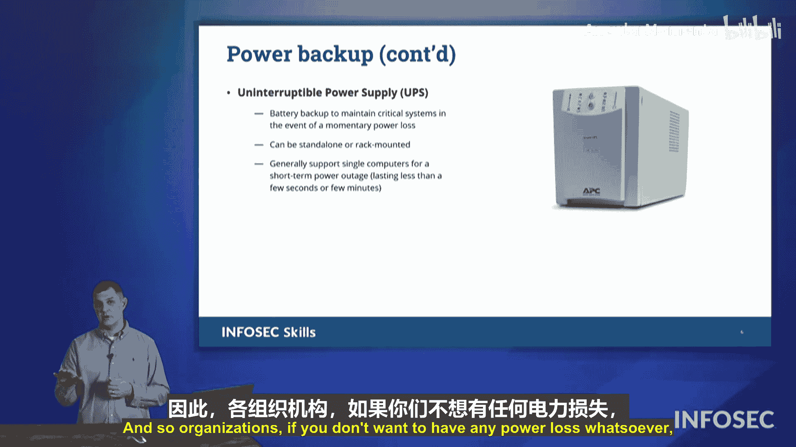

# 060：备份相关主题 🗂️


在本节课中，我们将学习与数据备份相关的几个核心概念，包括异地存储、日志文件系统、数据复制以及备用电源系统。理解这些概念对于制定有效的灾难恢复和业务连续性计划至关重要。

## 异地存储的重要性

上一节我们介绍了备份的基本概念，本节中我们来看看备份存储位置的关键性。确保备份数据存储在异地至关重要。

如果备份数据与原始系统存放在同一地点，一旦发生灾难，备份也可能一同损毁。以下是一些常见的风险场景：
*   火灾或水灾可能同时摧毁计算机和放在旁边的备份介质。
*   盗窃事件可能导致设备和备份一同丢失。
*   意外事故，如液体泼洒，也可能损坏备份。

因此，必须将备份数据安全地存储在另一个物理位置。一个标准的操作流程示例如下：
```plaintext
1. 执行定期全量备份（例如，每周五开始）。
2. 将备份介质（如磁带）装入安全的运输箱。
3. 由第三方物流公司取走并运送至安全的异地存储设施。
```

## 日志文件系统

在讨论了物理存储后，我们转向系统层面的数据保护机制。日志文件系统是一种记录数据移动操作的文件系统，用于在意外断电等事件后恢复未完成的操作。

其工作原理如下：
1.  当系统准备将数据从源位置移动到目标位置时，它首先在日志中创建一个条目，记录“准备将数据从A移动到B”。
2.  然后，系统开始实际的数据移动过程。
3.  如果在移动过程中发生断电，当系统重启后，它会检查日志。
4.  系统发现一个未完成的移动操作（“从A到B”），并且源数据A仍然存在。
5.  系统可以根据日志记录，继续完成将数据从A移动到B的操作。
6.  操作完成后，系统从日志中删除该条目。

这本质上是一种**纠正性控制**，能够在中断后使操作恢复到一致状态。

## 数据复制：同步与异步

除了传统的备份，现代组织常采用数据复制技术。数据复制涉及将数据实时或定期地拷贝到另一个站点，例如从本地数据中心复制到云端或另一个数据中心。

根据复制的频率和方式，主要分为两种模式：

以下是同步复制与异步复制的关键区别：
*   **同步复制**：每当主站点发生数据变更时，该变更会**立即**、实时地传播到复制站点。这确保了两个站点的数据时刻保持完全一致。
*   **异步复制**：数据变更会定期批量复制到目标站点。复制间隔可以是每分钟、每五分钟、每十五分钟甚至每小时。这不同于实时同步，会存在一定的数据延迟。需要注意的是，这里的定期“快照”本身并不是一个完整的备份。

## 备用电源系统

最后，我们来探讨保障备份和系统持续运行的基础设施——备用电源。电力中断是导致数据丢失和操作中断的常见原因，因此备用电源系统是业务连续性的关键组成部分。

主要有两种类型的备用电源解决方案：

以下是两种主要的备用电源方案：
1.  **备用发电机**：通常是大型柴油、天然气或丙烷发动机。当市电中断时，它们启动并为整个建筑（如办公楼、数据中心、医院）供电。柴油发电机功率强大，但燃料可能耗尽；天然气发电机则通过管道供应，燃料更持久。
2.  **不间断电源**：这是一种电池备份设备，通常用于单个计算机或服务器机柜。当市电中断时，UPS立即接管供电，确保设备持续运行数分钟到一小时，为发电机启动或安全关机提供缓冲时间。

**UPS和发电机通常结合使用**。因为大型发电机可能需要20到30秒才能启动并达到全功率输出，而UPS可以在这段间隙提供无缝的电力供应，实现零中断。

---




本节课中我们一起学习了备份策略的四个关键方面：**异地存储**确保了备份的物理安全；**日志文件系统**在系统层面提供了操作一致性保障；**数据复制**（同步与异步）实现了数据的多站点可用性；而**备用电源系统**则为所有基础设施提供了持续运行的电力基础。综合运用这些概念，可以构建一个健壮的数据保护和业务连续性框架。