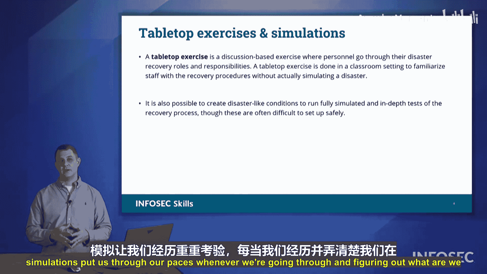

# 061：业务连续性运营（COOP）🛡️

在本节课中，我们将要学习业务连续性运营（COOP）的核心概念。COOP旨在确保组织在面对各种业务中断时，能够维持关键运营的持续性。我们将探讨其重要性、规划要素以及如何通过演练确保计划的有效性。

## 业务连续性运营概述

每个组织都可能遭遇业务中断。既有顺境，也会有逆境。当逆境发生时，必须确保组织拥有应对计划。业务连续性运营（COOP）正是为了确保我们能够在面对困境时维持运营。

上一节我们介绍了业务连续性的重要性，本节中我们来看看COOP的具体内涵。业务连续性运营的核心是确保在逆境中能够继续开展业务。因此，我们需要制定替代性的业务实践方案，以便在出现问题时，仍有办法维持基本运营底线。

## 替代性业务实践案例

以下是两个关于替代性业务实践的案例，说明了计划不当可能带来的后果。

**案例一：过时的支付方式**
一次在农贸市场，我们想从一位摊主那里购买一件商品。询问价格后，我问他是否接受Venmo或PayPal转账。他回答不熟悉这些，但有一个信用卡读卡器，不过当时在他的手机上无法工作。随后，他从卡车里拿出了一个老式的信用卡压印机。这种设备需要将信用卡和复写纸放在一起，通过滚轮压印出卡号副本，然后再手动填写金额。我表示这种方式可能不太安全，而且我的信用卡卡号没有凸起数字，根本无法使用。他的替代性业务流程（使用压印机）已经无法满足现代支付的安全与技术要求。

**案例二：未能适应变化的商业模式**
在COVID-19疫情期间，Bed Bath & Beyond这家以店内体验闻名的零售商受到了严重冲击。其商业模式依赖于顾客进店浏览、感受香氛、浏览商品并产生冲动消费。当人们居家隔离时，这一模式无法运转。他们的替代性业务实践是让小时工休假，并由门店经理处理线上订单。然而，许多顾客并不习惯在该店线上购物，其业务本质更偏向于冲动消费。因此，转向处理线上订单的替代方案不足以维持其生存，加之其他商业压力，该公司最终破产清算。

## COOP的关键要素：冗余与容量规划

通过业务连续性运营，我们需要确保能够持续为用户提供服务。这通常通过建立冗余运营来实现。

例如，如果需要备用电力，就应配备备用发电机。如果无法承受任何网络中断，那么当主网络服务出现故障时，就必须有备用方案或替代设置，以便能够无缝切换。这样，即使在服务中断的情况下，仍能维持运营。

在规划我们能做什么、能实现什么目标时，需要考虑不同情况。在正常情况下，我们能够完成既定任务。但在可能失去电力、设施供暖制冷或其他正常服务的情况下，我们将以降级容量运行。因此，需要找出限制因素，明确在逆境中仍能完成的任务。

这需要通过审视以下三个方面来实现：
1.  **人员**：你的员工在正常情况和不利条件下分别能完成什么工作？他们是否需要额外培训？
2.  **技术**：现有技术能支持你做什么？是否需要新技术来增强现有能力？
3.  **基础设施**：现有基础设施能支持什么？是否需要更强大或更冗余的基础设施来支持运营的弹性？

这一切都是**容量规划**的一部分。

## 确保计划有效性：培训与演练

制定计划后，必须确保相关人员知道如何响应。业务连续性运营的下一步是确保我们能够培训员工，让他们知道在特定情况下应完成什么任务以及该如何做。

我们通常会进行桌面演练和模拟演练。

**桌面演练**是指团队围坐在会议桌旁，设定一个特定场景。例如，主持人会说：“现在发生某种情况。你正在休假，所以无法参与。你们这组人正在参加会议或忙于其他事务。那么，在这种情况下你们会怎么做？” 接着，团队将讨论应该采取的行动。

桌面演练旨在梳理和确认：你是否了解计划？在这种情况下你的计划是什么？去哪里获取更多信息？如果其他人都无法响应，团队每个成员是否都知道如何应对？当每个人都清楚计划时，我们就能更快地执行。

模拟演练则让我们在实际操作中接受考验，帮助我们弄清楚在逆境中能够承受什么。这些演练有助于完善我们的业务连续性运营。

## 总结

本节课中我们一起学习了业务连续性运营（COOP）。我们了解了COOP对于维持组织在逆境中运营的重要性，探讨了制定替代性业务实践的必要性，并通过案例看到了计划不当的后果。我们还学习了实现COOP的关键要素，包括建立冗余运营和进行全面的容量规划（涵盖人员、技术、基础设施）。最后，我们强调了通过桌面演练和模拟演练来培训团队、确保计划有效执行的关键步骤。掌握这些概念对于应对CompTIA Security+考试中相关题目至关重要。