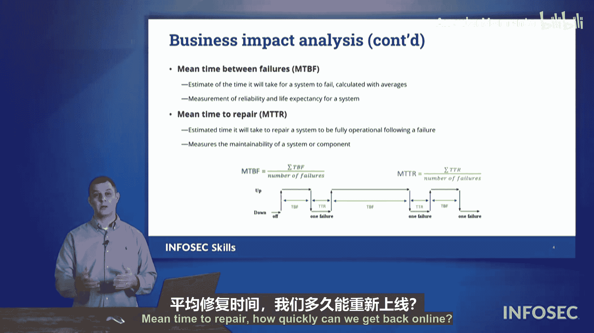

# 062：业务影响分析（BIA） 🎯

在本节课中，我们将学习业务影响分析中的核心概念。业务影响分析是评估风险对组织潜在危害程度的关键过程。我们将重点理解四个关键术语：恢复时间目标、恢复点目标、平均修复时间和平均故障间隔时间。掌握这些概念对于通过Security+认证考试至关重要。

上一节我们介绍了风险评估的基本框架，本节中我们来看看如何具体量化风险事件对业务运营的影响。

## 恢复点目标与恢复时间目标 📊

以下是两个紧密相关的核心指标，用于定义数据恢复的“起点”和“完成时间”。

*   **恢复点目标**：该指标关注的是**过去**。它定义了在灾难发生后，组织能够容忍丢失多少时间内的数据。例如，如果RPO设置为4小时，则意味着系统恢复后，数据最多只能恢复到灾难发生前4小时的状态。公式上，RPO决定了备份的频率：`备份频率 ≤ RPO`。
*   **恢复时间目标**：该指标关注的是**未来**。它定义了从灾难发生到业务功能恢复运营所能容忍的最长时间。RTO包含了从识别事件、启动恢复流程到数据恢复、系统测试直至重新上线的总时长。整个恢复过程的时间必须满足：`实际恢复时间 ≤ RTO`。

为了帮助记忆，可以联想字母：**RPO** 中的 **P** 代表 **Point in the Past**（过去的某个点）；**RTO** 中的 **T** 代表 **Time in the Future**（未来的时间）。

理解这两者的关系至关重要。假设发生了一次系统故障，我们首先根据RPO确定需要从多久之前的备份进行恢复（例如，昨天凌晨的备份）。然后，从加载该备份到系统完全恢复可用所花费的总时间，必须满足RTO的要求（例如，必须在8小时内完成）。因此，**总停机时间** 由寻找正确恢复点（RPO）和实际执行恢复（RTO）共同决定。

## 平均修复时间与平均故障间隔时间 ⚙️

除了恢复目标，我们还需要衡量系统本身的可靠性。以下是两个用于评估硬件或系统稳定性的指标。

*   **平均故障间隔时间**：指系统或组件在两次连续故障之间正常运行的平均时间。MTBF数值越高，表示系统越可靠。其基本计算思路是：`MTBF = 总正常运行时间 / 故障次数`。
*   **平均修复时间**：指修复一个故障组件或系统并使其恢复正常运行所需的平均时间。MTTR数值越低，表示组织的应急响应和修复能力越强。

我们可以通过一个简单的例子来理解：假设一台服务器的硬盘平均每2年（MTBF）会发生一次故障。当故障发生时，如果机房有备用硬盘，工程师可能只需1小时（MTTR）即可更换并恢复服务。但如果需要临时订购硬盘，等待物流可能需要2天，那么这次事件的MTTR就会显著增加。决策者可能会因此决定储备备用硬盘，以降低MTTR。

本节课中我们一起学习了业务影响分析的四个核心指标：**恢复点目标** 和 **恢复时间目标** 定义了数据恢复的基准与时限；**平均故障间隔时间** 和 **平均修复时间** 则衡量了系统自身的可靠性与组织的修复效率。理解这些术语是制定有效灾难恢复计划的基础。