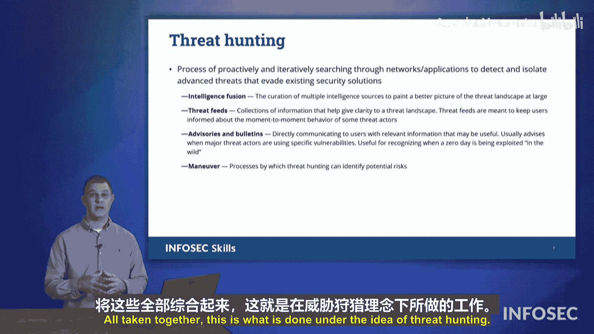

# 063：事件响应


## 概述

在本节中，我们将学习事件响应流程。任何组织都会经历顺境和逆境。当网络事件发生时，确保你有一个应对计划至关重要。我们将详细探讨事件响应的六个步骤，帮助你为“坏日子”做好准备。

## 事件响应流程概述

事件响应是一个循环的、持续改进的过程。它包含六个关键步骤，旨在系统化地处理安全事件，并从中学习以提升未来的防御能力。

以下是事件响应的六个核心阶段：

1.  **准备**
2.  **检测与分析**
3.  **遏制**
4.  **根除**
5.  **恢复**
6.  **经验总结**

这个流程始于准备，终于经验总结，而总结的成果又会反馈到下一轮循环的准备阶段，形成一个持续改进的闭环。

## 详细步骤解析

上一节我们概述了事件响应的整体流程，本节中我们将逐一深入解析每个步骤。

### 1. 准备阶段

准备阶段是事件响应循环的起点，其核心目标是在事件发生前做好一切准备。目前，你正在为你的雇主或未来的雇主进行网络安全方面的准备。

以下是准备阶段的关键活动：

*   **系统加固**：通过配置和更新，减少系统的攻击面。
*   **演练与培训**：进行模拟演习，确保团队成员知道如何应对。
*   **资源分配与预算**：为安全工具、技术和人员分配必要的资源。
*   **制定策略**：为员工制定清晰的事件响应政策和操作程序。

所有这些工作都是为了在真正的安全事件发生时，团队能够迅速、有效地行动。

### 2. 检测与分析阶段

在完成准备工作后，我们进入持续的监控阶段。检测与分析阶段涉及对网络活动的持续监视，以判断异常是否构成真正的安全威胁。

以下是此阶段的核心任务：

*   **持续监控**：利用工具监视网络流量、日志和系统行为。
*   **分析判断**：当检测到异常时，分析其性质、影响范围和根源。
*   **定性评估**：判断该活动是误报、普通故障，还是恶意的网络攻击。

如果分析确认事件是恶意的，就需要立即启动后续的响应步骤。

### 3. 遏制阶段

一旦确认恶意活动，首要目标是阻止其扩散，限制损失。遏制阶段旨在隔离威胁，防止其对网络其他部分造成更大破坏。

常见的遏制措施包括：

*   **断开网络连接**：切断受感染系统与互联网或内部网络的连接。
*   **网络分段**：利用VLAN或防火墙规则将受感染区域隔离。
*   **临时阻断**：根据预设规则，临时阻断可疑的IP地址或端口。

遏制计划应包含短期（立即执行）和长期（彻底解决前维持）策略。

### 4. 根除阶段

成功遏制威胁后，下一步是彻底清除它。根除阶段的目标是从受影响的系统中完全移除恶意软件、攻击工具或攻击者留下的后门。

根除操作可能包括：

*   **系统重装**：格式化受感染系统并重新安装操作系统和应用。
*   **代码示例（概念性）**：对于可修复的感染，可能需要运行专门的清除工具。
    ```bash
    # 示例：使用防病毒软件进行深度扫描和清除
    antivirus-tool --scan --remove-all /path/to/infected/system
    ```
*   **硬件更换**：在极端情况下，可能需要更换被植入持久化恶意代码的硬件（如硬盘）。

### 5. 恢复阶段

根除威胁后，我们需要让业务恢复正常运行。恢复阶段关注如何将系统、数据和业务功能恢复到安全、可用的状态。

恢复活动通常涉及：

*   **数据恢复**：从干净的备份中恢复受影响的数据。
*   **系统重建**：将操作系统和应用程序恢复到已知的安全基准状态。
*   **服务重启**：在验证安全后，逐步恢复对外服务。

完成恢复后，环境应重新进入常态监控，即返回到**检测与分析阶段**。

### 6. 经验总结阶段

在事件处理接近尾声时，启动经验总结至关重要。此阶段的目标是客观记录事件全过程，为未来的准备和响应提供依据。

撰写经验总结报告时，请遵循以下原则：

*   **记录事实**：客观描述发生了什么、团队做了什么、如何解决的。避免使用“应该”、“本可以”等推测性语言。
*   **避免指责**：不要追究个人责任（例如，“Carl做错了…”）。聚焦团队的整体行动和结果。
*   **量化影响**：使用**工时损失**、**系统停机时间**等指标来衡量影响，而非具体的金钱损失，因为后者会随时间贬值，参考意义下降。
    *   **公式示例**：`总生产力损失 = 受影响员工数 × 平均处理工时`
*   **进行根本原因分析**：明确指出导致事件发生的根本原因（例如，“由于未及时安装某个关键补丁…”），而不是表面现象。

这份报告是为未来的你或团队准备的“历史档案”，当下一次类似情况出现时，它能提供宝贵的行动参考。

## 主动防御：威胁狩猎

除了被动响应，组织还应主动寻找潜在威胁。威胁狩猎是一种主动安全活动，它结合外部情报和内部数据，主动搜寻可能已潜入网络的攻击者。

威胁狩猎的流程可以概括为以下步骤：

1.  **收集情报**：整合来自信息共享与分析中心、安全厂商公告、威胁情报源等的内外部信息。
2.  **形成假设**：基于情报，推测攻击者可能利用的漏洞或已使用的战术。
3.  **调查验证**：在自有网络中搜索与假设相符的迹象或痕迹。
4.  **处置与改进**：如果发现威胁，则进行处置；无论是否发现，都将狩猎过程和结果反馈到安全策略和监控规则中，提升整体检测能力。

## 总结

本节课中，我们一起学习了CompTIA Security+ 701认证要求掌握的事件响应流程。我们详细探讨了从**准备**、**检测与分析**、**遏制**、**根除**、**恢复**到**经验总结**的六个阶段，并了解了主动的**威胁狩猎**概念。记住，一个有效的事件响应流程是循环且持续改进的，每一次事件的处理都应使组织变得更加强韧。




**备考提示**：请熟悉上述事件响应流程的各个阶段及其关键活动，这在Security+考试中是重点考察内容。