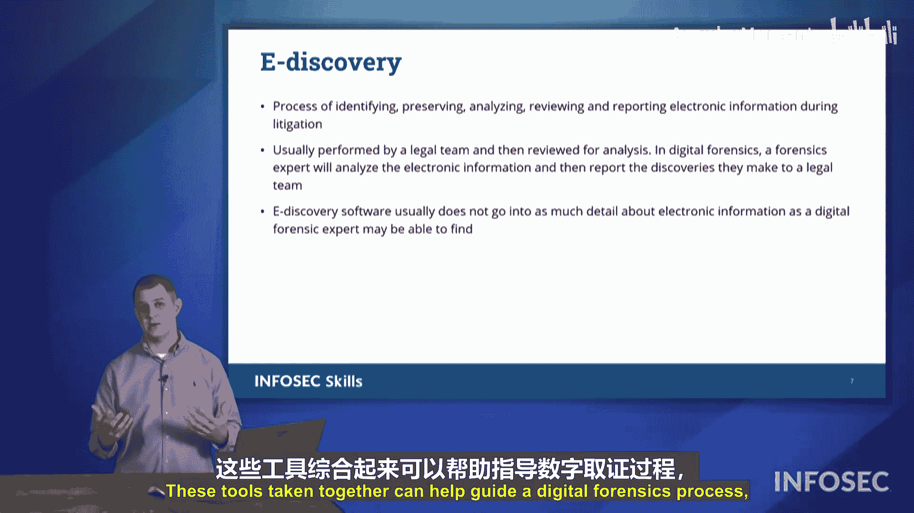

# 064：数字取证基础

在本节课中，我们将要学习数字取证调查的核心概念与流程。这些知识对于理解如何在安全事件后进行专业的调查至关重要，也是CompTIA Security+ 701认证考试的重点内容。

## 概述

数字取证是在发生安全事件后，为进行调查而采取的一系列科学方法和流程。它旨在以合法、可被法庭接受的方式收集、保存和分析数字证据。

## 核心概念与流程

上一节我们介绍了数字取证的基本定义，本节中我们来看看取证过程中涉及的具体术语和关键步骤。

### 法律保留通知

当组织或个人涉及法律诉讼时，可能会收到一份“法律保留通知”。这意味着必须保留所有相关信息，不得删除或销毁，因为这些信息将用于后续的调查。即使诉讼对象是前员工或高管，其相关的数字信息也需要被保留。

### 证据监管链

保护“证据监管链”是数字调查的核心。监管链详细记录了在调查过程中，谁在何时、何地接触过证据，以及证据是如何被移交的。其目的是确保证据的完整性和真实性，防止证据被篡改或污染。

以下是维护证据监管链的关键点：

*   **记录详细信息**：在收集证据时，需记录精确的时间、地点和收集人。
*   **全程负责**：证据应由收集人亲自保管和移交，避免经手无关人员。
*   **签署移交记录**：任何证据的移交都必须有双方签字确认，以明确责任。

### 数据采集与验证

在从存储介质（如硬盘）收集证据时，需要使用“写阻止器”。**写阻止器**是一种硬件或软件工具，其作用是防止对存储介质进行任何写入操作，从而保护原始证据的完整性。

采集数据后，需要创建硬盘的“镜像”，即逐比特的完整副本。然后，使用哈希算法对镜像文件生成一个唯一的“哈希值”。**哈希函数**的公式可以简化为：
`哈希值 = H(原始数据)`
通过对比原始证据和镜像的哈希值，可以验证镜像是否是完全相同的副本，从而在法庭上证明证据未被篡改。

### 报告与保存

调查结束后，必须撰写调查报告。报告需要清晰、简洁、基于事实，避免使用推测性或复杂的类比，以便非技术人员（如法官或陪审团）能够理解。同时，必须长期妥善保存所有原始证据和副本，因为法律程序可能持续数年，需要确保证据在需要时仍然可用。

### 电子取证

“电子取证”是指使用专门的软件工具，根据特定条件（如人员、时间范围）自动搜索、识别和收集相关的电子数据（如电子邮件、聊天记录、文件）。这大大提高了从海量数据中查找相关证据的效率。

## 总结

本节课中我们一起学习了数字取证的关键环节：从接收法律保留通知开始，到维护证据监管链、使用写阻止器采集数据、通过哈希验证完整性，最后完成报告并长期保存证据。理解这些流程对于进行合规、有效的安全事件调查至关重要。