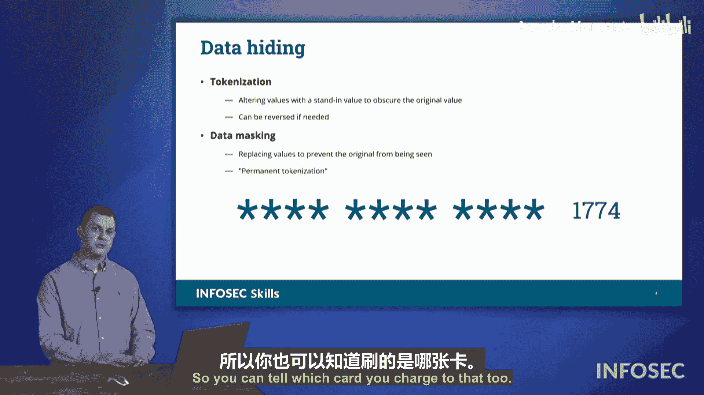

# 065：数据保护


## 概述

在本节课中，我们将学习几种保护数据免受窥探的关键技术。数据在使用过程中需要保持可访问性，同时也必须确保其安全性。我们将探讨混淆、隐写术以及数据隐藏（包括令牌化和数据掩码）这三种核心方法，了解它们如何在不同场景下保护敏感信息。

---

## 混淆：让代码难以阅读

上一节我们提到了数据保护的重要性，本节中我们来看看第一种技术：混淆。混淆是一种使代码或数据难以被人阅读和理解，但计算机仍能正常处理的技术。其核心目的是保护知识产权或逻辑，防止被轻易逆向工程。

例如，下图展示了一段来自《纽约时报》热门游戏Wordle的JavaScript代码片段。为了保护其投资，《纽约时报》对源代码进行了混淆处理。


即使你熟悉JavaScript，这段代码也几乎无法理解。变量名被替换为无意义的单字符（如 `e`、`a`、`v`、`t`），结构也被打乱。然而，计算机执行这段代码却毫无问题。混淆的公式可以简单表示为：

**原始可读代码** -> **混淆过程** -> **难以理解但功能相同的代码**

以下是混淆的一个简单代码示例：
```javascript
// 混淆前
function calculateTotal(price, quantity) {
    return price * quantity;
}

// 混淆后（示意）
function a(b,c){return b*c;}
```

---

## 隐写术：在文件中隐藏文件

混淆技术主要针对代码，接下来我们看看如何隐藏数据本身。隐写术是一种将信息（如文件、文本）隐藏在其他载体文件（如图片、音频、视频）中的技术。从外部看，载体文件看起来完全正常，但内部却包含了秘密信息。

例如，攻击者可能将一份公司机密文档隐藏在一张普通的猫咪图片中。当这张图片被传输时，看起来人畜无害，从而绕过了常规的安全检查。因此，隐写术也可能被用作数据泄露的途径。

安全团队需要对此保持警惕。现代数据防泄露工具能够检测文件中是否隐藏了其他文件。隐写术的过程可以描述为：

**秘密数据 + 载体文件（如图片）** -> **隐写编码** -> **含隐藏数据的新载体文件**

---

## 数据隐藏：令牌化与数据掩码

除了完全隐藏，我们更常遇到的需求是：在必须使用数据时，限制对其敏感部分的访问。这就是数据隐藏的范畴，主要包括两种技术：**令牌化**和**数据掩码**。

设想一个客服中心的场景。客服人员需要处理客户订单，但出于安全考虑，我们不应让他们看到完整的客户信用卡号。

### 令牌化：可逆的遮盖

以下是使用令牌化处理信用卡号的示例：



令牌化使用无意义的“令牌”临时替换敏感数据。客服界面可能显示为 `****-****-****-1774`，其中星号部分就是令牌。系统在后台存储着令牌与真实卡号的映射关系，当需要完成扣款等授权操作时，可以将其还原。因此，令牌化是**可逆的**。

**核心概念**：令牌化是用一个唯一的、无实际意义的标识符（令牌）来临时代表敏感数据，原始数据被安全地存储在别处。

### 数据掩码：不可逆的遮盖

与令牌化不同，数据掩码是**永久性**地替换或删除敏感数据。通常，它会用固定字符（如`X`或`*`）覆盖原数据。


例如，在显示给用户的交易历史中，信用卡号可能被永久显示为 `XXXX-XXXX-XXXX-1774`。此时，即使系统管理员也无法从这串掩码后的数据中恢复出完整卡号，因为原始数据已被丢弃或不可逆地转换。

**核心概念**：数据掩码是永久性地用伪造的或屏蔽的字符替换真实数据，过程不可逆。

**两者对比**：
*   **令牌化**：像用可移除的贴纸盖住纸上的数字，需要时可以揭开。
*   **数据掩码**：像用强力胶带粘住数字，强行揭开只会破坏纸张，永远无法看到原数字。

---

## 总结

本节课中我们一起学习了三种关键的数据保护技术：
1.  **混淆**：通过打乱代码结构，使其难以被人理解，从而保护逻辑和知识产权。
2.  **隐写术**：将秘密信息隐藏在其他普通文件中，用于隐蔽通信或构成数据泄露风险。
3.  **数据隐藏**：在必须使用数据时保护其敏感部分。
    *   **令牌化**：使用可逆的令牌临时替换敏感数据，适用于需要后续授权操作的场景。
    *   **数据掩码**：永久性地替换或删除敏感数据，适用于仅需验证身份但无需还原数据的场景。

理解这些技术的区别与应用场景，对于实施有效的数据安全策略至关重要。