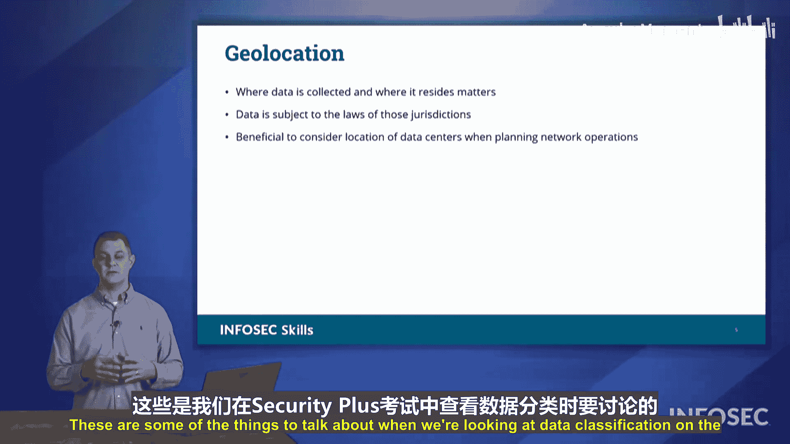

# 066：数据分类 📂

在本节课中，我们将要学习数据分类的核心概念。理解如何对组织内的信息进行分类，是制定有效安全策略和保护敏感资产的基础。我们将探讨不同类型的数据、它们的分类级别，以及地理定位对数据管理的影响。

## 数据分类概述

保护组织数据时，我们需要考虑不同的分类方式。在Security+考试中，我们可以通过多种方式对组织接收或存储的信息进行分类。这些可分类的不同数据类型包括：受监管信息、商业秘密、知识产权、法律与财务信息，以及人类可读与非人类可读格式。

## 数据类型详解

以下是几种主要的数据类型及其特点。

### 受监管信息
这类信息受到行业法规的保护。组织必须遵守这些法规，否则将面临严厉的处罚和罚款。

### 商业秘密与知识产权
这是使您的组织与众不同的东西。它可能是您组织追求成功的“秘密配方”，例如可口可乐的秘方或肯德基的“11种草药和香料”。这是您组织的独特之处，您需要保护这些知识产权和信息，以防止竞争对手获得与您同样成功的“行业工具”。

### 法律与财务信息
这也可能是您不希望对手访问的敏感信息。对手可能窃取特定的公司文件，或访问您的财务状况。您当然不希望他们获得这些信息。

### 人类可读与非人类可读格式
这并非指人类无法阅读此类信息，或计算机无法阅读此类信息。随着人工智能的兴起，我们可以看到计算机能够处理大量人类为人类编写的信息，如新闻文章、电子邮件等。但是，计算机之间传输数据有更高效的方式。

例如，幻灯片上展示的XML图片。XML是一种数据格式，可用于在计算机之间传输数据。它是一种结构化格式，易于计算机解析。但这并不意味着人类无法阅读这些信息。您可以阅读它并理解它引用了特定的CVE漏洞，具有特定的CVSS评分，并且可以通过该URL找到相关信息。然而，如果我要向您（另一个人）传达这些信息，我可能不会直接发送一个XML数据文件，而更可能以叙述性的方式写出来。

这就是人类可读与非人类可读格式的含义。有些格式是为计算机设计的，有些格式是为人类设计的。您的受众将决定您选择哪种解决方案。

## 数据分类级别

进入我们拥有的不同分类，我们有三种数据分类级别可供选择：公开信息、机密信息和关键信息。

### 公开信息
这是任何人都知道的信息。您可以在任何地方找到它。这是公开信息，不受任何形式的保护。例如，“今天下午3点在休息室为Carol举办派对”就是公开信息。我们不会对此进行保密或施加任何保密级别。

### 机密信息
您可能拥有不希望共享的机密信息。这不会是公开信息，仅限组织内的特定个人知晓。您需要将此信息标记为机密。这可能是您组织内部的信息，您不希望竞争对手知晓或了解。

### 关键信息
这是我们这里的第三个选项。这类信息将仅限于极少数个人访问，可能只有您的高管团队成员，如首席执行官、首席信息官、首席信息安全官等。只有有限数量的个人有权访问此类信息。

我们在不同政府实体对其信息的分类中也看到了这种反映。他们将有未分类信息（正如我们讨论的公开信息）、机密信息（这是受保护、不为公众所知的信息，相当于机密级别）以及绝密信息（可能达到关键级别）。当然，在政府级别中，我们还有其他形式的分类。但这就是我们谈论数据分类时的含义。

## 其他分类术语

在考试中您可能还会看到其他分类术语被提及：专有信息、私人信息、敏感信息和受限信息。

### 专有信息
这再次指您的“11种草药和香料”，您的“秘密配方”，或者是您软件解决方案的源代码。这是您绝对不希望竞争对手或对手获取副本的专有信息。

### 私人信息
这可能还包括个人可识别信息。这包括您的姓名、地址、社会安全号码、银行账号等。所有这些信息，您都不希望任何无权访问的人获得访问权限。这就是私人信息。

### 敏感信息
这源于GDPR（《通用数据保护条例》）。GDPR明确了哪些信息属于敏感信息的例子。这类敏感信息如果泄露，将对个人造成极大的麻烦和伤害。这包括宗教和政治信仰、性别和性取向等。个人可能不介意与他人分享这些信息，但他们希望控制谁有权在特定领域访问这些信息。在某些情况下，这对他人来说可能极具问题。从商业角度考虑时，您真的需要问自己：存储和保留此类信息对我们有何商业意义？如果我们存储此类信息，给个人带来的风险是否值得？如果我们不需要收集它，就不要收集。

### 受限信息
我们在这里可以分类的最后一种信息是受限信息。这类信息一旦泄露，将引发国际丑闻。如果这些信息泄露，将对个人造成极端伤害。您可以想到国家机密或其他国家外国特工的身份。这些就是我们将要限制访问的信息类型。绝对没有基层员工能够访问这些信息，只有最高安全许可级别的人员才能知晓这些信息，并且这当然将建立在“需要知道”的基础上。

## 地理定位的重要性

本节要讨论的最后一个主题是地理定位。关于地理定位，我们将看到：**数据所在的位置至关重要**。

您的数据必须遵守其所在地区的法律。因此，如果您正在考虑“我应该将数据中心设在哪里？”或“我们的公司总部应该设在哪里？”，您需要考虑该组织在不同地点将适用的规则和法规。您需要查看并了解数据法律，然后能够根据组织的意愿选择您的位置。

## 总结

本节课中，我们一起学习了Security+考试中关于数据分类的核心内容。我们探讨了不同类型的数据（如受监管信息、商业秘密等），理解了三种主要的分类级别（公开、机密、关键），并认识了其他重要的分类术语（如专有、私人、敏感、受限）。最后，我们明确了地理定位对数据合规性的重要性，即数据必须遵守其物理存储地的法律法规。掌握这些概念是有效实施数据安全策略的第一步。