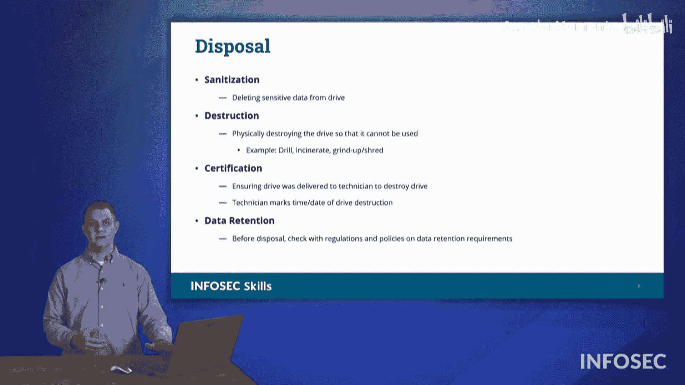

# 067：13_01_03_数据销毁

在本节课程中，我们将学习组织内信息保护的一个重要环节：数据销毁。当组织中的硬件设备达到其使用寿命终点时，我们必须考虑如何安全地移除存储在这些硬件上的数据，以防止敏感信息泄露。我们将探讨数据销毁的核心概念、不同存储介质（如机械硬盘、固态硬盘）的处理方法，以及相关的法律和认证要求。

## 数据销毁概述

当保护组织信息时，我们需要考虑存储在设备上的数据。存储在硬件上的数据，在硬件达到其使用寿命终点时，需要被处理。我们需要思考在处置这些硬件之前，如何移除存储在其上的数据。本节讨论的就是数据销毁。

在数据销毁领域，有几个为Security+考试需要了解的术语。首先，当我们处置硬件时，这被称为**停用**。这是指将硬件从组织的活跃角色中移除。存储在该设备上的可能是敏感信息，我们需要彻底移除这些信息。根据设备的具体情况，有几种不同的方法可以实现。

## 数据销毁方法

以下是几种主要的数据销毁方法，适用于不同类型的存储介质和设备。

*   **机械硬盘**：机械硬盘通过磁力在盘片上存储信息。这些信息必须被彻底移除。仅仅在操作系统中“删除”文件是不够的。现代操作系统删除文件时，通常只是标记该存储空间为“可用”，而不会立即擦除实际数据。为了确保安全，可以进行**安全擦除**。这个过程会反复用特定的数据模式（如`11111111`、`00000000`、`10101010`）覆盖硬盘上的原始数据（`1`和`0`）。这样做是因为硬盘上的每个磁点周围都有一个微弱的“磁晕效应”。通过反复写入不同的值，可以消除这种效应，防止有决心的攻击者通过读取残留的磁信号来推断原始数据。
*   **固态硬盘**：对于更现代、更快的固态硬盘，处理方法不同。你无法简单地通过覆盖来删除信息，因为它不是磁性存储，没有“磁晕效应”。通常需要**物理销毁**驱动器，例如通过研磨或粉碎。
*   **网络设备**：不同的网络设备，如路由器、交换机和无线接入点，会存储敏感的无线凭证。在停用这些设备之前，必须确保擦除所有凭证。否则，入侵者可能通过拍卖或其他途径获得该设备，从而利用其中存储的凭证获得对你网络的授权访问。
*   **特殊设备**：其他特殊设备，如扫描仪和多功能打印机，也可能存储信息。它们可以无线连接到设备，需要确保移除存储在其上的任何信息。

## 核心概念与处理方式

上一节我们介绍了针对不同设备的数据销毁方法，本节中我们来看看数据销毁的几个核心概念和处理方式。

首先，**清理**是指你选择性地移除设备上的特定信息。你挑选并选择要删除的信息，确保覆盖所有基础。

其次，**数据销毁**是指物理销毁存储介质本身。你通过某种机械手段物理性地破坏它，例如钻孔、在足够高温下焚化，或者使用工业碎纸机进行研磨或粉碎。

此外，还有一个术语叫**认证**。通常，一个组织可能没有能力自行物理销毁数据，可能缺乏工业级的碎纸机或研磨机等工具。这时，你会将介质提供给第三方机构。他们收集这些信息并进行物理销毁后，会签署文件进行认证。例如，他们会记录“技术员Tommy在特定时间将带有某个ID号或条形码的硬盘放入某台工业研磨机销毁”，并说明所有废弃物的处理结果。这就是认证过程。

在整个流程开始之前，甚至在开始销毁信息之前，你需要考虑**数据保留**的法律要求。确保你不需要因任何合规原因保留这些信息。因为一旦数据被正确销毁，就无法恢复。

## 磁性介质的特殊处理

当处理磁性存储介质时，有一个称为**消磁**的过程。

消磁会将左侧图中显示的非常均匀、有序的磁介质结构，置于一个变化的、演进的磁场中。这个过程会彻底破坏所有的磁序。**消磁**就是将磁性介质置于变化的磁场中的过程。

## 粉碎处理

我们还有**粉碎**系统。粉碎使用工业碎纸机或研磨机，它们有巨大的滚轮，可以吞入金属并将其压碎。YouTube上有一些展示这个过程的娱乐性视频。它将硬盘研磨、粉碎成电子废弃物，这些废弃物可以被开采并回收其中的贵金属，用于其他用途。但是，有决心的攻击者将无法从这些微小的碎片中提取信息，因为它已经被粉碎得无影无踪。

我得说，我觉得这大概会是一份持续一周的有趣工作。我想我大概需要一周时间来体验粉碎硬盘的乐趣。你知道，把东西扔进碎纸机听起来很有趣。有提供这种服务的公司，他们会通过整个认证流程来签署证明。

## 设备停用的注意事项

正如前面提到的，某些多功能打印机设备可能存储了无线凭证，它们连接到组织的无线网络。最近一家打印机制造商发布公告称，如果你有他们的设备并且存储了无线凭证，即使你执行了恢复出厂设置，也需要进入并更改你的Wi-Fi凭证。因为本质上，Wi-Fi板卡不属于恢复出厂设置过程的一部分。

因此，如果你要停用一台多功能打印机或任何设备，请确保遵循制造商的指导，以安全销毁该设备上的所有数据。这些就是我们在研究数据销毁时讨论的一些概念。

## 课程总结

本节课中，我们一起学习了数据销毁的完整流程。我们从数据销毁的必要性讲起，了解了**停用**硬件的概念。然后，我们详细探讨了针对**机械硬盘**、**固态硬盘**、**网络设备**和**特殊设备**的不同销毁方法，包括安全擦除、物理销毁和凭证清除。我们还学习了**清理**、**数据销毁**、**认证**和**数据保留**等核心概念，并特别介绍了针对磁性介质的**消磁**技术和工业**粉碎**过程。最后，我们强调了遵循设备制造商指南的重要性。掌握这些知识，对于确保组织信息在硬件生命周期结束时得到安全处置至关重要。