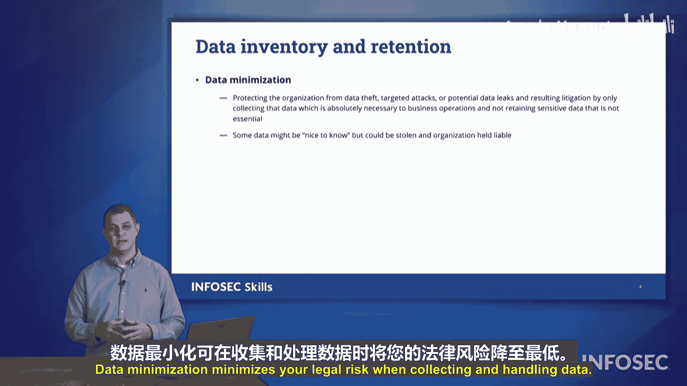

# 068：组织内的数据保护角色与概念 🔐

在本节中，我们将探讨组织如何构建其团队以保护数据隐私。我们将概述组织内为帮助保障安全运营而设立的不同职位。

## 概述
在本节中，我们将学习由《通用数据保护条例》（GDPR）定义的关键数据保护角色，以及数据最小化等重要概念。理解这些角色和概念对于构建有效的隐私保护框架至关重要。

## GDPR定义的数据保护角色
以下是GDPR定义的不同角色及其职责。

*   **数据所有者**：组织内对数据隐私负最终责任的个人。通常是首席信息官、首席隐私官或其他高管。他们的名字与责任挂钩，需为组织如何保护数据承担责任。
*   **数据管理员**：由数据所有者委派，负责确保所收集数据的准确性，并代表数据所有者专注于数据隐私，确保组织行为符合数据安全政策。
*   **数据保管员**：协助数据管理员，负责实施管理员提出的控制措施。管理员决定“做什么”和“如何做”，保管员则负责具体执行。
*   **隐私官**：确保组织行为符合法律法规的成员，通常来自法律团队。他们与管理员和保管员合作，确保满足所有法规要求。
*   **数据控制者**：控制数据访问权限的个人。他们利用其他人制定的安全控制措施，确保只有授权用户才能访问和修改数据。他们是确保政策得到执行、控制措施有效运作的一线人员。
*   **数据处理器**：基于已收集或正在使用的数据为组织创造价值的个人。他们处理数据以产生业务价值。

上一节我们介绍了GDPR定义的核心角色，本节中我们来看看另外两个关键概念：数据主体与数据最小化。

## 数据所有者 vs. 数据主体
需要特别注意“数据所有者”和“数据主体”之间的区别。

*   **数据所有者**：负责数据收集和安全保管的一方（通常是组织）。
*   **数据主体**：数据所指向的个人。根据GDPR或其他州法规，数据主体拥有决定其数据如何处理的权利。从法律角度看，成为数据主体比成为数据所有者（对自身数据而言）地位更有利。

## 数据最小化原则
最后，我们讨论数据最小化。组织可能希望最小化其收集的数据类型。

某些信息非常敏感，一旦泄露会造成伤害。因此，组织必须决策是否真的需要收集和存储这些信息，因为这可能带来法律风险。只收集业务决策绝对必需的数据，是进行数据收集的安全方式。**数据最小化** 能降低组织在收集和处理数据时的法律风险。

## 总结
本节课中，我们一起学习了GDPR框架下的关键数据保护角色（数据所有者、管理员、保管员、隐私官、控制者、处理器），厘清了数据所有者与数据主体的区别，并理解了数据最小化原则对于降低法律风险的重要性。这些是Security+考试中需要重点关注的概念。