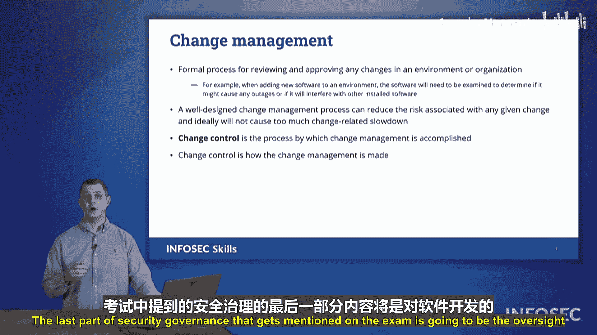

# 069：第14章 第1节 安全治理 🛡️

在本节中，我们将探讨组织如何监督其安全计划。安全治理这一部分着眼于组织规划和监督其安全计划的各种方式。

## 概述

在本节中，我们将学习安全治理的核心组成部分，包括指导方针、基准、标准、程序、预案以及各类计划。这些元素共同构成了组织安全管理的框架，确保安全措施得到有效规划、实施和监督。

## 指导方针

首先，我们来看指导方针。指导方针是关于组织如何处理各种情况的非限制性边界。它不会规定应如何处理特定事件，更像是为情况设置护栏。其含义是：我不希望你超越这些边界，但边界之内的一切都是可行的，具体如何处理由你自行决定。这些是我们拥有的通用指导方针。

## 基准

我们可能还会遵循各种基准。这些基准将使用其他组织的衡量标准。我们会观察其他组织遵循哪些指标来衡量我们是否在做需要或正确的事情。例如，行业的最佳实践是什么？互联网安全中心会发布 **CIS基准**，这是一系列最佳实践的集合，供连接到互联网的组织遵循。

## 标准

我们还有可以提出的标准。不同的组织会提出关于我们应如何处理某些技术的标准。例如，我们可能有一个密码标准，规定如何创建密码，以及什么构成一个好的密码。

接下来，我们可能有必须遵循的访问控制标准。工作组下的所有部门或所有公司，或联邦网络的不同成员，都可能被要求遵守此标准。

此外，我们还可以有物理安全标准，规定我们组织如何处理物理安全的要求。我们可能还会利用加密标准，例如**联邦信息处理标准**。它概述了哪些形式的加密被允许用于联邦信息处理或在联邦网络上保护数据安全。这些标准会不时更新，如果组织是联邦网络的一部分，则必须更新以符合那些联邦标准。

## 程序

接下来，我们想要概述各种程序。我们将记录这些程序，并为入职或离职制定流程。

**入职**是指我们有新员工或用户加入组织时，并规划如何将他们引入组织的过程。这包括创建他们的账户，确保他们拥有正确的文件和系统访问权限来完成工作，确保他们拥有合适的技术（如果向他们发放了电脑或办公电话），以及他们是否有工作空间。所有这些都将在入职程序中列出。

**离职**几乎是入职的反面。它是指用户或员工将要离开组织时，无论是自愿还是非自愿。每当有人离开我们的组织时，我们需要执行相同的离职流程，以撤销他们的权限，撤销他们对可能拥有的不同文件共享的访问权限，并保留我们的资产。如果我们发放了手机、移动设备、笔记本电脑，我们需要确保收回所有资产，并且不允许访问任何可能导致数据外泄问题的数据。

## 预案

我们还可以有预案。预案将列出我们的组织或团队在特定事件发生时应该遵循的特定程序或一系列步骤。我们希望确保以相同的方式执行预案，就像运动队中的运动员在足球或篮球比赛中遵循特定战术一样。如果团队的每个成员都做好自己的工作，团队就能推进并得分。有了预案，每个成员都知道自己的工作是一个更大机器的一部分，他们能够完成在应对事件或创建某种新系统并确保其尽可能安全运行时所设定的目标。

## 其他监督类型

不同安全组织可能使用的其他监督类型包括制定事件响应计划。

在事件响应中，你需要确保为那些发生坏事的时刻制定计划。总会有发生某种网络事件的日子。事件响应计划将帮助你了解你将如何响应，它将定义你的团队成员在做什么，并且你将能够以冷静、沉着和专注的方式处理问题。

业务连续性计划帮助我们了解在事件发生时，我们将如何继续推进并维持我们的底线，继续创造收入。

最后，我们有灾难恢复计划。我们如何从这场灾难中恢复？发生了某些事情，我们希望将服务恢复到最初的状态。这都是灾难恢复过程的一部分，所有这些都包含在事件响应过程的监督之下。

## 变更管理

接下来，我们需要确保遵循变更管理流程。我们在课程开始时讨论过这一点。我们需要确保遵循一个流程来改变不同的系统。我们要么更新或修补系统，跟踪这些变更，记录我们所做的事情，然后能够观察和监控这些系统，确保根据需要应用了补丁。但变更管理的关键在于**文档记录、测试，然后应用这些变更以限制发生的工作中断**。

## 软件开发监督

考试中提到的安全治理的最后一部分是软件开发的监督。

软件开发生命周期在此示例中分为五个不同的步骤：
1.  **规划**：我们为特定项目制定需求。
2.  **分析**：我们仔细研究哪些需求可以通过软件解决方案来满足。
3.  **设计**：我们设计解决方案以满足那些经过分析的需求。
4.  **实施**：我们实施该软件，确保正确推出并安全运行。
5.  **维护**：解决它可能存在的任何不足，包括更新、发布补丁等。

然后整个过程重新开始。这就是我们提到软件开发生命周期时所讨论的内容。这以及我们刚刚讨论的所有术语，都是我们在Security+考试的安全治理部分会看到的内容。

## 总结

本节课中，我们一起学习了安全治理的各个核心组成部分。我们了解了**指导方针**作为非限制性边界的作用，**基准**作为行业最佳实践的参考，以及**标准**作为必须遵守的具体要求。我们还探讨了**程序**（如入职/离职）、**预案**、**事件响应计划**、**业务连续性计划**、**灾难恢复计划**以及**变更管理**流程。最后，我们回顾了**软件开发生命周期**作为软件开发监督的框架。所有这些元素共同构成了一个全面的安全治理体系，确保组织的安全计划得到有效规划、执行和监督。