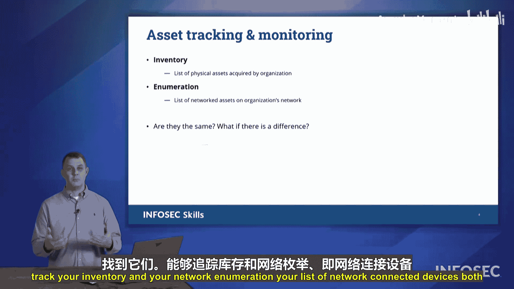

# 070：资产管理

## 概述

在本节中，我们将学习资产管理。资产管理是保护组织安全的基础，它帮助我们追踪网络上的资产，明确哪些设备属于我们的网络，哪些不属于。

## 资产管理的重要性

保护组织时，能够追踪资产至关重要。这有助于确定哪些资产属于我们的网络，哪些不属于。

上一节我们介绍了安全管理的整体框架，本节中我们来看看资产管理。通过资产管理，我们可以对拥有的设备进行核算，并判断它们是否属于组织。

## 资产管理的核心要素

以下是资产管理的关键组成部分。

### 1. 追踪采购与获取

首先，我们需要能够追踪资产的获取过程。采购与获取涉及创建书面记录，追踪谁申请了该物品、我们从何处获得、谁提供的。这有助于追踪供应链，避免任何形式的供应链攻击。

### 2. 使用资产标签追踪单个资产

其次，我们需要能够追踪单个资产。为此，我们通常会使用资产标签。资产标签是一种半永久性、极难移除的标签，粘贴在设备上。如果强行移除，至少会留下一些证据表明该标签已被移除。有些标签含有特殊物质，当从塑料表面移除时，会蚀刻进塑料中，无法完全去除，通常会损坏所附着的设备。这为设备提供了永久性记录。

通过追踪资产标签上的ID号，可以追溯到原始的采购订单和来源。

### 3. 确定系统所有者

此外，每当收到新资产时，我们需要能够追踪系统所有者。我们会明确指定设备属于哪位员工。例如，计算机1023号属于Tommy，1024号属于Chuck。

这可以防止设备丢失后随意拿取同事的设备，也防止员工自行购买设备替换公司资产。所有权可以通过资产标签来固定和追踪。

### 4. 对无特定所有者的设备进行分类

对于没有特定所有者的设备，如复印机、咖啡机或休息室的冰箱，需要进行分类。这些设备根据其在组织中的位置来识别。例如，那是三楼的复印机，属于三楼；那个冰箱在四楼休息室。

分类允许我们根据设备的位置或功能来识别其角色。虽然没有个人所有者，但可以将其分配给一个“所有者空间”。

### 5. 建立资产清单与网络枚举

我们还可以利用资产标签创建系统清单。物理清单是我们拥有的所有物理资产的列表。

与之相对的是网络枚举，这是一种基于网络的逻辑列表。它列出的是网络上的设备。

我们需要对比物理清单和网络枚举列表。例如，我们购买了500台电脑，但网络上发现了520台设备，为什么数字不同？或者我们购买了500台电脑，但只有400台曾在网络上使用过，另外100台笔记本电脑发生了什么？

这有助于确定我们的库存是否与网络上的设备一致，并追踪这些设备在组织内的物理位置。当出现问题时，我们可以快速定位并恢复设备。

## 总结

本节课中，我们一起学习了资产管理。我们探讨了追踪采购、使用资产标签、确定所有者、对设备进行分类以及建立清单与枚举的重要性。掌握这些核心概念，对于有效管理组织资产、确保网络安全至关重要。