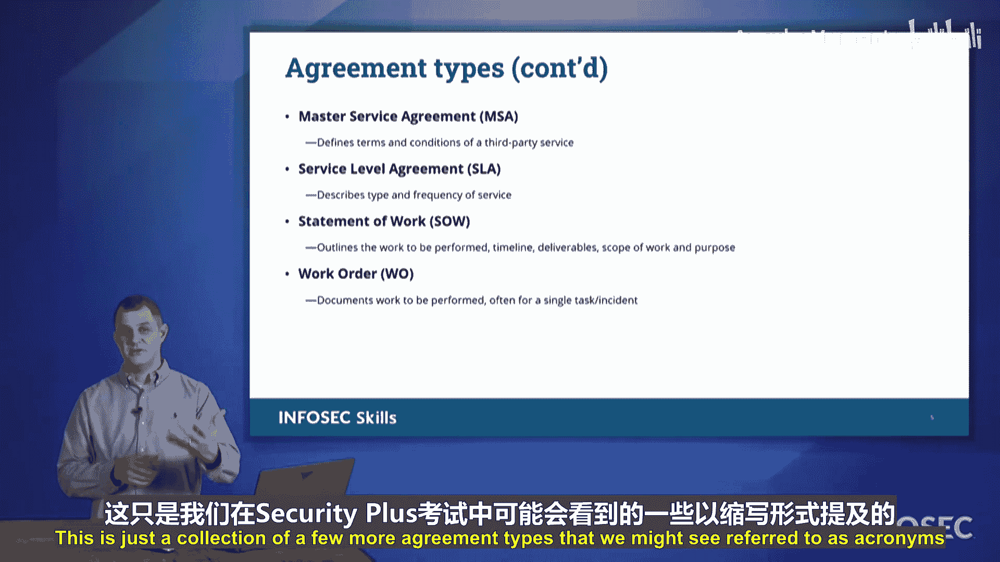

# 071：1.3 网络安全治理协议类型 📜

在本节课中，我们将要学习网络安全治理中的各种协议类型。这些协议定义了组织内部以及与外部合作伙伴之间的行为准则和责任关系，是构建安全框架的基础。

上一节我们介绍了网络安全治理的基本概念，本节中我们来看看一系列具体的协议类型。在CompTIA Security+考试中，会涉及许多缩写词，了解这些协议的含义至关重要。

## 标准操作规程

标准操作规程定义了组织内个人应如何执行不同的活动。这确保了每个步骤都按既定程序执行，并且执行得一丝不苟。

*   **SOP**：标准操作规程。它规定了执行特定任务或流程的标准化步骤。

## 可接受使用政策

可接受使用政策为员工明确了在组织内什么是可接受的行为。它定义了在公司技术设备上允许和禁止的活动。

以下是AUP通常涵盖的内容：
*   允许的工作类型。
*   禁止访问的网站类别。
*   禁止使用个人邮箱等。

## 合作伙伴与服务协议

当组织需要与商业伙伴或服务提供商合作时，会使用一系列更正式的协议。这些协议明确了各方的责任和期望。

以下是几种常见的合作协议：
*   **MOU**：谅解备忘录。这是一种**非约束性**的协议，类似于“纸面上的握手”，旨在表达合作意向，可以轻易解除。
*   **MOA**：协议备忘录。这是一种**具有法律约束力**的协议，正式规定了各方的责任。解除MOA通常需要法律程序。
*   **BPA**：商业伙伴协议。这是一种为长期合作伙伴关系设计的结构，明确规定了各方的投入和收益分配。
*   **NDA**：保密协议。它保护在会议、通话等场合共享的信息，防止信息被泄露给未经授权的第三方。
*   **ISA**：互连安全协议。当两个组织需要连接其网络时，ISA规定了各方如何保护对方的网络，例如在发生恶意软件爆发时如何断开连接。
*   **MSA**：主服务协议。这是客户与服务提供商之间的总体框架协议，确立了双方的合作关系。
*   **SLA**：服务等级协议。它定义了在MSA框架下，服务的具体类型、频率和最低可交付成果。SLA是衡量服务是否达标的关键依据。
*   **SOW**：工作说明书。它定义了特定项目中将执行的具体工作内容。
*   **工作订单**：在SOW之下，具体的、可交付的单项任务指令。

本节课中我们一起学习了网络安全治理中的多种关键协议类型，从内部管理的SOP和AUP，到与外部合作的MOU、MOA、BPA等。理解这些协议的区别和用途，对于建立有效的安全治理体系和应对相关考试都非常重要。