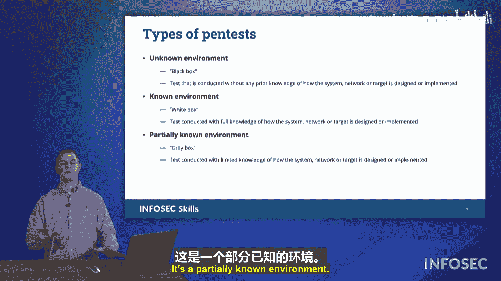

# 072：渗透测试

## 概述

在本节课中，我们将要学习渗透测试。上一节我们介绍了漏洞扫描，本节中我们来看看如何主动利用这些漏洞，即通过渗透测试来模拟真实攻击，评估网络的安全性。

## 什么是渗透测试？

渗透测试，简称“渗透测试”，是指聘请一组经验丰富的“白帽”黑客，对我们发起模拟攻击。他们的目标是尝试利用在网络上发现和存在的漏洞。他们会利用这些漏洞，并进一步挖掘其他可能存在的弱点，最终向我们报告所有可能被攻击者获取的信息。

由于渗透测试会暴露大量敏感信息，因此需要与测试团队签订严格的协议。这些协议包括保密协议，以及对测试范围和行为的限制。测试团队会记录所有发现，并向我们提供详细的报告。在“入侵”之后，他们会将系统恢复原状。这是一种探索所有漏洞及其潜在危害的有效方法。

## 渗透测试与漏洞扫描的区别

这与漏洞扫描不同。漏洞扫描是基于软件的自动化过程。渗透测试则是基于人的，无法完全自动化。虽然渗透测试团队会使用特定的脚本和程序，但漏洞扫描只是你可以自行运行的持续扫描。渗透测试则是模拟真实攻击者，实际尝试“入侵”系统。

## 渗透测试的类型

在渗透测试中，我们模拟攻击。我们让某人“入侵”我们的网络，扮演攻击者的角色。这主要有两种形式：物理渗透测试和基于网络的渗透测试。

以下是两种主要类型的渗透测试：

*   **物理渗透测试**：测试物理安全措施。例如，尝试进入一个安全设施，评估门禁、警报和安保人员的反应。
*   **基于网络的渗透测试**：测试网络安全。尝试通过网络入侵系统，窃取信息，利用计算机漏洞，或诱骗用户泄露信息。

有时这两种形式会结合使用，测试团队会同时进行物理和网络渗透，以全面评估安全状况。

## 信息收集：侦察

在执行渗透测试时，需要收集目标组织的信息。主要有两种侦察类型：被动侦察和主动侦察。

以下是两种侦察方式的区别：

*   **被动侦察**：从远处收集信息，不直接与目标互动。例如，在设施外观察员工进出规律，或在网络上监听数据流量而不发送任何数据包。
*   **主动侦察**：直接与目标互动以获取信息。例如，向服务器发送数据包并分析响应，或伪装身份进入设施内部观察安防布局。主动侦察通常会在被动侦察之后进行，以减少被发现的可能。

## 测试环境考量

当客户聘请渗透测试公司时，需要考虑三种不同的测试环境。

以下是三种主要的测试环境：

*   **未知环境**：也称为“黑盒测试”。测试团队对目标系统一无所知，需要从零开始侦察。
*   **已知环境**：也称为“白盒测试”。客户向测试团队提供所有相关信息，如网络拓扑图、系统版本、用户列表等。
*   **部分已知环境**：也称为“灰盒测试”。客户只提供部分信息，例如公开的IP地址或部分系统类型，介于黑盒与白盒之间。

在CompTIA Security+考试中，需注意这些术语及其对应的测试深度。

## 总结

本节课中我们一起学习了渗透测试的核心概念。我们了解了渗透测试是通过模拟真实攻击来主动利用漏洞的安全评估方法，它与自动化的漏洞扫描有本质区别。我们探讨了物理与网络两种测试类型，以及被动与主动两种侦察方式。最后，我们明确了在规划测试时需要考虑的三种环境：未知环境、已知环境和部分已知环境。理解这些概念对于构建全面的安全防御策略至关重要。