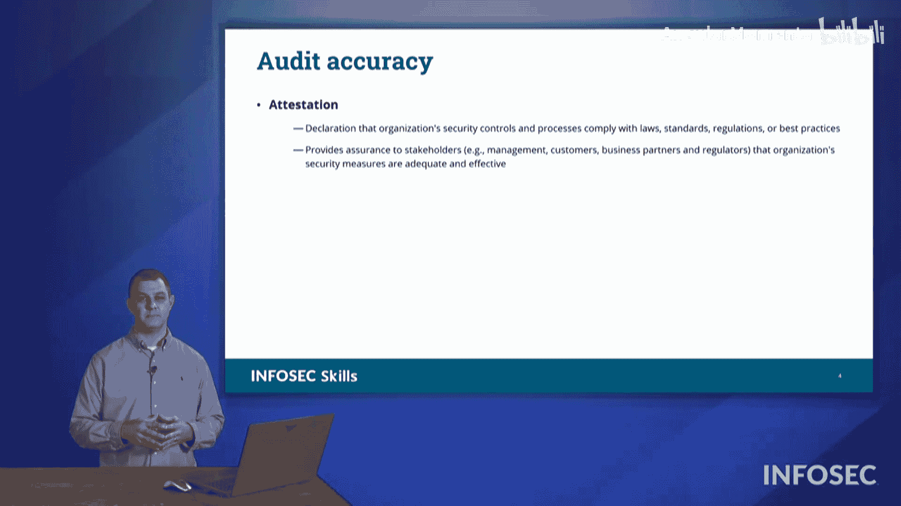

# 073：第14章第1节第5讲 - 审计与评估 🧾

在本节课中，我们将学习如何通过创建审计与评估来检查组织的安全状况，以保护组织及其安全。这是确保组织运营符合法规和内部标准的关键环节。

上一节我们介绍了安全监控的整体框架，本节中我们来看看具体的审计与评估类型。

## 合规性审计

首先，我们将探讨合规性审计。这指的是组织为了确保自身行为符合初始法规、法律、法令等要求而进行的评估或审计。

以下是几种常见的审计与评估形式：

*   **审计委员会**：由一组个人组成的机构，负责检查董事会的运营，确保组织行为符合相关法律法规。该委员会独立于组织的管理层。
*   **自我评估**：对组织结构和运营进行的非正式检查，是了解运营状况的一种方式。

## 外部审计

然而，更正式的做法是依赖外部审计。通过外部审计，我们可以进行监管审计或评估，目的是保持对法规的遵守。法规可能要求我们创建或执行此类审计，以证明我们正在履行承诺并处于合规状态。

以下是外部审计的两种主要形式：

*   **正式评估**：对组织健康状况的全面检查，确保我们合规且正式地执行了必要的工作。
*   **第三方审计**：邀请外部人员进入组织，对我们所做的事情进行审计，不受任何偏见或主观意见的影响。我们依赖第三方来告知实际情况。通过这种方式，我们可以获得关于自身行为的诚实评估。

## 正式检查与证明

最后，我们可以进行正式检查。检查是指由第三方进行的、非常正式的评估类型，这种评估将非常详尽，并覆盖整个组织。

完成审计后，我们需要确保其准确性，这涉及到证明环节。证明是指最终有人签署报告，声明“我证明此报告内容属实，这些发现是正确的”，并署上自己的名字。这通常由组织的首席执行官或其他高管完成，他们将为审计的准确性作证。

---

在本节课中，我们一起学习了多种审计与评估方法，包括合规性审计、自我评估、外部正式评估、第三方审计以及最终的正式检查与证明。理解这些概念对于在Security+考试中取得好成绩至关重要。