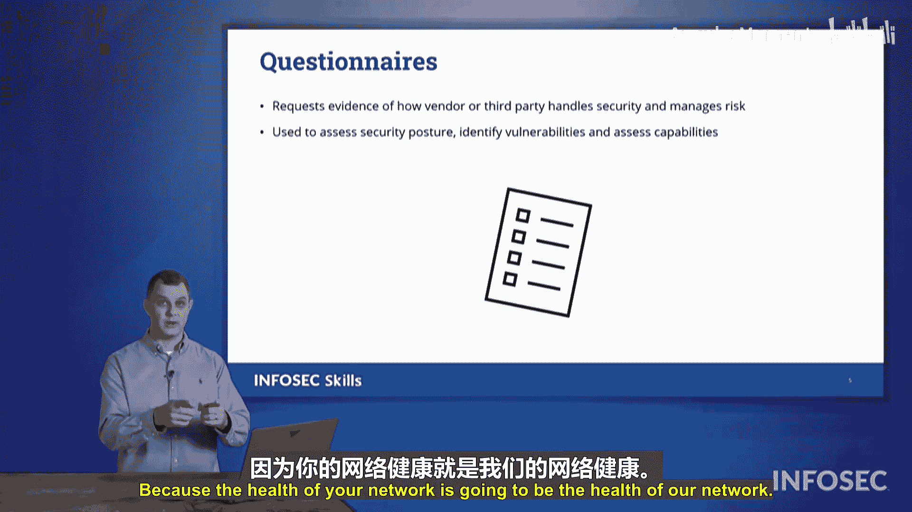

# 074：第三方监督 👁️

在本节中，我们将探讨如何与其他组织建立合作关系。

每当准备签订合同协议时，在正式达成协议之前，我们都需要核对一些特定事项。在关于第三方监督的这部分内容里，我们将了解与此概念相关的一些术语和概念。

## 选择供应商时的考量

以下是选择供应商时需要考虑的几个关键方面。

*   **渗透测试要求**：你可能要求供应商完成渗透测试。记住，渗透测试是主动寻找不同漏洞并可能利用这些漏洞，以了解攻击者若能侵入该网络可以获取什么。
*   **审计权条款**：我们可以提出审计权条款，表明如果我们达成此协议，我们保留获取其内部审计报告或自费对其进行外部审计的权利。
*   **内部审计证据**：你可能希望看到内部审计的证据。我们不需要查看可能包含你不愿与我们分享的信息和细节的内部审计报告，但至少需要确认你已完成审计并已提交给相关主管机构。
*   **独立评估报告**：如果进行了独立评估，我们也应获得一份副本。这可能是出于合规或监管原因的要求。我们保留索取该报告副本的权利，或者，如果我们建立合作关系，你应该主动发送一份副本给我们。
*   **供应链分析**：你可能还需要深入进行供应链分析。我们不希望自己的组织成为供应链攻击的受害者，因此我们将调查你作为供应商，了解你的供应商是谁，他们的安全性如何。因为如果那个供应商或供应商被攻击，对我们来说也可能是个问题。我们可能是目标，但攻击者会通过供应商或其供应商来攻击我们。因此，在与供应商建立伙伴关系或协议时，进行所有这些检查对于选择合适的供应商至关重要。

## 尽职调查与利益冲突

上一节我们介绍了选择供应商时的具体检查项，本节中我们来看看更宏观的决策原则：尽职调查和避免利益冲突。

进行尽职调查是许多组织的要求。如果你不考虑我们可能产生利益冲突的所有方式，或者不考虑该供应商或供应商可能无法帮助我们的所有情况，那将不是一个专业的决定。他们可以告诉我们他们能做到，但他们真的能兑现吗？他们真的能提供我们要求的服务吗？

关于我提到的利益冲突，你需要确保你是自由的，并且是在没有任何利益冲突的情况下做出这些决定。

*   **财务利益披露**：你需要披露是否存在任何财务往来。如果我们这样做，是否会发生某种回扣，或者这会改变我们的考量吗？
*   **个人利益冲突**：我们是否存在任何个人利益冲突？也许我们的CEO大量投资了这家特定的公司。这会影响我们的判断吗？
*   **竞争性利益冲突**：我们要确保没有任何竞争性利益冲突。如果我们雇佣一个供应商，我们要确保他们不是我们竞争对手的子公司。因为那样我们就是在从竞争对手那里购买服务，把钱放进他们的口袋。我们不希望发生这种情况。
*   **内幕信息**：我们还要确保我们的决定不受任何可能使此次特定供应商选择非法或不道德的内幕信息影响。

这整个利益冲突问题都是为了确保我们在没有任何潜在责任的情况下，为组织做出最佳决策。

## 持续监控与评估

在选定供应商并签订协议后，工作并未结束。我们需要持续监控这些供应商。

确保他们安全运营，没有因其供应商带来的任何风险或问题，因为如果他们向我们提供服务或产品，他们的问题就会变成我们的问题。确保他们做了该做的事，并确保他们以他们声称能够达到的能力水平运营，是确保我们自身安全的一部分。

最后，我们希望向这些供应商发送调查问卷。问卷会询问他们：你们在做这个吗？你们有这些安全计划吗？你们的员工有网络安全意识吗？你们是否处于网络安全防御状态？你们在保护自己网络方面有多积极？因为你们网络的健康状况将决定我们网络的健康状况。

这些是在签订第三方协议时需要关注的一些术语，也是我们可能在Security+考试中看到的一些术语。

## 总结

本节课中我们一起学习了与第三方监督相关的关键概念。我们探讨了选择供应商时的具体检查项，如要求**渗透测试**、设立**审计权条款**以及进行**供应链分析**。接着，我们了解了**尽职调查**的重要性以及如何避免各种**利益冲突**，包括财务、个人和竞争性冲突。最后，我们强调了持续**监控供应商**和通过**问卷调查**进行评估的必要性，以确保合作伙伴的安全状况不会危及我们自身组织的安全。掌握这些知识对于建立安全可靠的第三方合作关系至关重要。