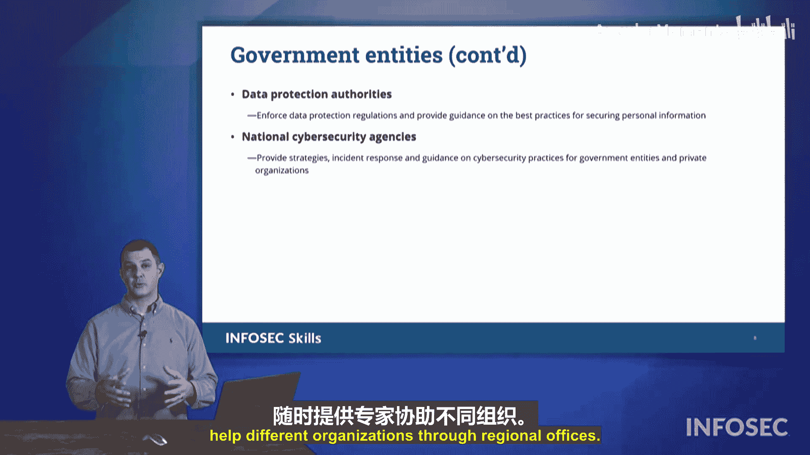

# 075：法律考量事项 🧑⚖️

在本节中，我们将探讨组织需要考虑的各种法律和法规。本节关于法律考量的内容深入探讨了这些主题，并概述了在Security+考试中我们需要了解的一些法律。

## 概述

在本节课中，我们将学习不同层级（地方、国家、国际）以及不同行业（如教育、医疗、金融）中适用的关键法律和法规。我们还将了解组织治理结构和可提供帮助的政府机构。

## 法律与法规的层级

首先，我们需要认识到，法律必须在州/地方、国家以及国际层面得到遵守。

### 州和地方层面

州和地方层面的法律因地区和司法管辖区而异。

### 国家层面

在国家层面，根据您所在的行业，有许多不同的国家法律必须遵守。

### 国际层面

在国际层面，这里提到了**GDPR**（通用数据保护条例）。GDPR是由欧盟通过的综合性数据隐私法。它被认为是国际性的，因为欧盟的每个成员国都是主权国家。根据定义，在欧盟框架下，它们的行为都具有国际性。每个国家都有自己的法律，但它们都遵循相同的GDPR。

## 行业合规与法规

除了通用法律，我们还需要留意各种行业合规与法规。这取决于您所处的行业。不同行业根据法律和监管该特定行业的机构，有不同的要求。在行业合规与法规方面，我们必须遵守这些规定，否则将面临严厉处罚、吊销执照等后果。

接下来，我们将介绍一些我们必须遵守的法律和法规。

## 关键合规与法规类型

以下是几种我们必须遵守的不同类型的合规与法规。

### 隐私法规

*   **GDPR**：欧盟的通用数据保护条例。
*   **CCPA**：加州消费者隐私法案。它保护加州居民的数据和隐私不被窃取。即使您不是加州公民，您仍然受益于CCPA。例如，根据CCPA，消费级家用互联网路由器的无线网络不会使用标准的默认用户名、密码和网络名称，而是会分配一个看似由随机字母和数字组成的唯一网络名称和凭据。这是为了解决用户使用默认设置导致大量网络犯罪活动的问题。

### 教育领域法规

如果您与儿童合作或在教育领域工作，必须遵守一些不同的合规政策。

*   **FERPA**：家庭教育权利和隐私法案。这意味着您不能将学生的信息分享给其父母或监护人以外的任何人。
*   **CIPA**：儿童互联网保护法案。该法案要求学校和图书馆为儿童过滤互联网活动，以防止他们接触网络上的任何露骨信息。在孩子们连接互联网之前，这些内容已被过滤。
*   **COPPA**：儿童在线隐私保护法案。您是否注意到，注册某些网络应用时，它会询问“您是否年满13岁”？原因就是COPPA。COPPA规定，对于13岁或以下的个人，不能存储其任何信息。对于13至18岁的青少年，随着**COPPA 2.0**的通过，这将限制未成年人可拥有的账户数量，并普遍禁止社交媒体组织向未成年人推送和提供有害内容。

### 医疗领域法规

在医疗保健领域，我们有**HIPAA**（健康保险流通与责任法案）。该法案保护您与医疗保健提供者、医生或药房共享的个人隐私信息，防止这些信息被盗用于身份盗窃。

### 金融服务领域法规

*   **GLBA**：格雷姆-里奇-比利雷法案。如果您是一家上市公司，您必须遵守该法案，并向投资者和股东提供某些披露信息。
*   **PCI DSS**：支付卡行业数据安全标准。这几乎肯定会出现在您的CompTIA Security+考试中。PCI DSS关注的是，如果您接受支付卡（行业术语，指信用卡、借记卡或由Visa、万事达卡、美国运通、发现卡等支付卡领域大型发行方发行的礼品卡），那么组织必须如何保护自己免受金融欺诈、浪费和滥用。金融服务公司或任何接受支付卡的公司都必须遵守PCI DSS。请注意，CompTIA通常会以**自愿性法规**的例子来考察PCI DSS。您不一定必须接受信用卡，但在这个时代，有多少公司不接受支付卡呢？因此，您不必遵守PCI DSS，只是如果您不遵守，就不能使用信用卡。如果您接受信用卡，则必须遵守PCI DSS。它是自愿的，但由于市场力量，又“并非完全自愿”。因此，PCI DSS是CompTIA用来举例说明组织“自愿选择”遵守的法规。

### 其他法规

还存在其他类型的合规与法规，例如**FISMA**（联邦信息安全现代化法案）和**CJIS**（刑事司法信息服务安全法案）。这些法规监督在各自行业中运营的组织。

## 组织治理结构

在组织如何管理自身方面，通常会有一个董事会提供监督。这些董事会由最了解特定组织角色和发展轨迹及其业务类型的行业人士组成。他们可能并不总是具备网络安全意识，可能不理解所有技术，甚至可能对此感到畏惧。因此，有时董事会会授权给一个由更贴近相关主题的专家组成的委员会，由其提供见解和监督，并向董事会汇报。委员会在董事会的授权下运作，但董事会将其责任委托给委员会，通常只是“橡皮图章式”地批准委员会的建议。因此，委员会为董事会服务，董事会提供总体监督，委员会则为其成立的特定主题提供有针对性的监督。

### 治理的两种结构

我们还有两种不同的治理结构：**集中式监督**和**分散式监督**。

*   **集中式监督**是“一刀切”的模式。例如，一家大公司有总部，然后在其他地方有许多卫星办公室。对于这些卫星办公室，我们可能需要承担安全责任。采用集中式监督，我们可能会说：“是的，我们将在总部实施这些安全措施，并在所有其他站点做同样的事情。”这意味着，在我们拥有100名或更多员工的总部办公室，与在郊区某个可能只容纳四五个人的小型通勤办公室，我们将实施完全相同的安全控制措施。这对于我们谈到的小型办公室来说可能是完全不必要的。
*   因此，我们可能更倾向于采用**分散式监督**。分散式监督是指，根据每个办公室的规模和位置，我们将实施不同的安全控制措施，或者这些控制措施的表现形式可能不同。因此，适用于我们总部大楼的方案可能完全不同于某个较小的卫星办公室。

## 提供协助的政府机构

此外，我们还有许多不同的政府实体可以帮助我们组织进行安全运营。

*   **监管机构**：通常有监管机构提供我们之前谈到的法律和法规方面的监管监督。
*   **情报机构**：例如**CIA**（中央情报局），它们会收集外国对手的情报，并将其提供给我们本地机构。
*   **执法机构**：例如**FBI**（联邦调查局），它们将提供关于美国境内内部行为者的情报给我们的成员。它们会关注正在进行的活动类型，以及我们如何最好地保护他人，应该向某些网络安全组织提供何种预警。
*   **国防和军事组织**：例如**NSA**（国家安全局），或每个联邦军事分支（陆军、海军、空军、海军陆战队、太空军，甚至海岸警卫队）都有自己的网络作战部门。它们都可以提供情报和可操作信息，帮助组织更好地保护自己。
*   **数据保护机构**：确保客户和消费者信息受到保护，不会在大规模地在黑市上出售。我们希望确保这类数据被捕获并得到保护，而数据保护机构将站在消费者的前沿进行监督。
*   **国家网络安全机构**：这里想到的是像**CISA**（网络安全和基础设施安全局）这样的组织。CISA在国家/联邦政府层面提供防御性项目的监督，并拥有随时准备通过区域办公室帮助不同组织的专家。

请留意这些术语和概念，它们可能会出现在您的Security+考试中。

## 总结

本节课中，我们一起学习了组织运营时必须考虑的多层次法律框架，包括地方、国家和国际法规。我们探讨了针对隐私、教育、医疗和金融等特定行业的关键合规要求，如GDPR、HIPAA和PCI DSS。我们还了解了组织的两种治理结构（集中式与分散式监督）以及董事会和委员会的角色。最后，我们认识了能够为组织网络安全提供支持与情报的各类政府机构，如监管机构、情报机构和CISA。理解这些法律考量和治理结构对于构建合规且有效的安全计划至关重要。