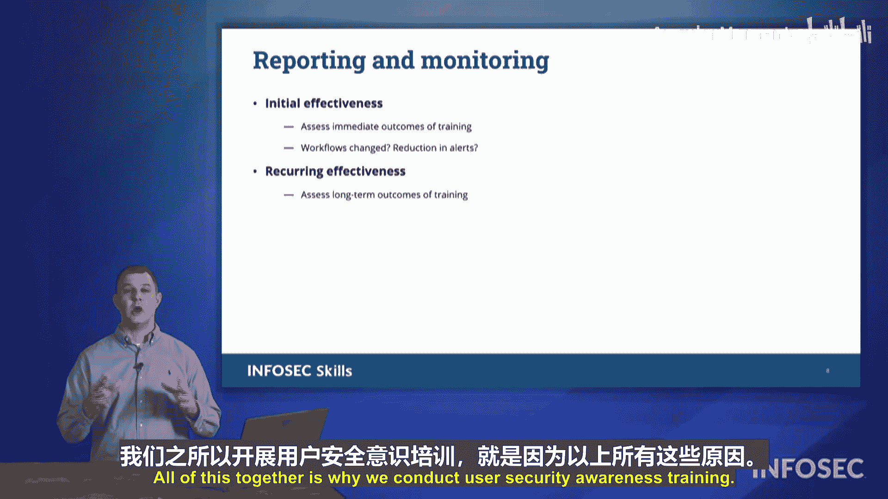

# 076：安全意识培训

在本节中，我们将探讨组织如何确保其员工和用户保持网络安全意识。我们将介绍安全意识培训所围绕的一些核心概念。

## 概述

在本节中，我们将学习为何以及如何进行网络安全意识培训。我们将了解培训的目标、常用方法以及一个系统化的培训开发模型。目标是让初学者理解如何通过有效的培训，帮助用户识别风险、避免错误，从而提升组织的整体安全水平。

## 为何进行安全意识培训

首先，我们来看看为用户开展网络安全培训的方式和原因。核心目标是让用户能够识别工作场所或网络中出现的任何异常活动。我们希望用户能够识别高风险和意外的行为，以及那些由用户无意中造成但仍可能对组织造成损害的失误。

许多组织依赖网络钓鱼意识模拟器。在InfoSec，我们拥有名为“IQ”的网络钓鱼模拟器。该工具会向员工发送模拟的钓鱼邮件。如果用户点击了过多的恶意链接，他们最终将“免费获得”一次强制培训。这就是网络钓鱼意识培训的一种方式。

## 培训形式与内容

除了模拟测试，我们还有用户指导和培训视频，例如“Workbytes”系列。这是InfoSec制作的一个视频系列。事实上，我的一位朋友即将登场，他正是这些培训视频中的明星。

（视频角色Clack登场互动环节...）

正如刚才与Clack的互动所示，在这些培训视频中，我们会共同探讨许多主题。内容包括识别内部威胁的不同方法、密码管理，当然还有社会工程学等。通过使用可关联的媒体，以轻松有趣的方式涵盖各种密码和安全主题，是开展网络安全培训的有效途径。

## 系统化培训开发：ADDIE模型

那么，我们出于多种原因开展网络安全培训。在培训他人时，我们通常会遵循一个名为**ADDIE**的开发模型。这是一个系统化的教学设计过程：

以下是ADDIE模型的五个阶段：

1.  **分析**：分析目标受众的需求。
2.  **设计**：基于分析结果，设计培训方案。
3.  **开发**：开发具体的教学材料。
4.  **实施**：实际执行并开展培训。
5.  **评估**：评估培训效果，确保达到目标。

在**实施**阶段，你需要确保培训满足用户需求，并能够影响他们的行为，留下持久的印象。

## 培训的评估与监控

进行此类培训时，必须确保对过程进行报告和监控。这意味着需要收集用户的培训日志，并确认我们旨在改变的行为确实发生了改变。

我们将衡量两种效果：
*   **初始有效性**：培训后几天或一周内，用户的行为发生了哪些变化。
*   **持续有效性**：由于网络安全培训而产生的那些长期行为改变。

## 总结

本节课中，我们一起学习了组织进行用户安全意识培训的原因和方法。我们探讨了通过模拟测试（如钓鱼演练）和多媒体内容（如培训视频）进行培训的实践。更重要的是，我们介绍了一个系统化的**ADDIE模型**（分析、设计、开发、实施、评估）来指导培训的开发与执行。最后，我们强调了通过收集日志和衡量短期与长期行为改变来评估培训效果的重要性。所有这些努力都是为了保护我们的用户，并为组织可能发生的网络安全事件做好准备。