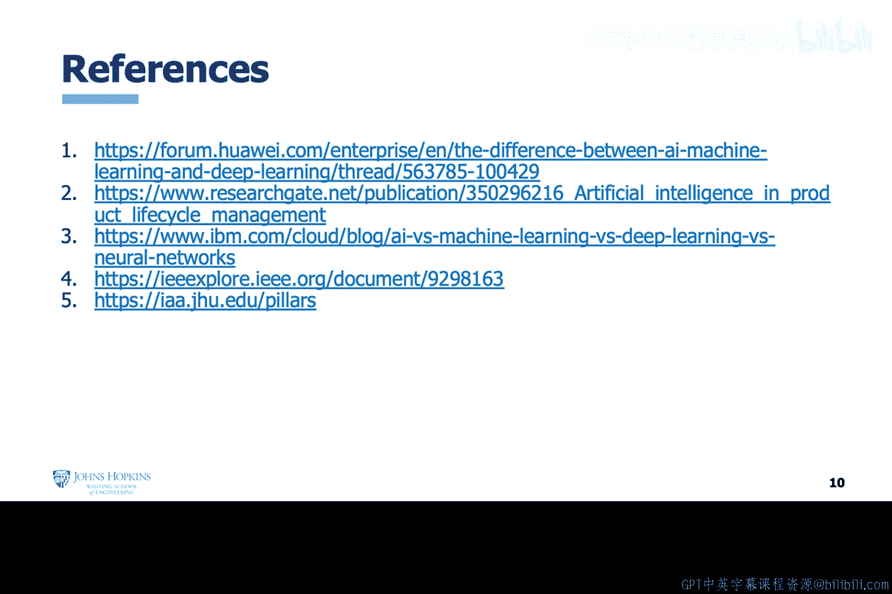

# 001：人工智能技术背景与综述 🧠

在本节课中，我们将学习人工智能的背景知识及其简要概述。我们将探讨人工智能的定义、发展历程、核心概念及其在网络安全领域的应用前景。

## 概述

人工智能是一个广泛使用的流行词，但其确切含义和起源并非人人皆知。许多人可能认为它是一个新术语，但实际上它是一个相当古老的术语。人工智能领域经历了多次兴衰周期，这些周期与政府资助密切相关。当前的人工智能复兴始于2012年左右，由一种被称为深度学习的机器学习算法所推动。

## 人工智能的定义与范畴

人工智能是一个非常广泛的领域，这导致了许多混淆。你可能会听到人工智能、机器学习或深度学习等术语被交替使用。为了理清这些概念，我们需要从宏观视角来看：人工智能是一个涵盖多种技术的广阔领域。

一般来说，人工智能可以定义为**使用计算机模拟人类智能的算法**。它可以按其应用分为几个子类：**行为**（如机器人技术）、**认知与学习**（如机器学习）以及**感知**（如自然语言处理）。其中，机器学习是目前最流行的术语，而深度学习是机器学习的一个子领域。

## 强人工智能与弱人工智能

在具体讨论机器学习之前，我们需要理解强人工智能与弱人工智能的概念。

你可能没有听说过这种区分方式，但很可能见过它们的表现形式。例如，大多数人都见过或拥有具备驾驶辅助或自动驾驶功能的汽车。虽然存在许多功能强大的驾驶辅助算法，但几乎没有哪个算法能让人完全信任其可以独立完成横跨全国的驾驶。这些都是**弱人工智能**的例子。

在电影《全面回忆》中，汽车能够载人去任何想去的地方，这是**强人工智能**的例子。而在电影《我，机器人》中，人类被禁止在高速公路上驾驶，因为自动驾驶汽车是比任何人类都更出色的驾驶员，这则是**超级人工智能**的例子。

关键点在于：**弱人工智能**是我们今天已经开发出来的技术，主要通过机器学习应用来体现。我们目前尚未开发出**强人工智能**或**超级人工智能**，这些概念主要存在于电影中。

## 聚焦机器学习

正如之前提到的，人工智能是一个广阔的研究领域，在其“认知与学习”子领域下，包含了机器学习。虽然也存在模糊逻辑等其他算法，但机器学习是目前人工智能最流行的表现形式。

这主要得益于两个因素：第一，机器学习是数据驱动的，而当前有大量数据可用于支持许多需要机器学习的领域；第二，有足够的计算能力来运行算法处理这些数据。

机器学习算法主要分为三种类型：

以下是三种主要的机器学习算法类型：

*   **监督学习**：使用**带标签的数据**来学习如何对数据进行分类。
*   **无监督学习**：根据数据的内在特征学习对数据进行分组，**不需要带标签的示例**。
*   **强化学习**：通过与数据或环境的试错交互进行学习，整个过程由一个**奖励函数或矩阵**来引导。

在本课程中，你将通过实践课程，在解决网络安全问题的背景下更深入地理解这些算法。

## 神经网络与深度学习

神经网络是一种机器学习算法，可以是监督式或无监督式的。它受到人脑生物神经网络的启发，由连接的节点层组成：一个输入层、一个输出层以及一到多个中间层（或称隐藏层）。

一种特殊版本的神经网络，其主要特征是具有多个隐藏层，被称为**深度学习**。深度学习需要**海量的数据**和**极强的计算处理能力**。近年来这两方面的增长使得深度学习变得可行。

进一步探讨深度学习，其名称来源于其**隐藏层的深度**。此外，深度学习的特点是能够**自主选择特征**。其缺点是，深度学习在很大程度上是一个“黑箱”，我们对其如何选择特征乃至如何做出决策的内在机制知之甚少。但我们知道，它在解决复杂问题的决策方面非常有效，例如在多种复杂游戏和挑战中击败人类玩家。

## 自主性与保障

讨论人工智能时不能不谈自主性。人工智能可用于开发能够在不同程度上无需人类帮助而执行特定任务的系统，这意味着存在不同级别的自主性。

有许多框架试图界定人工智能系统的自主级别与人类依赖程度之间的关系。本课程采用一个简单的框架进行说明。目前，我们已经在系统层面实现了一定程度的自主性，例如在自动驾驶汽车中，这可以称为**第2级：半自主（高级）**，也属于弱人工智能。而**第3级：完全自主系统**目前仅存在于电影中。

另一个重要议题是自主性的保障。一旦赋予系统一定程度的自主性，就必须有办法确保该系统是安全、可靠并能持续按预期运行的。这可以通过自主性保障来实现。J2自主保障研究所的框架采取了整体性视角，不仅关注技术本身，还关注与技术交互的整个生态系统，以及管理技术行为的法律和政策。

## 人工智能与网络安全问题

从这里开始，我们将触及问题的核心。首先需要明确的是：我们面临一个网络安全问题。

这个问题的根源在于，基于计算的技术被广泛应用于我们全部的16个关键基础设施部门。关键基础设施支撑着美国庞大的经济和军事实力。然而，技术的发展速度远远超过了我们保护它的能力，因此所有技术都存在被利用的漏洞。

这些漏洞之所以存在，是因为不完美的人类设计和建造了这些技术，并且在大多数情况下，这些技术通过互联网相互连接。因此，这些技术不仅存在可利用性，而且在大多数情况下是**可被远程利用的**。

更糟糕的是，我们没有足够的人类网络防御人员来保护关键基础设施中的系统。这正是人工智能可能发挥作用的地方。

在本课程中，我们将重点探讨如何利用人工智能协助一级网络安全分析师进行网络事件分类和处置。换句话说，我们的理念是，如果设计和实施得当，人类分析师应该能够将人工智能驱动的工具作为**力量倍增器**，协助他们更好地保护网络、系统、应用程序，并识别内部威胁。

## 总结

本节课我们一起学习了人工智能的背景与综述。我们明确了人工智能是一个模拟人类智能的广阔领域，经历了多次兴衰周期。我们区分了弱人工智能与强人工智能，并指出当前应用主要为弱人工智能下的机器学习。我们介绍了监督学习、无监督学习和强化学习这三种主要的机器学习类型，以及作为其特殊形式的神经网络与深度学习。最后，我们探讨了系统自主性的级别与保障问题，并指出了当前严峻的网络安全形势，以及人工智能作为力量倍增器辅助人类分析师应对挑战的潜在价值。