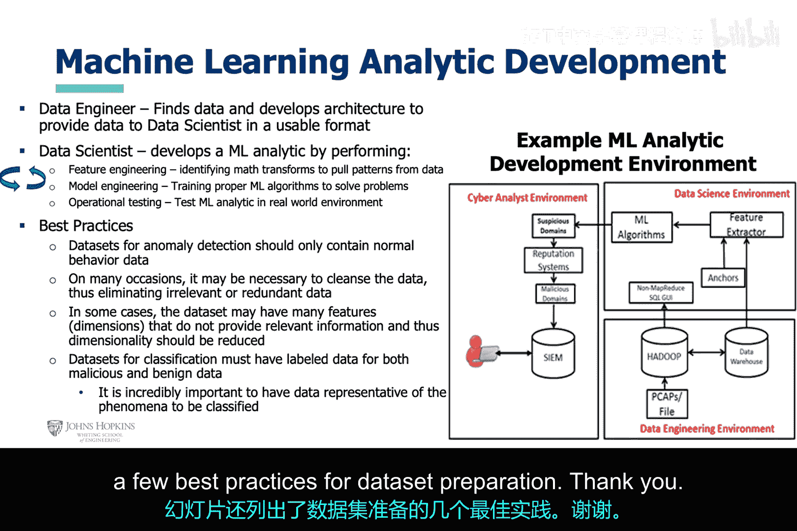
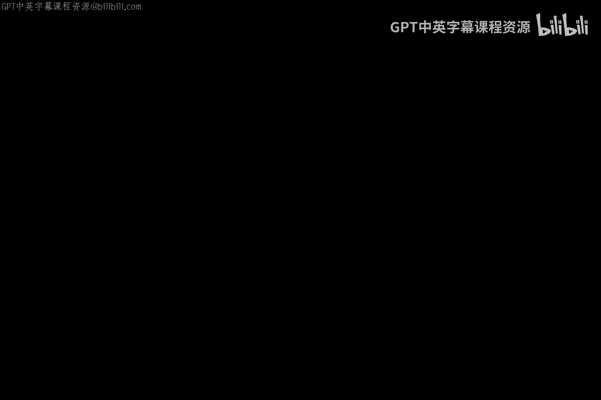

# 002：多种机器学习算法实战演练 🚀


在本节课中，我们将通过动手实践的方式，学习几种重要的机器学习算法。我们将了解监督学习、无监督学习和强化学习的基本概念，并查看它们在网络安全问题（如垃圾邮件检测、恶意软件分析）中的应用示例。课程将引导你使用提供的Jupyter Notebook环境运行代码，并理解机器学习分析的基本流程。

---

## 环境准备与代码使用说明 💻

上一节我们概述了课程内容，本节中我们来看看如何准备实践环境并正确运行代码。

你已获得一个包含Jupyter Notebook的CAI虚拟机，其中包含了我们将讨论的AI方法的运行代码。

以下是启动和运行代码的步骤：
1.  使用用户名和密码（均为 `inLauraCaseKelly`）打开虚拟机。
2.  导航至幻灯片中所示的目录。
3.  启动幻灯片中所示的Jupyter Notebook。

对于本讲座，所有代码都位于 `chapter 1` 文件夹下的 `sources` 子文件夹中，具体在 `Chapter 1 examples` notebook中。

请注意，教科书中的部分代码使用了已弃用的命令。我已进行修改以修复错误。然而，你可能仍会看到一些警告和偶尔的错误，但这不应妨碍笔记本中代码的功能。

鼓励你运行代码。为了获得最佳结果，请将代码复制到一个新的单元格中，并从新单元格运行代码。此外，在一些笔记本中，你可能会看到两个版本的代码。请始终使用第二个版本，因为第一个版本可能是教科书中的原始代码，使用了已弃用的命令。

你可能会注意到原始代码已运行并显示了结果。因此，尽量不要重新运行那些单元格，以免丢失原始代码的结果。如果你将代码复制到新的笔记本中，请确保为示例笔记本使用相同的内核版本。

---

## 监督学习算法实战 📈

上一节我们准备好了环境，本节中我们来看看监督学习算法的具体示例。这些算法通过使用带标签的数据进行训练来学习。

这些机器学习算法及其他算法可用于解决网络安全问题，例如检测垃圾邮件。为此，你需要在一个监督式机器学习算法上，使用垃圾邮件示例和合法电子邮件示例进行训练，然后在它从未见过的电子邮件上测试该算法，以确定其学习性能。

本幻灯片展示了一个线性回归监督学习算法。幻灯片左侧的代码片段说明了用于实现该算法的Python代码的主要组成部分。同时展示的还有用于训练机器学习算法的数据图，以及算法预测出的最能描述数据的最佳直线。

首先，导入几个重要的库，然后实例化一个线性回归模型并用随机线性数据对其进行训练。最后，将机器学习算法的输出可视化在训练数据之上。

这个例子说明了实例化模型、训练模型和可视化结果所需的高级步骤。

```python
# 示例：线性回归
from sklearn.linear_model import LinearRegression
import numpy as np
import matplotlib.pyplot as plt

# 生成随机数据
X = np.random.rand(100, 1) * 10
y = 2 * X + 1 + np.random.randn(100, 1)

# 实例化并训练模型
model = LinearRegression()
model.fit(X, y)

# 预测并可视化
X_new = np.array([[0], [10]])
y_predict = model.predict(X_new)
plt.scatter(X, y)
plt.plot(X_new, y_predict, "r-")
plt.show()
```

在此示例中，作者提供了一个自定义函数来绘制机器学习算法的决策空间。以下是关键步骤：

1.  在此处导入重要的Python库。
2.  作者从Python的`datasets`包创建了一个数据集。
3.  然后绘制数据集中的点。
4.  接着实例化机器学习算法并进行训练。
5.  最后，在其训练过的数据点上绘制决策空间。

---

## 无监督学习算法实战 🧩

上一节我们实践了监督学习，本节中我们转向无需标签数据的无监督学习算法。

这些机器学习算法不需要标签数据。聚类算法可以从数据中学习特征并据此对数据进行分组，而降维算法可以减少数据集中的特征。这些机器学习算法及其他算法可用于恶意软件和欺诈检测。

在本幻灯片中，作者首先使用PCA算法减少数据集中的特征，然后使用聚类算法对数据进行分组。让我们退一步看：

他做的第一件事是导入重要的库，然后从提供的CSV文件加载数据集。接着，他实例化PCA机器学习算法并将其应用于数据。PCA算法将特征从24个减少到4个。随后，实例化高斯混合聚类算法并将其应用于降维后的数据。最后，将得到的聚类分组可视化。

---

## 强化学习简介与网络安全应用 ⚡

本章作者提供了监督学习和无监督学习的动手示例，但没有提供强化学习的例子。作为补充，我添加了一张幻灯片，更详细地介绍了这种方法。然而，你需要等到后面的模块才能获得强化学习的动手示例。

本幻灯片列出了几种强化学习方法。通常，强化学习算法通过与数据集的试错交互来学习，试图从奖励矩阵中获得最高分数。奖励矩阵被设计为对算法做出正确决策给予正分，对做出错误决策给予负分。

强化学习可用于检测多态恶意软件。

---

## 机器学习分析流程与最佳实践 📊

上一节我们介绍了各类算法，本节我们来总结机器学习在网络安全中的完整分析流程。

这张幻灯片很好地总结了网络分析师开发机器学习工具所需的机器学习分析流程。

流程首先由担任数据工程师角色的网络分析师开始，即识别适当的数据并将数据存储在某种结构中，以便为下一个角色（数据科学家）以可用的形式存储数据。这可能简单到处理一个小数据集并将其保存为CSV文件，也可能复杂到建立一个集群来存储PB级数据，并必须提取出较小的部分放入数据仓库或数据集市，供数据科学家访问。

接下来，担任数据科学家角色的网络分析师需要执行机器学习分析流程，即使用数学变换从数据中提取特征模式，以输入到监督机器学习算法中。当然，无监督机器学习算法或深度学习算法可能不需要此步骤。

然后是机器学习模型开发和优化步骤。这里的工作是为数据确定合适的机器学习算法，然后训练和测试模型，直到获得最佳结果。在优化过程中，特征工程和模型工程步骤可能是一个迭代过程。

一旦获得优化模型，网络分析师应在真实环境中测试机器学习分析工具。

幻灯片还列出了数据集准备的几个最佳实践：

*   **数据清洗**：处理缺失值、异常值。
*   **特征选择/工程**：选择相关特征或创建新特征。
*   **数据标准化/归一化**：将数据缩放到共同尺度。
*   **数据集划分**：分为训练集、验证集和测试集。

---

## 总结 🎯





本节课中，我们一起学习了多种机器学习算法的实战应用。我们首先设置了Jupyter Notebook实践环境，并了解了代码运行的注意事项。接着，我们动手实践了线性回归等监督学习算法，观察了它们如何从带标签的数据中学习并进行预测。然后，我们探索了PCA降维和聚类等无监督学习算法，它们无需标签即可发现数据内在结构。此外，我们还简要介绍了强化学习的基本原理及其在网络安全（如多态恶意软件检测）中的应用潜力。最后，我们梳理了从数据准备到模型部署的完整机器学习分析流程，并总结了数据预处理的最佳实践。这些知识为运用AI解决实际的网络安全问题奠定了基础。