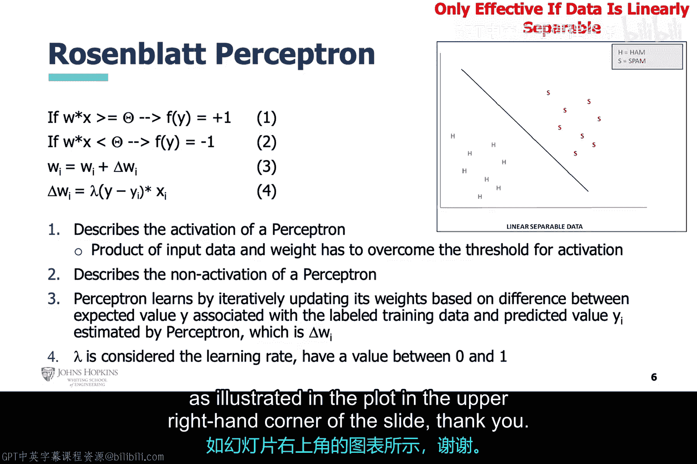

# 003：使用人工智能检测电子邮件网络威胁 📧

在本节课中，我们将学习如何利用人工智能技术来检测电子邮件中的网络威胁，特别是垃圾邮件。我们将探讨从传统规则方法到现代AI方法的演变，并深入理解感知机这一基础神经网络模型的工作原理。

## 从传统规则到人工智能的演变

上一节我们介绍了本课程的主题。本节中，我们来看看电子邮件安全这个具体的网络安全问题。

电子邮件是一个巨大的攻击面。我们每个人每天都会收到大量邮件。这为构建AI分析工具以实现自动化保护提供了完美的应用场景。

我们并非孤军奋战。最早的AI自动垃圾邮件过滤器之一是SpamAssassin。建议您自行研究以加深理解。

最初，垃圾邮件过滤器可能非常简单，由静态规则和统计分析构成。其中一些可能只追踪某些关键词。单个关键词的出现可能不足以达到判定阈值，但邮件中同时出现某些特定关键词组合，就可能达到垃圾邮件或恶意意图的阈值，如顶部表格所示。

随着垃圾邮件发送者变得更聪明，过滤器也演变为更复杂的规则。这些规则追踪关键词的频率，可能应用数学变换，然后应用阈值进行判定。随着垃圾邮件发送者进一步升级，可能需要更改关键词或重新校准阈值，就像第二个表格所示。

随着攻击者变得越来越聪明，更简单的垃圾邮件过滤器将不再有效。我们今天需要的是更动态的过滤器，这正是AI能够提供的。

## 人工智能基础：从生物神经元到感知机

现在让我们转换话题，谈谈人工智能。我们在上一个模块提到了神经网络。这里，我们将更深入一些，尝试更明确地比较人脑神经元和人工神经网络神经元。

请看并排比较图。生物神经元通过树突接收刺激，这导致细胞体发生电变化。如果来自树突的刺激足够强，产生的信号会被发送到轴突，并沿着轴突传递到轴突末梢，触发“放电”。

对于本次讨论，我们将聚焦于感知机，它是最基础的神经网络。感知机没有隐藏层，它有一个传递函数，类似于树突接收输入，应用权重，处理加权输入，然后输出到一个激活函数。激活函数应用一个阈值。

感知机迭代地分配权重，以正确分类训练数据，希望这些优化后的权重能使其在未来对未见过的数据实现高性能分类。

## 感知机：一个线性分类器

您可能没有意识到，数据科学主要是数学。然而，好处在于，在本课程中，您将保持网络安全分析师的角色，只是为了开发AI工具来解决网络安全问题而扮演数据科学家。这意味着您可以略过复杂的数学，只专注于对AI算法的高层次理解。

因此，我们可以将感知机视为一个线性分类器。这意味着它可以通过画一条直线来分类数据，类似于我们之前讨论的示例垃圾邮件过滤器。所以，我们基本上可以使用感知机来执行与我们讨论过的示例相同的垃圾邮件过滤任务。

## 感知机的学习过程

在本幻灯片中，我们重点介绍设置权重的机制。如前所述，感知机在其训练过程中迭代更新其权重。需要明确的是，这描述了感知机的学习过程：它根据训练值和预测值之间的差异迭代更新权重。本幻灯片还引入了学习率的概念，它描述了权重更新的速度。

最后，感知机仅对线性可分的数据有效，如幻灯片右上角图表所示。

## 总结

本节课中，我们一起学习了使用人工智能检测电子邮件威胁的历程。我们从传统的基于规则的垃圾邮件过滤方法开始，看到了其局限性，进而引入了基于感知机的人工智能方法。我们了解了感知机作为线性分类器的工作原理，包括其如何接收输入、应用权重、通过激活函数做出决策，并通过迭代学习优化自身。理解这些基础概念，是构建更复杂AI网络安全工具的第一步。