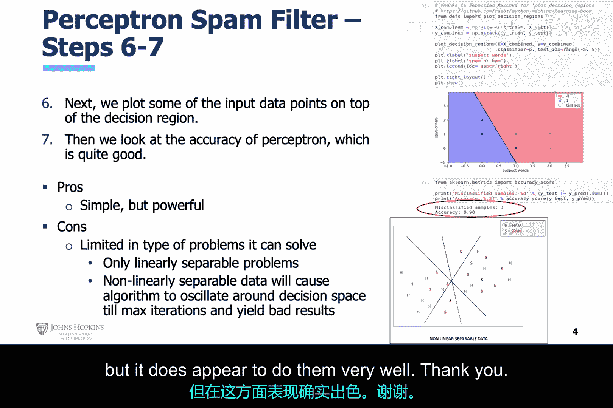

# 004：感知机神经网络垃圾邮件过滤器实例 🧠📧

在本节课中，我们将聚焦于一个实践案例：使用机器学习感知机进行垃圾邮件过滤。这是利用真实公开数据集进行垃圾邮件过滤的首次尝试。

## 数据集概览

上一节我们介绍了感知机的基本概念，本节中我们来看看如何将其应用于实际问题。首先，我们需要理解所使用的数据。

幻灯片右上角展示了公开数据集的片段。该数据集的每一行都是一条被标记为“正常邮件”（ham）或“垃圾邮件”（spam）的短信文本。

## 数据工程步骤

以下是数据准备的关键步骤，这些步骤属于机器学习分析开发流程中的数据工程环节。

1.  **关键词筛选**：我们回顾之前的简化示例，使用预设的关键词。
2.  **特征提取**：根据这些关键词过滤数据集，追踪它们在每条短信中出现的频率。
3.  **新数据集构建**：将关键词频率记录到一个新的数据集中，并保留原始的“正常邮件”或“垃圾邮件”标签。

在这张幻灯片中，执行了机器学习分析开发流程中的数据工程步骤。数据从一个CSV文件中读取，经过预处理，并创建了一个新的数据集。

## 数据科学家步骤：模型开发与训练

现在，我们进入机器学习分析开发流程中由数据科学家执行的步骤。

1.  **数据分割**：将新数据集拆分为训练集和测试集。
2.  **特征说明**：该数据集由两个特征组成，即两个关键词在每条短信中出现的频率。这些是原始特征，未经过任何数学变换。
3.  **模型实例化**：实例化感知机模型。
4.  **初始优化**：对其配置设置应用初步优化。
5.  **训练与测试**：随后训练感知机，并最终对其进行测试。至此，从实用角度出发，机器学习分析模型已经开发完成。

## 模型评估与可视化

在这张幻灯片中，数据科学家的步骤继续进行。

1.  **决策空间可视化**：将决策空间与测试数据点一同可视化。
2.  **准确性评估**：评估机器学习分析模型的准确性。该模型的准确性相当不错。

虽然可以使用更多关键指标进行评估，但我们将在课程后续部分讨论这些内容。目前，我们专注于简单的准确性指标。

我们可以显式修改模型的配置设置，尝试产生更准确的结果。但同样，为了保持简洁，我们现在将一切尽可能简化。

我们承认感知机仅限于解决线性可分的问题，但它在处理这类问题时表现得非常出色。

## 总结

本节课中，我们一起学习了如何将感知机神经网络应用于垃圾邮件过滤的实际案例。我们从数据集的介绍开始，逐步完成了数据工程、模型训练、测试以及结果可视化的全过程。尽管感知机有其局限性，但它在解决线性可分问题方面是一个强大而直观的工具。