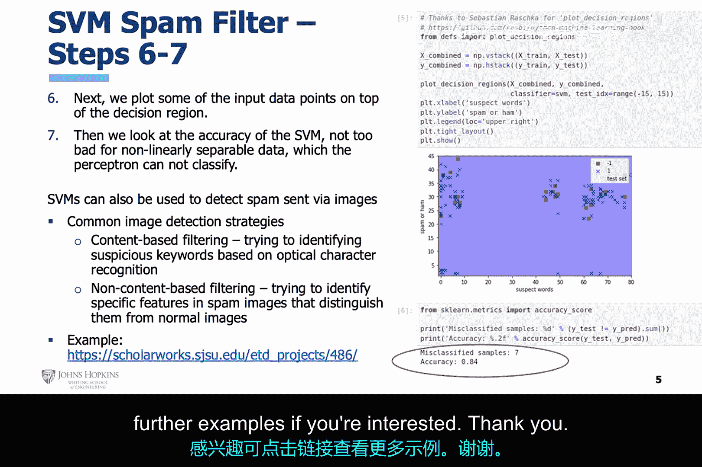

# 005：支持向量机(SVM)垃圾邮件过滤器实例 📧

在本节课中，我们将聚焦于一个实际案例：使用机器学习中的支持向量机进行垃圾邮件过滤。我们将通过一个具体的例子，了解SVM如何应用于解决非线性的分类问题。

## 概述

上一节我们介绍了感知机算法。本节中，我们来看看另一种监督学习算法——支持向量机。我们将使用与感知机相同的公开数据集，但处理一个更复杂、非线性可分的问题，以此展示SVM的强大能力。

## 支持向量机与感知机的区别

支持向量机与感知机类似，都是一种监督机器学习算法。然而，两者的目标不同。

*   **感知机**的目标是通过最小化分类错误来对数据进行分类。
*   **支持向量机**的目标则是最大化其用于分隔数据的**超平面**与离该超平面最近的训练数据点之间的距离。这个距离被称为**间隔**，而那些最近的数据点则被称为**支持向量**。

此外，支持向量机能够分类**非线性可分**的数据，这是其相较于感知机的一个关键优势。

## 项目实例：垃圾邮件过滤

这是我们尝试使用人工智能进行垃圾邮件过滤的另一个案例，使用了与感知机相同的公开数据集。

### 数据集介绍

幻灯片右上角展示了该公开数据集的一个片段。数据集的每一行都是一条短信文本，并被标记为“ham”（正常邮件）或“spam”（垃圾邮件）。

### 特征工程

这次，我们使用一组关键词（称为“可疑词”或垃圾邮件词）和中性词（正常邮件词）来构建特征。我们的评分函数不能再被建模为一个线性函数，这是一个非常重要的区别。因为由此产生的数据集不再是线性可分的，从而构成了一个感知机无法解决的、更困难的问题。

接下来，数据集会根据这组关键词及其出现频率进行筛选。这些信息被记录到一个新的数据集中，同时我们保留了原始的标签。

以下是数据工程步骤：

*   从CSV文件中读取数据。
*   对数据进行预处理。
*   创建一个包含关键词频率和标签的新数据集。

### 模型训练与测试

以下是数据科学家步骤：

*   将新数据集拆分为**训练集**和**测试集**。
*   该数据集由两个特征组成：每条短信中，预设关键词组里每个词的出现频率。这些原始特征被直接使用，没有进行任何数学变换。
*   然后，实例化支持向量机模型，并对其配置设置进行初步优化。
*   接着，使用训练集对支持向量机进行训练。
*   最后，使用测试集对模型进行评估。至此，从实用角度讲，机器学习分析模型已经开发完成。

### 结果可视化与评估

数据科学步骤继续进行：

*   对决策空间进行可视化，同时展示测试数据点。
*   评估机器学习分析模型的准确性。

考虑到这已不再是一个线性可分问题，而是一个更困难的问题，该机器学习分析模型的准确性相当不错。

当然，我们可以使用更多关键指标进行评估，但目前我们只关注**准确率**这个简单指标。同样，我们也可以迭代修改机器学习分析模型的配置设置，尝试产生更准确的结果，但为了简单起见，我们现在保持一切尽可能简单。

## 支持向量机的扩展应用

支持向量机还能够通过图像检测垃圾邮件。如果你感兴趣，可以点击链接查看更多示例。

## 总结

本节课中，我们一起学习了支持向量机在垃圾邮件过滤中的应用。我们了解到SVM通过最大化间隔来寻找最优分类超平面，并且能够处理非线性可分的数据集。通过一个实际案例，我们走过了从数据预处理、特征工程到模型训练、评估的完整流程，看到了SVM在解决更复杂分类问题上的有效性。