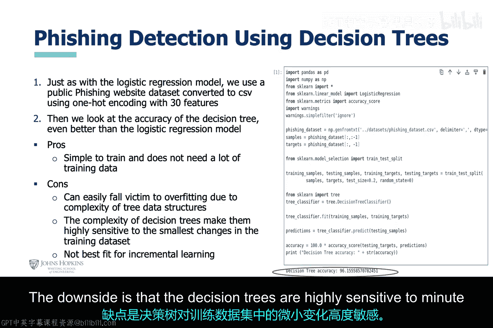

# 006：基于回归与树算法的钓鱼攻击检测 🎯

在本节课中，我们将通过一个实践案例，学习如何应用机器学习中的回归算法和决策树算法来检测钓鱼攻击。我们将从线性回归开始，逐步过渡到逻辑回归，最后探讨决策树算法，并比较它们在处理分类问题时的表现。

---

## 线性回归算法 📉

上一节我们介绍了感知机算法，本节我们来看看线性回归算法。与感知机类似，线性回归也使用特征（如关键词）来拟合一条直线，但其输出是连续值而非离散类别。

线性回归的模型可以表示为：

**公式：** `y = w1*x1 + w2*x2 + ... + wn*xn + b`

其中，`y` 是预测值，`x1, x2, ..., xn` 是特征，`w1, w2, ..., wn` 是权重，`b` 是偏置项。

我们使用与感知机案例相同的公开数据集（SMS垃圾邮件数据集）进行实验。以下是构建线性回归分析模型的主要步骤：

1.  **数据与特征工程**：筛选出预定义的关键词，并统计它们在每条短信中出现的频率。这些频率值构成了新的特征数据集，同时保留了原始的“正常邮件”或“垃圾邮件”标签。
2.  **模型工程与评估**：使用新的特征数据集训练线性回归模型，并评估其准确率。

实验结果显示，线性回归模型在此任务上的表现远不如感知机。这在意料之中，因为线性回归更适合处理连续型数据，而我们面对的是一个离散的分类问题。此外，线性回归假设特征之间相互独立，且不擅长处理分类结果，这些局限性在此案例中暴露无遗。

---

## 逻辑回归算法 🔄

鉴于线性回归在分类问题上的不足，我们转向逻辑回归算法。与线性回归预测具体数值不同，逻辑回归**估计样本属于某个类别的概率**，这使其更适用于分类任务。

逻辑回归的函数（Sigmoid函数）为：

**公式：** `P(y=1) = 1 / (1 + e^(-z))`
其中 `z = w1*x1 + w2*x2 + ... + wn*xn + b`

现在，我们使用一个新的钓鱼网站数据集来开发逻辑回归分析模型。以下是构建过程：

1.  **数据与特征工程**：我们应用**独热编码**技术，将数据集中的分类数据（如URL类型、协议类型）转换为数值型数据。处理后的数据集包含30个特征。
2.  **模型训练与测试**：将数据集划分为训练集和测试集。实例化逻辑回归模型，用训练集进行训练，并在测试集上评估性能。

该方法效果良好，成功开发出了一个可用的机器学习分析模型。然而，逻辑回归同样假设特征之间线性独立，这是其一个主要限制。

---

## 决策树算法 🌳

接下来，我们探讨决策树算法。决策树通过一系列“是/否”问题对数据进行划分，结构直观易懂。

我们使用与逻辑回归案例中**相同的、经过独热编码处理的数据集**（30个特征）来构建决策树模型。以下是关键步骤：

1.  **模型训练**：实例化决策树分类器，并使用训练数据对其进行训练。决策树会自动学习基于特征进行决策的规则。
2.  **模型评估**：在测试集上评估训练好的决策树模型。

结果表明，**决策树模型的表现甚至优于逻辑回归模型**。此外，决策树原理简单，不需要大量的训练数据。其缺点是，决策树对训练数据中的微小变化非常敏感，这可能导致生成的树结构不稳定。

---

## 总结 📝

本节课中，我们一起学习了三种机器学习算法在钓鱼攻击检测中的应用：

*   **线性回归**：因其处理连续数据的特性，在本次分类任务中表现不佳。
*   **逻辑回归**：通过估计类别概率，更适合分类问题，在此任务中取得了良好效果。
*   **决策树**：以直观的规则进行决策，在本案例中表现最佳，且模型简单易懂，但对数据细节较为敏感。

通过这个完整的流程——从数据工程、特征工程到模型工程与评估——我们实践了构建一个机器学习分析模型的全过程。理解不同算法的特性，对于在网络安全领域选择合适的AI工具至关重要。