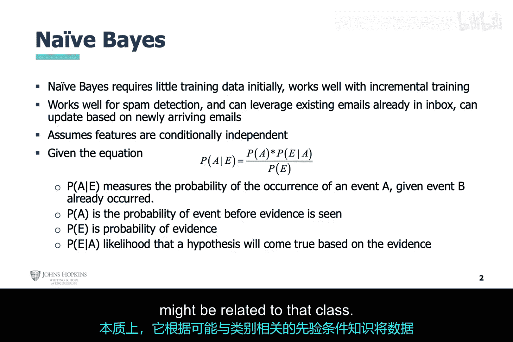
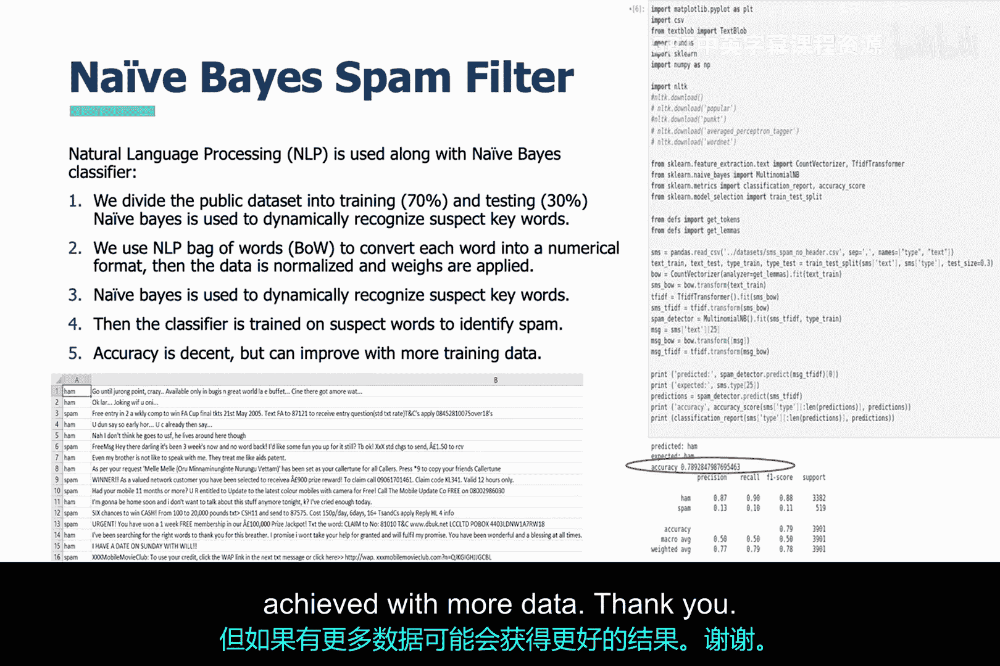

# 007：朴素贝叶斯垃圾邮件过滤器实例 📧

在本节课中，我们将学习如何利用朴素贝叶斯机器学习算法和自然语言处理技术，来构建一个垃圾邮件过滤器。我们将通过一个实际案例，了解从数据处理到模型评估的完整流程。

上一节我们介绍了机器学习在网络安全中的应用背景，本节中我们来看看一个具体的算法实例。

## 朴素贝叶斯算法简介

我们现在转向朴素贝叶斯机器学习算法。这是一种非常强大的技术，它只需要很少的训练数据。它是一个概率分类器，使用**贝叶斯定理**来对数据进行分类。其本质是基于与类别可能相关的条件的先验知识，将数据点分配到一个类别。

其核心公式可以表示为：
**P(类别|特征) = [P(特征|类别) * P(类别)] / P(特征)**

## 项目概述：基于SMS的垃圾邮件过滤

这是利用人工智能进行垃圾邮件过滤的又一次尝试，使用的是公开的SMS文本数据集。数据集的每一行都是一条SMS文本消息，并被标记为“ham”（正常邮件）或“spam”（垃圾邮件）。

以下是本项目实现的主要步骤：

1.  **数据预处理**：使用自然语言处理技术将每个单词转换为数值格式。
2.  **特征工程**：对数据进行归一化处理，并应用权重。
3.  **模型训练**：使用朴素贝叶斯算法动态识别可疑关键词。
4.  **流程执行**：在本案例中，执行了机器学习模型开发流程的所有步骤。
5.  **结果评估**：实现了数据工程、特征工程、模型工程，并获得了准确率结果。

## 结果与总结

最终得到的结果尚可。但是，如果使用更多的数据，可能会获得更好的效果。

本节课中，我们一起学习了朴素贝叶斯算法在垃圾邮件过滤中的实际应用。我们了解了从文本数据到分类模型的完整流程，包括数据转换、特征处理以及模型训练与评估。这个实例展示了如何将理论算法应用于解决一个具体的网络安全问题——信息过滤。