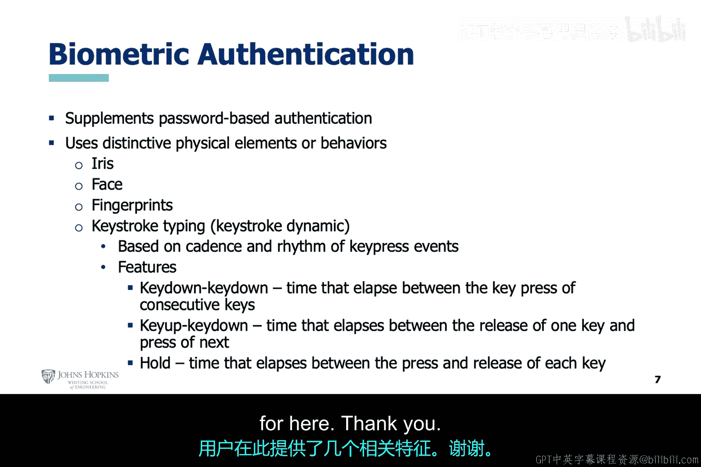

# 008：用户身份认证安全技术 🔐

在本节课中，我们将学习如何保护用户身份认证过程。我们将从垃圾邮件、恶意软件和网络威胁的话题稍作转换，聚焦于身份认证本身，并探讨为何需要加强其安全性。

## 概述：认证安全的驱动力

用户账户遭受入侵的一个主要驱动力是物联网设备的爆炸式增长。物联网设备通常内存小、计算能力有限，但具备无线互联网接入功能。这类设备不仅包括智能手机，还包括诸如Fitbits、Apple Watch、三星智能手表等可穿戴设备。这些设备的普及增加了人机交互的机会，同时也提高了未经授权用户访问的概率。

## 弱密码与单因素认证的风险

用户账户访问权限的泄露通常意味着用户账户保护薄弱，尤其是用户密码。仅使用密码这一种认证方式，是灾难的根源。存在其他更安全的选项。

以下是几种常见的增强认证方式：
*   **一次性密码**：通过短信发送到您关联的手机号。
*   **邮件验证**：发送验证链接到您账户关联的邮箱。
*   **认证器应用**：如Google Authenticator，生成动态验证码。
*   **硬件安全密钥**：如YubiKey，提供物理层面的认证。

## 识别异常行为的策略

网络安全分析师在监控托管用户账户的系统时，有多种选项来帮助识别未经授权的访问。这些方法大多围绕识别不符合人类常规行为模式的活动。

常见的异常行为指标包括：
*   **快速登录尝试**：在极短时间内多次尝试登录。
*   **快速输入不同密码**：连续尝试多个不同的密码。
*   **地理位置异常**：从用户通常不会访问的世界区域登录。
*   **设备或系统异常**：使用该用户不常用的操作系统或设备类型。

## 反应式与预测式安全策略

网络安全分析师可以采用反应式或预测式的方法来保护系统的用户账户。

**反应式策略**通常设定静态规则。例如，在多次密码尝试失败后锁定用户账户。这种策略的挑战在于，它可能因用户自身的失误而将合法用户锁在账户之外，并且统一的尝试次数阈值可能无法有效应对所有攻击场景。

**预测式策略**则更具动态性，能够纳入个体用户的行为模式，从而更有效地预测并阻止未来的攻击行为。这种策略的实现，正如您可能已经猜到的，可以借助机器学习技术。

## 机器学习在认证安全中的应用

我们已经讨论过机器学习分析模型的开发流程，因此您对开发预测性分析所涉及的步骤已有所了解。根据教材作者的经验和书中的示例，他针对不同情况提供了选用最佳机器学习算法的见解。

在模型工程阶段，作者指出了一些可用于识别虚假账户行为的潜在特征，例如：
*   **同一IP关联多个账户**。
*   **账户活动发生在极短的时间内**。

此外，作者还强调了有助于评估用户账户信誉的特征，这有助于确定用户账户的正常行为模式。监督学习的最佳实践应有助于减少误报，而无监督学习的最佳实践应有助于提高结果的准确性。

## 生物特征认证

最后，作者提到了使用生物特征进行认证。由于智能手机功能的增强，生物特征认证如今应用得越来越广泛。许多智能手机的生物特征基于面部或指纹。

还存在其他类型的生物特征，例如：
*   **步态**：即您走路的方式。
*   **击键动力学**：即您打字的方式和节奏。

## 总结

本节课中，我们一起学习了用户身份认证安全的重要性及其面临的挑战。我们探讨了物联网设备增长带来的风险、弱密码和单因素认证的局限性，以及识别异常登录行为的方法。我们比较了反应式与预测式安全策略的优劣，并了解了机器学习如何通过分析用户行为模式来实现更智能、更自适应的预测式防护。最后，我们还简要介绍了生物特征认证这一新兴且日益普及的技术。保护认证过程是构建健壮网络安全防御体系的关键一环。