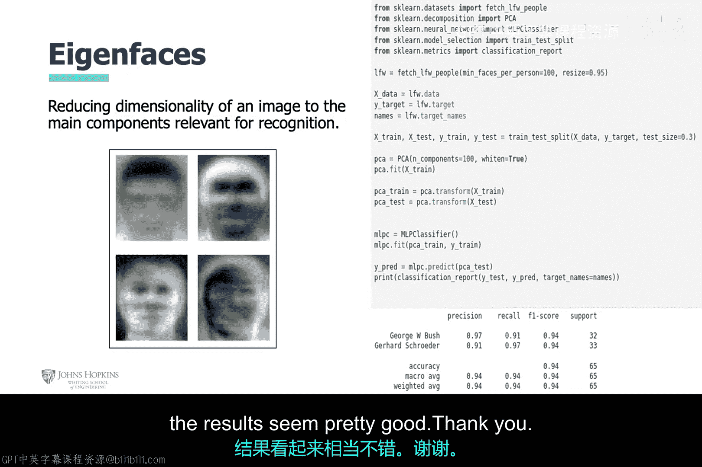

# 009：击键动力学与人脸识别生物认证 👤🔐


在本节课中，我们将学习两种基于人工智能的生物特征认证方法：击键动力学认证与人脸识别。我们将探讨它们的工作原理、实现步骤以及面临的挑战。

---

## 击键动力学认证 ⌨️

上一节我们介绍了生物特征认证的概念，本节我们来看看一种具体的行为生物特征：用户击键模式。

击键动力学认证通过分析用户打字时的节奏、按键间隔等特征来识别身份。以下是实现该认证的机器学习流程：

1.  **数据准备**：使用一个包含51名用户的公开数据集，每位用户重复输入同一密码400次。数据被划分为训练集和测试集。
2.  **特征提取**：从每次击键事件中提取超过30个特征（例如，按键之间的延迟时间）。
3.  **模型训练与测试**：将特征数据输入多种机器学习模型进行训练和测试，包括：
    *   多层感知器
    *   支持向量机
    *   K-近邻算法
4.  **性能评估**：计算每个模型的准确率。在本例中，多层感知器模型表现最佳。

> 注：示例中可能未对模型参数进行优化，仅使用了默认设置。

---

## 人脸识别认证 📸

了解了基于行为的认证后，我们转向一种更直观的生理特征认证：人脸识别。这种方法历史悠久，从通缉令到现代智能手机都在使用。

然而，使用人脸识别进行身份认证存在一些挑战：
*   长相相似的人（如双胞胎、家庭成员）可能难以区分。
*   人的面部特征会随着年龄、健康状况而变化。

为了克服这些挑战，研究人员通常专注于提取面部最独特的特征。

---

### 关键概念区分

在深入之前，我们需要区分两个术语：
*   **人脸检测**：在图像中定位人脸的位置。
*   **人脸识别**：将检测到的人脸与数据库中已知身份的人脸进行匹配或分类。本节我们关注的是**人脸识别**。

人脸图像数据维度很高（每个像素都可视为一个特征）。我们只关心其中最具区分性的特征子集。为此，我们使用**主成分分析**（PCA）这一无监督技术来降低数据维度。

---

### 主成分分析（PCA）算法

PCA算法能识别数据中的“主成分”，即数据方差最大的方向。对于人脸，这些主成分就对应最独特的特征，或称“特征脸”。

PCA的核心步骤如下：
1.  计算数据集的**协方差矩阵**。
2.  找出该协方差矩阵中最大的**特征向量**并保留。
3.  舍弃其他成分。

**方差**衡量一组数据的离散程度。**协方差**衡量两个变量之间的线性关系。**协方差矩阵**则包含了数据集中所有维度两两之间的协方差值。

以下是一个用Python计算协方差矩阵的简单示例：
```python
import numpy as np
# 示例数据
data = np.array([[1, 2], [3, 4], [5, 6]])
# 计算协方差矩阵，每行代表一个特征，每列代表一个样本
cov_matrix = np.cov(data, rowvar=True)
print(cov_matrix)
```

---

### 从PCA到特征脸

PCA的数学基础是线性代数中的特征向量与特征值。协方差矩阵的特征向量指向数据变化最大的方向（主成分），对应的特征值表示该方向上的方差大小。

“特征脸”方法就是将所有人脸图像通过PCA转换后，得到的一组代表所有人脸共同变化模式的基础图像。任何一张人脸都可以表示为这些“特征脸”的线性组合。

---

### 人脸识别系统开发流程

现在，我们将上述概念整合到一个人脸识别系统的开发流程中：

1.  **数据加载**：使用`sklearn`库中的`fetch_lfw_people`函数加载公开的“Labeled Faces in the Wild”人脸数据集子集。
2.  **数据划分**：将数据分为训练集和测试集。
3.  **特征工程**：应用PCA算法从人脸图像中提取“特征脸”。这些特征脸将作为新的、降维后的特征。
4.  **模型训练**：将PCA提取的特征输入一个分类器（如多层感知器）进行训练。
5.  **评估**：根据准确率等指标评估模型性能。基于PCA和简单分类器的组合通常能取得不错的效果。

---

## 总结 🎯

本节课我们一起学习了两种AI驱动的生物特征认证技术。
*   首先，我们探讨了**击键动力学认证**，它通过分析用户的打字模式来识别身份，并走过了从数据准备到模型评估的标准机器学习流程。
*   接着，我们深入研究了**人脸识别认证**。我们区分了人脸检测与识别，介绍了使用PCA算法提取“特征脸”以捕获面部独特特征的核心思想，并概述了构建一个人脸识别系统的完整步骤。



这两种技术展示了AI如何将行为模式和生理特征转化为强大的安全认证手段。