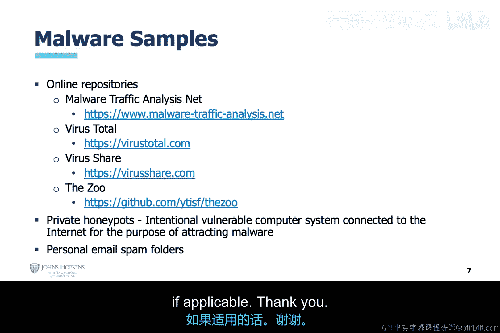

# 010：利用人工智能检测恶意软件威胁

在本节课中，我们将学习恶意软件的基础知识以及用于检测和分析恶意软件的基本工具。我们将探讨传统检测方法的局限性，并了解人工智能技术如何作为纵深防御策略的一部分，增强网络安全防护能力。

## 概述：恶意软件与纵深防御

上一节我们介绍了网络安全的基本挑战，本节中我们来看看针对恶意软件威胁的防御策略。

我们对抗网络威胁的最佳策略是**纵深防御**。这意味着部署多层不同类型的安全措施，而非依赖单一技术。

基于签名的恶意软件检测方法，由于攻击者技术的进步，其有效性已降低。但这仅是众多方法之一。尽管不如过去有效，基于签名的检测在防御已知威胁方面仍有其价值，不应完全抛弃。

在本课程中你将遇到的、基于人工智能的更强大技术，也应作为纵深防御解决方案中的一层。例如基于异常的检测和自主网络安全。将这三类技术结合使用，能构建更强大的防御态势。

## 机器学习在网络安全中的角色

现在，让我们更具体地讨论机器学习应如何协助网络安全分析师。

如前所述，机器学习应协助**一级分析师**，他们是人类防御的第一道防线。由于恶意软件威胁的数量和种类激增，这对人类分析师而言可能是一项繁重的工作。如果机器学习技术能帮助分析师更明显地识别威胁，那么这道防线将得到加强。

## 恶意软件攻击阶段与检测位置

恶意软件攻击的第一阶段通常是主机文件系统。在恶意软件于整个网络扩散之前，在初始主机上检测到它是理想情况。

网络安全分析师用于恶意软件检测的基本工具分为两类：
*   **静态分析工具**：用于检查处于静止状态的恶意软件。
*   **动态分析工具**：用于检查正在执行的恶意软件。

## 常见恶意软件类型

以下是几种常见的恶意软件类型：

*   **木马**：伪装成合法应用程序，但在用户最意想不到的时候进行恶意行为。
*   **僵尸网络**：由一组被称为“僵尸”的受控计算机组成，完全由命令与控制计算机控制，而这些计算机又由被称为“僵尸牧人”的人类控制。
*   **下载器**：用于下载其他恶意软件的恶意软件。木马和僵尸网络可能通过下载器传播。
*   **Rootkit**：渗透到操作系统之下的恶意软件，以实现持久驻留。
*   **勒索软件**：其首要目标是找到重要信息并加密，希望系统所有者支付赎金以重新获得文件访问权限。
*   **高级持续性威胁**：这是恶意软件的终极形式，拥有自己的生命周期。它很可能利用**零日漏洞**（即无人知晓的漏洞，甚至硬件/软件供应商也不知道）来入侵计算机。这类恶意软件最终可能达成其目标，因为它们通常有国家支持的黑客作为后盾。

## 恶意软件分析工具

本幻灯片列出了其他类型的恶意软件分析工具。其中一些是静态分析工具，一些是动态分析工具。另一些则是帮助逆向工程或解除恶意软件作者为躲避检测工具而应用的混淆技术的工具。

接下来，我们将更深入地探讨静态恶意软件分析的概念，并查看检查恶意软件代码的基本和高级策略。

## 动态恶意软件分析基础

在深入动态分析之前，我们首先需要引入系统和网络监控的概念，这为动态恶意软件分析提供了支持。

我们将了解执行动态恶意软件分析的高级步骤，以及恶意软件作者为帮助其软件躲避检测而采取的防护方法。

## 恶意软件样本来源

本幻灯片揭示了寻找恶意软件样本的位置。我曾多次使用VirusTotal。该公司允许教授和学生为研究目的有限访问其档案。我也曾帮助学生建立蜜罐来吸引和研究恶意软件。其他资料库看起来也很有趣。这些都将是你获取恶意软件样本用于作业或课程项目的绝佳来源。

## 总结

本节课中，我们一起学习了恶意软件的基本概念、常见类型以及用于检测和分析的静态与动态工具。我们认识到，单一的签名检测方法已不足够，需要结合基于异常的检测和人工智能技术，构建多层次的纵深防御体系。机器学习能够有效协助一线分析师，提升威胁检测与响应的效率。最后，我们还了解了一些获取恶意软件样本用于研究的公开资源。