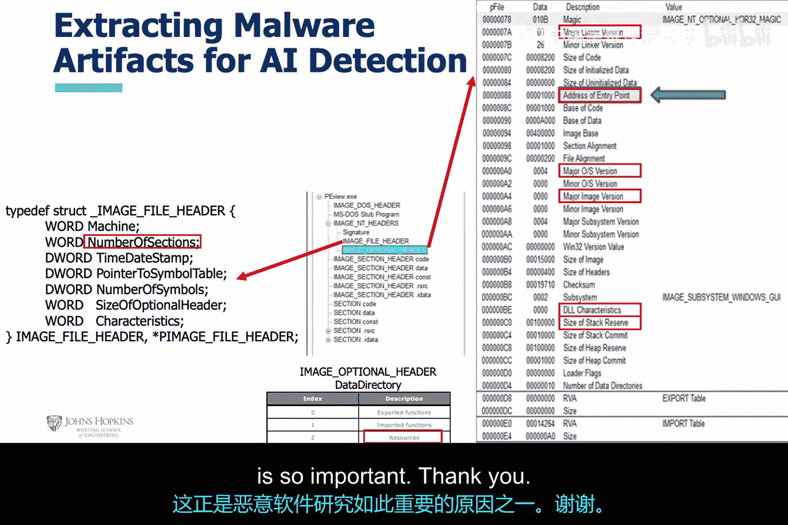

# 011：针对Windows操作系统的恶意软件分析 🔍

在本节课中，我们将要学习分析基于Windows的恶意软件的基本方法。我们将从介绍可移植可执行文件格式开始，并探讨如何利用其结构信息作为机器学习算法的特征，以区分合法文件与恶意软件。

## 引入PE文件格式 📁

上一节我们介绍了课程主题，本节中我们来看看分析Windows恶意软件的基础——可移植可执行文件格式。

可移植可执行文件格式是Windows操作系统中可执行文件的标准格式。我们同时引入PEView工具，这是一个用于可视化PE结构的基本工具。

PE文件可以分解为多个主要部分，包括PE文件头、节表和节数据。这些部分被封装在WIN头部结构中，具体包含MS-DOS头部、PE签名、映像文件头和可选头部。

## 使用PEView分析文件结构 🛠️

上一节我们介绍了PE文件的基本结构，本节中我们来看看如何使用PEView工具具体查看这些信息。

这张幻灯片展示了PEView对某个Windows文件的可视化结果。请注意，PEView屏幕左侧枚举了PE节的详细信息。这些信息及其内容是机器学习算法潜在的良好特征来源。

因此，在我们讨论这些信息时，请记住我们正是为此而关注它们。所有这些信息都是很好的特征，可供机器学习算法学习合法文件与恶意软件之间的差异。

## 深入解析PE头部信息 🧩

上一节我们看到了PEView的整体视图，本节中我们聚焦于PEView枚举出的具体PE节。

这张幻灯片重点展示了MS-DOS头部、DOS Stub和PE头部，并提供了关于这两类信息的基本说明。这些同样是机器学习算法非常具有潜力的特征。

这张幻灯片聚焦于映像可选头部以及入口点地址的位置。这些信息也可能成为机器学习算法非常有用的特征。

## 导入表与导出表的作用 📊

上一节我们分析了头部信息，本节中我们来看看PE文件中另一个关键部分——导入表和导出表。

这张幻灯片展示了关于导入表和导出表的信息。从历史上看，合法文件和恶意软件在使用这些表的方式上存在显著差异。

正如之前所述，通过将此类信息视为特征，机器学习算法能够学会区分合法文件与恶意软件。

## 特征选择的重要性与挑战 ⚖️

上一节我们讨论了导入/导出表等具体特征，本节中我们来总结一下特征选择的核心观点。

这张幻灯片总结了我贯穿本讲座一直试图阐明的一个观点：存在一些特定的PE文件节，合法文件和恶意软件对它们的使用方式截然不同。正是这些特定的PE文件节构成了非常优秀的特征。

这一点对于某些特定的PE文件节是成立的，而其他一些节则被合法文件和恶意软件以大致相同的方式使用。将这些类型的PE文件节用作特征并没有太大帮助，因为它们无助于区分恶意软件和合法文件。这些信息很可能是通过恶意软件研究人员进行恶意软件分析并观察这些差异而实验确定的。

新的恶意软件完全有可能利用不同的PE节表现出不同的行为，这就需要恶意软件研究人员去重新描述其特征。这也是恶意软件研究如此重要的原因之一。

## 总结 📝

本节课中我们一起学习了分析Windows恶意软件的基本方法。我们从介绍PE文件格式和PEView工具开始，详细探讨了如何将PE文件的不同部分（如头部、可选头部、导入/导出表以及特定节）的信息提取为特征，并解释了为什么某些特征能有效帮助机器学习算法区分恶意软件与合法文件，而另一些则不能。理解这些基础是应用人工智能技术进行网络安全分析的关键第一步。