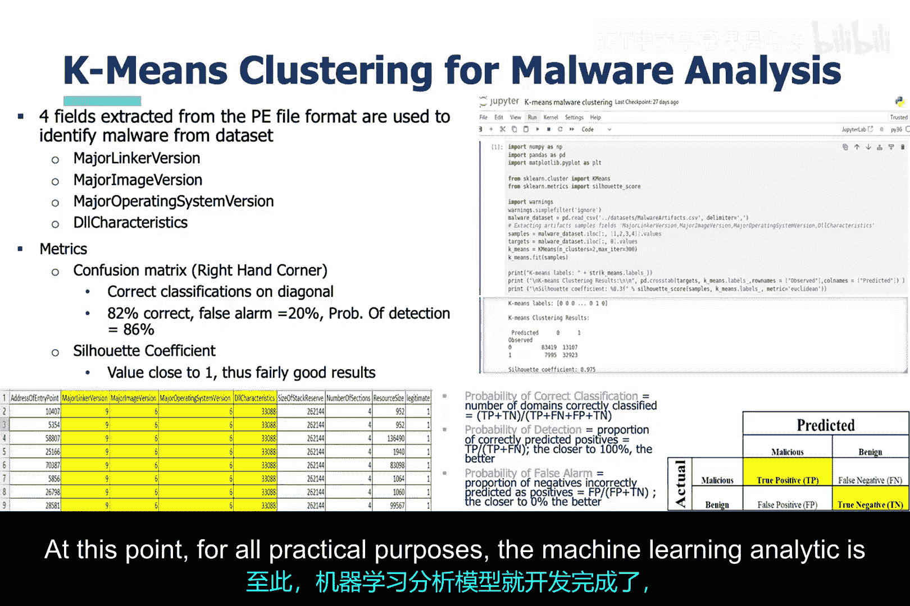

# 012：基于聚类和决策树的恶意软件威胁检测 🛡️

在本节课中，我们将运用之前恶意软件分析讲座中讨论的知识，来开发用于检测恶意软件的机器学习分析模型。我们将首先探讨无监督学习如何用于恶意软件检测，然后介绍一种具体的聚类算法，最后对比介绍有监督的决策树方法。

## 无监督学习与恶意软件检测

上一节我们回顾了恶意软件分析的基础，本节中我们来看看如何利用无监督机器学习来检测恶意软件。

使用无监督机器学习的一个核心理由是，某些恶意软件（如多态恶意软件）能够改变自身。因此，对于这类恶意软件，必须找出它无法改变或通常不会改变的自身特征，并专注于这些特征。

无监督机器学习不依赖于样本数据进行学习。这意味着你无需向算法提供任何示例标签。无监督机器学习基于恶意软件的某些**内在特征**进行学习，并可以根据这些特征对文件进行分组。因此，期望是合适的无监督机器学习算法能够将恶意软件与恶意软件分在一组，将合法文件与合法文件分在一组。

在本案例中，我们专注于**聚类**方法。聚类主要利用文件特征之间的距离对它们进行分类。

以下是三种常用的距离度量方式：
*   **欧几里得距离**：`distance = sqrt((x2-x1)² + (y2-y1)²)`，即两点间的直线距离。
*   **曼哈顿距离**：`distance = |x2-x1| + |y2-y1|`，即沿轴移动的网格距离。
*   **切比雪夫距离**：`distance = max(|x2-x1|, |y2-y1|)`，即各维度坐标差绝对值的最大值。

## 聚类算法简介

存在多种类型的聚类算法，有些甚至是有监督的。一种有监督的聚类算法是**K近邻算法**。用户指定聚类数量K，算法根据数据点与测试数据的接近程度进行分组。

其他算法则是无监督的，各有其特点。本幻灯片强调了一个可用于评估聚类算法效果的指标。该指标本质上测试每个聚类内部点的紧密程度、与其他聚类点的远离程度，以及所使用的聚类数量是否合适。

对于具体实现，我们将重点介绍 **K均值聚类算法**。

## K均值聚类算法详解

上一节我们介绍了聚类的概念，本节中我们来深入了解K均值算法。

K均值聚类算法是一种无监督机器学习算法。用户选择聚类数量K，算法根据数据点之间的相似性（基本上是欧几里得距离）将数据点分配到各个聚类中。

从机制上讲，算法首先在特征空间中随机选择每个聚类的初始位置。**特征空间**是所有变量或特征存在的n维空间。然后，算法使用**质心**（即聚类中心）的概念，将数据分配到各个聚类中。接着，更新聚类的位置，以确保质心尽可能地位于每个聚类组点的中心。

这种机器学习算法的优点是极其简单，并且能很好地处理大量数据。但它不适用于特征数量庞大的数据。此外，你可能需要大量探索数据集才能恰当地选择K值。

## 无监督学习恶意软件分析实现

现在，我们来看看作者的无监督机器学习聚类恶意软件分析实现。

幻灯片中列出的四个特征来自PE文件的**映像可选头**。幻灯片中还涵盖了混淆矩阵及其内容的定义。

以下是三个关键的机器学习分析指标：
*   **正确分类概率**：衡量分析模型对测试数据集的整体分类效果。
*   **检测概率**：衡量分析模型识别恶意软件的能力。
*   **误报概率**：衡量分析模型声称检测到恶意软件但实际并未发生的频率。

此外，还有**轮廓系数**，这是机器学习聚类算法特有的指标，用于衡量聚类算法在选择聚类位置和正确分配数据到聚类方面的效果。

最后是分析模型本身，如幻灯片右上角所示。数据科学家执行了机器学习分析开发过程的步骤。在无监督机器学习中，不需要训练阶段。

之前提到的四个特征是从一个更大的数据集中提取的，幻灯片左下角展示了一个摘录。这些原始特征被直接使用，未应用任何数学变换。然后实例化K均值算法，对其配置设置应用初始优化，并计算轮廓系数以产生结果。至此，就我们的实际目的而言，机器学习分析模型就开发完成了。

## 有监督决策树算法

与上一节讨论的无监督机器学习聚类算法形成对比，本节我们讨论有监督决策树机器学习算法的实现。

决策树基于 **if-then-else语句** 进行决策。本幻灯片还展示了用于调整和评估决策树所做决策的性能参数和指标。

作者仅使用了PE文件映像可选头中的两个特征来确定决策树分析模型。这些原始特征被直接使用，未应用任何数学变换。接下来，数据被拆分为训练数据集和测试数据集。然后实例化决策树算法，对其配置设置应用初始优化。性能调优在此处完成并产生结果。

## 总结

本节课中，我们一起学习了如何应用机器学习进行恶意软件威胁检测。我们探讨了无监督的K均值聚类算法，它通过计算特征距离来分组文件，适用于发现恶意软件的固有模式。同时，我们也介绍了有监督的决策树算法，它通过if-then规则从标记数据中学习并进行分类。两种方法各有适用场景，为构建有效的恶意软件检测系统提供了基础工具。