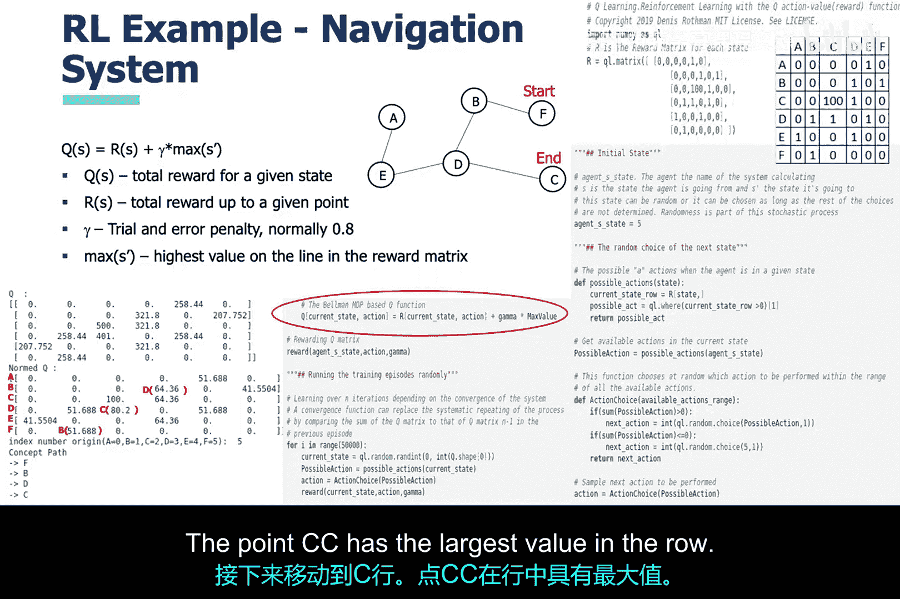

# 013：变形恶意软件检测技术 🛡️

在本节课中，我们将继续探讨网络安全与恶意软件的话题。我们将重点介绍**变形**与**多态**恶意软件，以及可用于检测和创建这类恶意软件的人工智能工具。

## 恶意软件的演变

上一节我们介绍了恶意软件的基本概念，本节中我们来看看其演变过程。在网络安全领域，防御者与攻击者之间的关系是一场持续的军备竞赛。防御者首先部署防护措施，攻击者则设法规避这些措施，随后防御者再次升级防御。这种循环似乎永无止境。

多态恶意软件是攻击者为隐藏恶意代码、伪装成良性应用程序而开发的工具。它最初使用加密技术来隐藏自身，给防御者带来了挑战。然而，当防御者找到应对方法后，攻击者又推出了**变形恶意软件**。这种恶意软件在每次执行时都会**重写自身代码**，而不仅仅是加密，这使得检测变得更加困难。

## 检测策略

了解了多态与变形恶意软件的基本特性后，现在我们来探讨网络分析师的检测策略。

一种检测多态恶意软件的简单方法是等待其自行解密，然后查找恶意软件的特征签名。但恶意软件通常不会在实施恶意行为前轻易暴露自己。因此，我们需要将可疑文件置于受控环境（如沙箱）中，允许其解密，然后再进行特征分析。

检测变形恶意软件则更具挑战性。我们需要通过捕获其指令流逻辑来分析其行为，判断应用程序是否在自我重写。这种方法存在一些问题，例如**误报率高**且**计算密集**。这时，机器学习可以提供帮助。

## 人工智能的作用

人工智能既可用于检测，也可能被用于扩散变形恶意软件。

一种有前景的检测方法是使用**隐马尔可夫模型**来学习恶意软件的**操作码序列**（即指令的逻辑流），并将可疑文件的模型与已知恶意软件的隐马尔可夫模型进行比较。如果相似概率很高，则该文件很可能是恶意软件。

另一方面，恶意软件编写者未来可能会利用**强化学习**等人工智能技术，使恶意软件能够自我修改以规避检测。强化学习的核心是学习在环境中采取**最优行为**以获取**最大奖励**，其数学框架是**马尔可夫决策过程**。

## 深入理解隐马尔可夫模型

首先，**马尔可夫过程**是一个基于预定概率改变状态的随机过程，其所有状态都是可观察的。相比之下，**隐马尔可夫模型**包含一些无法直接观察的隐藏状态。

我们通过一个简单的“抽球问题”例子来理解。有三个隐藏的瓮，每个瓮里有已知比例的不同颜色的球。随机从一个瓮中抽取球并记录颜色序列，但隐藏了是从哪个瓮抽取的。由于当前选择的瓮不依赖于之前的选择，且瓮的状态不可直接观察，这便构成了一个隐马尔可夫过程。因此，我们只能通过概率来推断瓮的选择序列。

## 隐马尔可夫模型实现示例

以下示例模拟了一个基本的计算机应用程序指令调用序列，类似于使用隐马尔可夫模型识别变形恶意软件的原理。

*   **隐藏状态**：`M`（恶意指令）和 `L`（合法指令）。
*   **可观察状态**：`W`（计算机正常工作）和 `N`（计算机不工作）。

问题的核心是一台处理指令的计算机，其运行状态取决于执行的指令。模型的关键部分对应于**初始状态矩阵**、**状态转移矩阵**和**发射矩阵**。在实际分析中，这些矩阵如同特征，用于训练模型。模型最终会输出观察到特定序列的概率，以及最可能产生该观察序列的隐藏状态序列。

## 强化学习详解

在深入探讨之前，需要重申强化学习可能被恶意软件作者用来构建规避检测的恶意软件，这也是在此介绍它的原因。

如前所述，强化学习可以通过**马尔可夫决策过程**实现，并使用**贝尔曼方程**来计算在特定环境或行为交互下获得的奖励。

以下是一个导航系统的例子：用户从节点 `F` 出发，希望到达节点 `C`。系统使用强化学习随机选择下一个节点，试图最大化其奖励。如果实现正确，系统将引导用户到达能提供最大奖励的节点 `C`。

## 强化学习导航系统实现

我们使用马尔可夫决策过程实现这个导航系统，并用贝尔曼方程计算奖励（在代码片段中用红色圆圈标出）。

首先看道路图。导航系统必须规划路线，用户从 `F` 出发，需要导航到 `C`。

接下来看奖励矩阵。矩阵中，任意两个相连的节点之间值为 `1`，不相连的节点之间值为 `0`。但目标节点 `C` 的奖励值被设为 `100`，这是用户和导航系统都希望到达的终极奖励点。

经过 50000 次迭代后，奖励矩阵的值发生了变化。此时，算法应已通过试错学会了最有利的路径，这也应是用户希望到达的路径。在左下角，可以看到强化学习导航系统选择的路径，这与更新后的奖励矩阵内容相符。

以下是路径选择过程的解读：
1.  从 `F` 行开始，值最大的列是 `E`，对应路径 `F -> E`。
2.  移动到 `E` 行，值最大的列是 `B`，对应路径 `E -> B`。
3.  移动到 `B` 行，值最大的列是 `D`，对应路径 `B -> D`。
4.  移动到 `D` 行，值最大的列是 `C`，对应路径 `D -> C`。
5.  最终到达 `C`。

虽然这不是一个恶意软件的例子，但希望能帮助你更好地理解强化学习。关于强化学习如何用于规避恶意软件检测，我们将在后续课程中探讨。

## 总结

本节课中，我们一起学习了：
1.  **变形与多态恶意软件**的演变及其对网络安全构成的挑战。
2.  针对这类恶意软件的**传统检测策略**及其局限性。
3.  **人工智能**，特别是**隐马尔可夫模型**在检测变形恶意软件中的应用原理。
4.  **强化学习**的基本概念及其通过**马尔可夫决策过程**和**贝尔曼方程**的实现方式，并认识到它可能被用于增强恶意软件的规避能力。

理解这些概念对于开发更智能的网络安全防御工具至关重要。