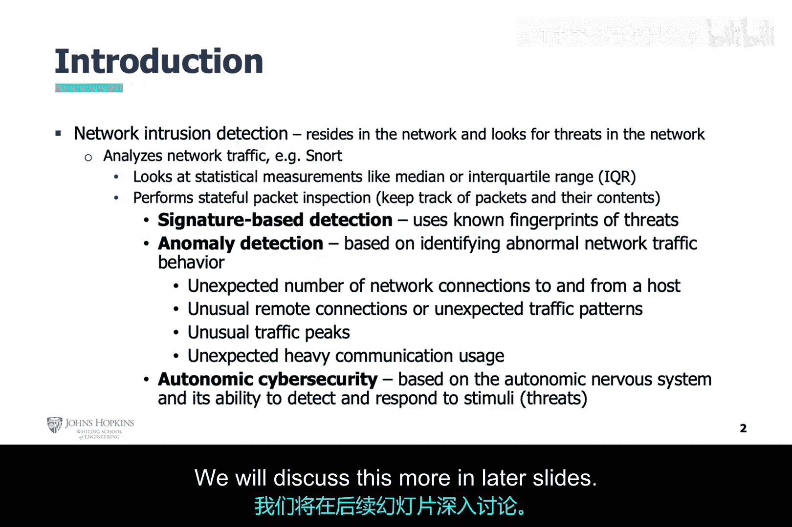
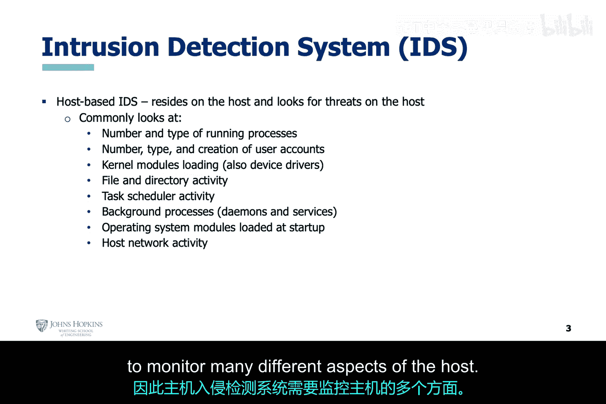
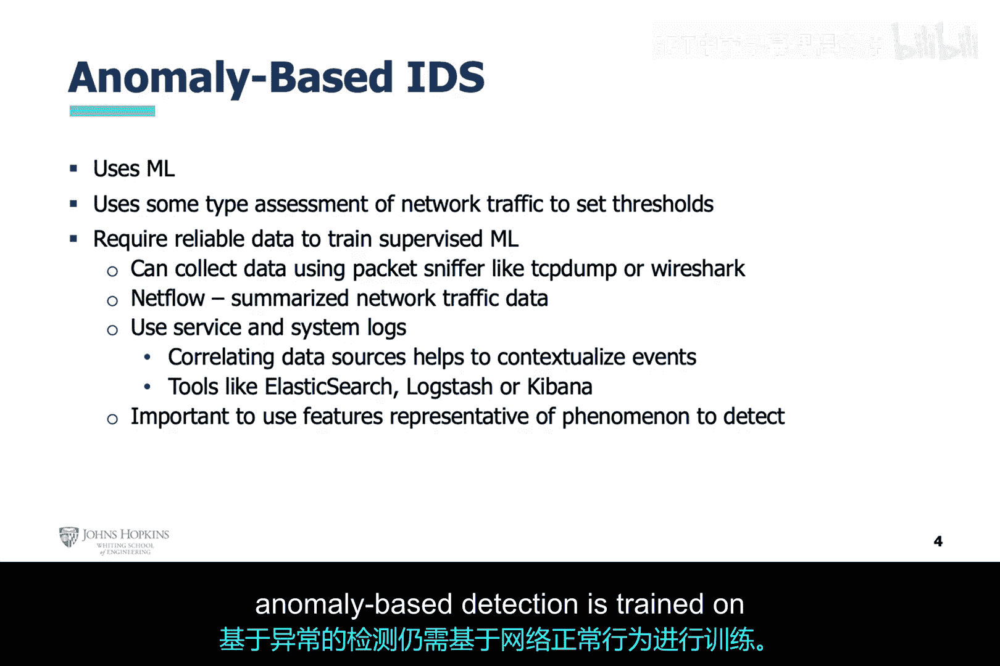
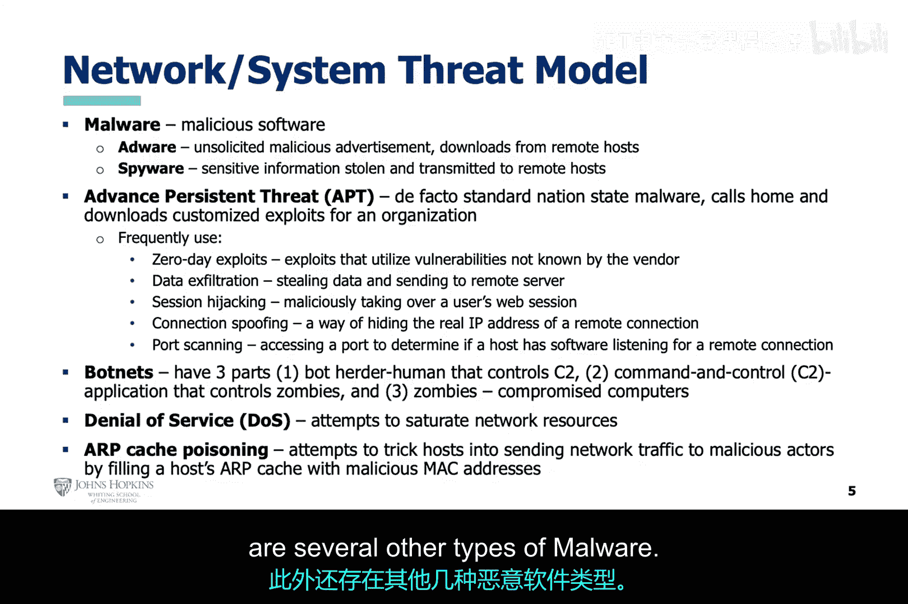
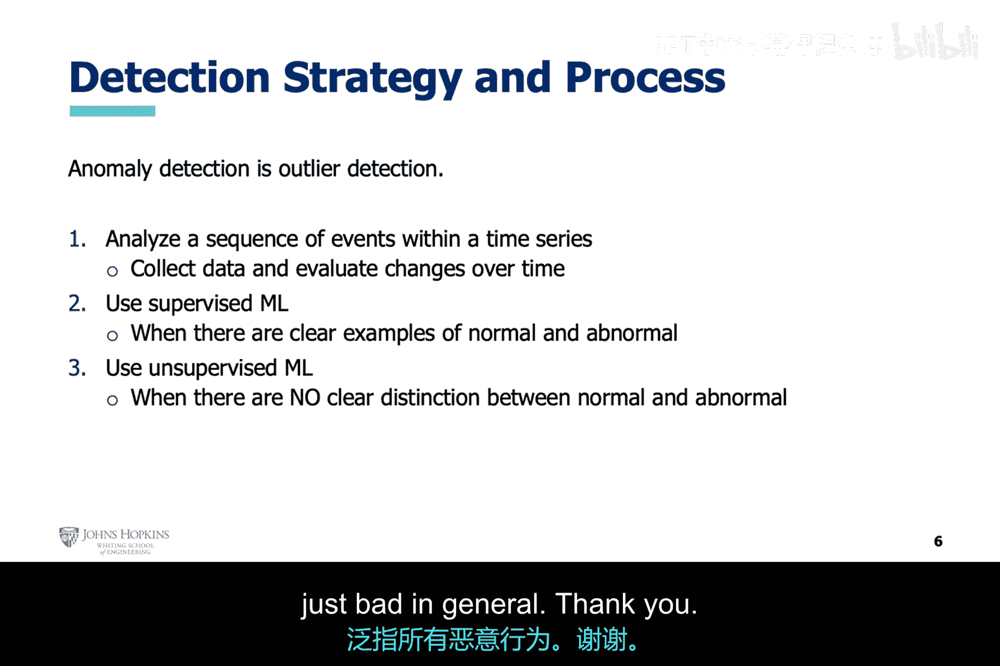

# 014：网络异常行为检测 🛡️

在本节课中，我们将学习网络异常行为检测的背景知识、核心概念以及实现策略。我们将探讨为何需要异常检测，以及如何利用机器学习技术来识别网络中的可疑活动。

## 概述

在之前的课程中我们提到，网络安全问题源于关键基础设施所依赖的、由人类生产并充满缺陷的软硬件系统。这些系统通过网络互联，使得攻击者可以远程利用这些缺陷。这一背景为我们描绘了当前所面临的网络安全环境。

## 为何需要异常检测

上述背景有助于解释为何需要异常检测。从本页幻灯片开始，我们将讨论入侵检测，特别是网络入侵检测。这引出了关于特征检测、异常检测以及自主网络安全的讨论。

目前，网络防御者与攻击者之间正在进行一场“军备竞赛”。由于高级恶意软件的出现，传统的特征检测已几乎失效。在我看来，异常检测是目前前景广阔的技术，而自主网络安全则是未来的方向。尽管这不是一个新范式，但我相信人工智能的必要进步才刚刚开始，这将使该技术的真正潜力得以展现。我们将在后续幻灯片中进一步讨论。

## 主机入侵检测

上一节我们讨论了入侵检测的主题，本节我们将重点关注终端系统或主机系统中的入侵检测。

主机系统通常由硬件（如CPU、内存和文件系统）、软件（如操作系统和运行中的应用程序）以及其他半硬件或半软件组件（当然也包括网络接口）组成。因此，恶意软件在主机中有许多可以藏身的地方。所以，主机入侵检测系统需要监控主机的许多不同方面。

既然我们目前认为基于异常的检测技术前景广阔，让我们再多讨论一些。当然，它是一种机器学习检测方案，但也有其简单的一面。

## 异常检测的核心思想

与试图学习恶意软件的复杂行为不同，异常检测旨在基于网络“无聊的”正常行为进行训练。然而，这说起来容易做起来难，因为网络所有者实际上很难观察到他们希望看到的、网络真正的正常行为。大多数时候，他们无法确定网络是否已经以某种方式被攻破。

因此，出于实际目的，基于异常的检测是在网络的正常行为上进行训练的。

## 我们面临的威胁

现在，让我们进一步讨论那些我们非常害怕的外部威胁。攻击者是存在的，并且可以以恶意软件的形式出现，这些软件可以进入计算机网络和我们的终端用户系统。

恶意软件本质上是恶意软件，其危害程度从“坏”到“更坏”不等。在“坏”的一端，例如广告软件和间谍软件，它们分别通过试图向你推销产品或窃取你的个人信息来烦扰你。在“更坏”甚至“可怕”的一端，是高级持续性威胁（APT）。这是攻击者的终极体现。

它们之所以如此危险，是因为这种形式的恶意软件很可能代表某个外国政府，并拥有相应的资金支持。这类恶意软件非常恶劣，它有自己的生命周期，充满了各种恶意活动。只要有足够的时间，它很可能会击败我们所有的防御方法。其主要原因是，它很可能包含针对你的网络或终端用户系统的零日漏洞利用，最终会像开罐器一样打开你的系统，因为你甚至供应商都不知道你的系统存在它将要利用的漏洞，因此得名“零日”。在这两者之间，还存在其他几种类型的恶意软件。

## 网络入侵检测策略与流程

现在，让我们讨论一种用于检测网络入侵的潜在策略及相关流程。首先，让我们重温我们策略的主要主题，即异常检测。

重申一下，我们的目标不是检测特定类型的威胁或恶意软件，而是识别我们的网络或终端用户系统的行为何时超出了我们通常预期的范围。关键在于，我们能够在拥有“真实情况”证明网络行为正常时，收集网络或系统数据。这将形成一个行为基线。

我刚才所说的一切，在你使用无监督机器学习以及一类监督机器学习算法时都是成立的。我们不会深入探讨这类机器学习算法，但为了让你有所了解：这类算法可以在单一类别的数据上进行训练（这应该是正常数据），然后可以在现有的网络或系统数据上进行测试，以确定网络或系统是否偏离常态。

言归正传，对于无监督机器学习，没有训练过程，因此不需要正常或异常的示例。这种算法可以直接应用于网络或系统数据，并根据数据的内在特征对其进行分组。

接下来是监督机器学习。使用这类算法，我们需要良好行为和不良行为的示例。根据我们用于训练机器学习算法的数据集，我们可以寻找特定类型的恶意软件，或者，如果在多种类型恶意软件的不良行为上进行训练，则可以寻找一般性的不良行为。

## 总结

本节课中，我们一起学习了网络异常行为检测的背景和重要性。我们探讨了从特征检测到异常检测的演变，了解了主机入侵检测的复杂性，并明确了异常检测的核心思想是建立正常行为基线。我们还分析了当前面临的主要威胁，特别是高级持续性威胁的挑战。最后，我们概述了利用无监督和监督机器学习进行网络入侵检测的策略与基本流程。理解这些基础是构建有效人工智能网络安全防御体系的关键第一步。