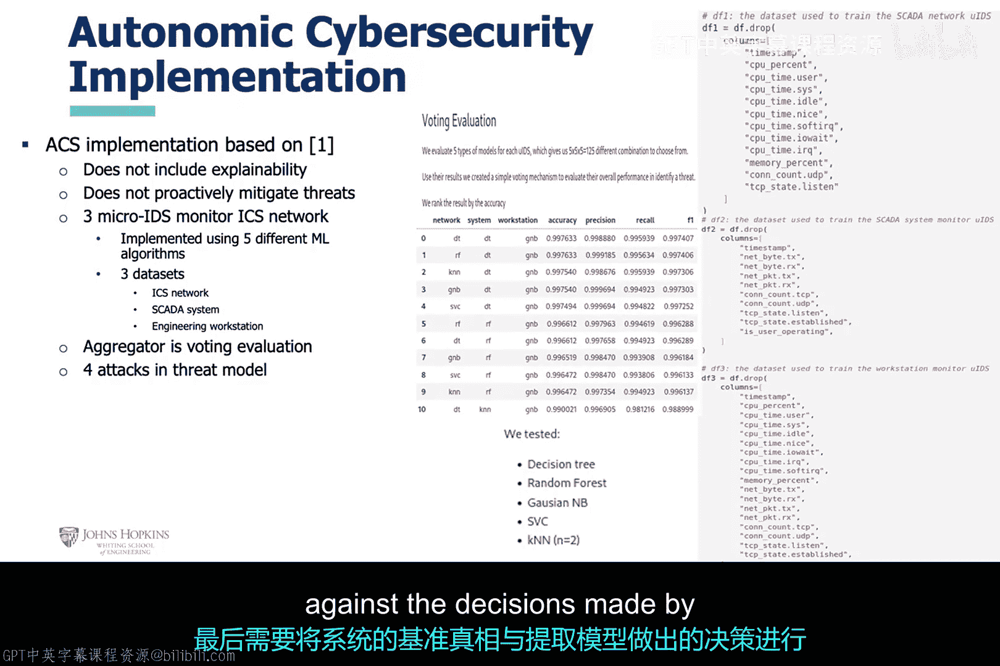

# 015：僵尸网络异常检测案例分析 🧠

在本节课中，我们将学习如何利用僵尸网络数据进行异常检测分析的实际操作。我们将从策略概述开始，逐步深入到具体的数据处理、算法应用、统计方法，并最终探讨一种基于自主计算理念的新型入侵检测系统。

## 概述

上一讲我们介绍了异常检测的基本概念。本节中，我们将通过一个僵尸网络检测的案例，来具体看看如何实现这一策略。我们的核心方法是分析网络数据，从中提取特征并寻找由僵尸网络引起的异常流量模式。

## 僵尸网络基础

在深入分析之前，我们需要明确几个核心概念。僵尸网络主要由三部分组成：
*   **受感染的计算机或“僵尸机”**：这些计算机被恶意软件控制。
*   **命令与控制服务器**：通常简称为C2，它控制着僵尸机。一个僵尸网络可能有一个或多个C2服务器。
*   **僵尸牧羊人**：这是控制整个僵尸网络的攻击者。

僵尸网络的用途多样，例如比特币挖矿、发送垃圾邮件或发起分布式拒绝服务攻击。另一个重要术语是**僵尸网络杀伤链**，它描述了僵尸网络恶意软件行为特征的一系列网络活动。

## 数据分析与机器学习实现

以下是僵尸网络分析开发的核心代码流程。

首先，准备好已标记的数据集，并将其分割为训练集和测试集。特征已从数据中提取出来。用于生成这些特征的数学变换细节在此不赘述，我们直接使用特征数据。

我们在此代码片段中训练并测试了三种监督学习算法：K近邻、决策树和高斯朴素贝叶斯。这里使用的唯一评估指标是准确率，三种算法都表现良好。

## 转向统计分析方法

现在让我们转换一下思路，在本节中我们将聚焦于统计分析，特别是**高斯分布**。

我们可以用平均值（μ）和方差（σ²）来描述正态分布的特性。了解这一点很重要，因为我们可以假设数据集的特征（如吞吐量和延迟）服从正态分布。如果这个假设成立，那么提取这些特征的系统所产生的网络流量应始终符合此分布。否则，就很可能表明系统出现了异常行为，进而提示可能存在恶意软件。

本节内容体现了上一节所述的理论。我们展示了一个用Python实现的、用于检测网络流量中异常行为的统计过程。这是一个很好的例子，它凸显了非机器学习方法的优点（复杂度较低）和缺点（能力较弱）。

统计方法可以用很少的代码快速产生结果，这有利于进行初步的静态分析。但如果你需要更持续和动态的解决方案，那么开发基于机器学习的分析模型可能更合适。

## 统计方法的局限性

本节重点说明了上一节提到的统计方法的缺点。请注意，静态阈值必须被确定。此实现的核心是一个自定义类，它利用数据来生成这个阈值。然而，我并不认为这是一种机器学习方法，因为它基于所用数据集中包含的统计关系，并且用于预测的阈值仅在非常有限的情况下（主要是使用此数据集时）是准确的。相比之下，使用机器学习算法开发的模型会更加动态，适用场景也更少受限。

## 引入新的评估指标

本节主要介绍了可用于描述所开发的统计或机器学习分析模型质量的新指标。我们引入了：
*   **召回率**或**灵敏度**，也有人称之为**真正例率**。
*   **精确率**。
*   **假正例率**。
*   **F1分数**。

## 基于自主计算的入侵检测系统

现在，我们转向基于**自主计算**理念的新一代入侵检测系统。这类系统被认为是具有自我意识的，其基础是至少四个自我实现的属性。该系统的理论和MAP-K架构被认为是自主网络安全的基础。

这里我们引入了**自主网络安全**的概念。它植根于自主性，很可能对应于我们之前讨论过的2级自主性或半自主性。在这个自主级别上，系统是主动的，会在执行规则之前自行制定规则供用户批准。

本质上，这种入侵检测系统由许多**微入侵检测系统**组成，它们监控受保护网络资产的小方面。例如，为网络上使用的每个协议、主机上使用的每个应用程序、击键、鼠标移动以及网络资产的其他可能方面都设置一个微IDS。然后，这些微IDS不断将结果发送给一个**聚合器**。这个聚合器可以是一个机器学习算法，它接收所有微IDS的输出，并判断是否发生了入侵，同时制定缓解入侵的计划。自主网络安全系统可以直接执行此计划，也可以将其计划发送给人类批准，具体取决于所实现的自主级别。

如果自主网络安全系统是**可解释的**，它还会解释它建议或决定采取的行动。本节提到的例子仅能判断入侵是否发生并解释其决策，但并未提供任何缓解建议。

## 数据集与威胁模型

本节我们关注数据集和威胁模型。工业控制系统环境包括一个在虚拟机上运行的PLC设备，该设备与代表工程工作站的虚拟机联网。工业控制系统仿真负责一些工业任务，其中PLC设备从某些物理过程获取输入、执行计算并产生输出。工程工作站仿真代表一台执行人机界面应用程序的PC，该程序通常向用户提供PLC设备的运行状态和健康状况。

出于数据收集目的，自主网络安全系统包含可以从PLC设备提取CPU、运行进程信息和内存数据，以及从工程工作站提取用户鼠标移动的脚本。威胁模型模拟了对工业控制系统的基本攻击。自主网络安全系统的微IDS持续监控PLC虚拟机、工业控制系统网络和工程工作站中的异常活动，并将响应反馈给聚合器，由聚合器决定网络资产是否已受到入侵。

## 系统的可解释性

本节重点介绍我们的示例自主网络安全系统的可解释性。如果微IDS使用决策树机器学习算法，那么用于决定分类的逻辑可以被提取出来，并用于解释整个自主网络安全的警报决策逻辑。这在AI开发中是一个非常重要的概念，因为像深度学习这样非常强大的机器学习方法缺乏这种能力，开发人员必须花费很大力气才能尝试从这类算法中获取决策逻辑信息。

## 系统实现与展望

本节聚焦于自主网络安全的实现。我们在前面讨论的自主网络安全系统的所有方面都已实现，除了可解释性和主动缓解方面。所有的微IDS都使用五种不同的机器学习算法实现，此处展示了部分结果摘录。

如果这个实现是一个测试或原型，则需要进一步开发，以尝试在运行的系统上测量其真实性能。表现最好的机器学习算法需要使用类似Python的`pickle`功能导出为模型，并监控真实系统的各个方面。提取出的特征将被发送给这些导出的模型，然后模型会产生结果。最后，需要将系统的真实情况与导出模型所做的决策进行比较。

## 总结

本节课中，我们一起学习了僵尸网络异常检测的完整案例分析。我们从基础的僵尸网络概念和机器学习实现入手，探讨了统计分析方法及其局限性，并引入了更全面的评估指标。最后，我们展望了一种基于自主计算理念的、具有可解释性的新型入侵检测系统架构，并讨论了其实现与评估方法。希望本教程能帮助你理解如何将AI技术应用于网络安全中的异常检测任务。