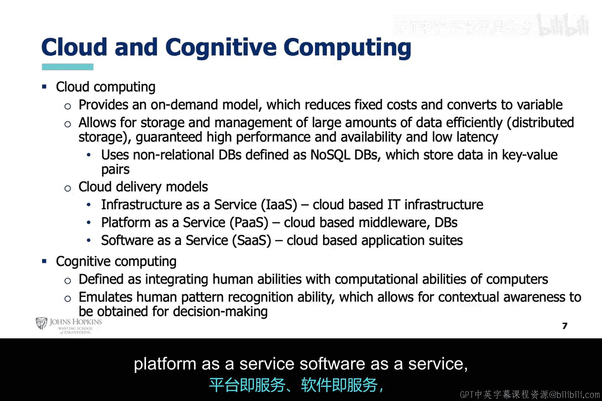

# 016：基于人工智能的信用卡反欺诈系统 💳

欢迎来到《网络安全的AI》课程。在本节课中，我们将讨论信用卡欺诈以及如何利用人工智能进行预防。

信用卡欺诈对犯罪分子而言，可能是一种低风险、高回报的犯罪活动。

信用卡欺诈的基础是身份盗窃，而伪造文件是完成身份盗窃的简单途径。

犯罪分子可以伪造一些文件，然后便开始实施欺诈。

目前，对这种行为的威慑力有限。事实上，与其他许多传统犯罪相比，被抓获的风险更低。

只要他们将盗刷金额控制在某个阈值以下，金融机构就缺乏追查的动力。

此外，在大多数情况下，金融机构担心报告此类犯罪会削弱其在公众眼中的形象。

实施者很可能是利用信用卡欺诈来支持洗钱或其他非法活动的有组织犯罪。

预防所有这些欺诈所需的工具可能很复杂，因此需要云资源。

信用卡欺诈造成的损失以数十亿美元计，主要可分为以下三种情景：

1.  犯罪分子盗取一张合法信用卡，并刷爆其额度。
2.  犯罪分子盗取一张合法信用卡的卡号和/或PIN码，并持续进行小额盗刷。
3.  犯罪分子盗取一个人的身份信息，基于虚假信息申请一张合法信用卡，然后持续进行无限制的盗刷。

金融机构试图通过两种方式来缓解这一问题：在低端使用双因素认证，在高端使用机器学习和预测分析。

上一节我们提到了欺诈检测和预防，现在我们来讨论一下两者的区别。欺诈检测发生在欺诈行为发生之后，而欺诈预防则旨在从一开始就阻止欺诈发生。

接下来，让我们聚焦于欺诈预防，特别是基于专家规则的预测模型。

顾名思义，这种模型是专家根据特定规则建立的，通过对交易进行评分，然后根据交易的某些特征来标记或阻止交易。

这种方法易于实施，但可能无法有效应对新型的欺诈模式。

与基于规则的预测模型不同，基于数据的预测模型是动态的，并且当然基于数据。

这正是机器学习可以发挥作用的地方，因为它可以从数据中学习，从而能够关联数据集中的多个特征。

这种方法的一个缺点可能是缺乏可解释性。但归根结底，在一个良好的欺诈预防解决方案中，结合使用基于规则和基于数据的预测模型可能更为实用。

正如上一张幻灯片提到的，一个平衡的解决方案将是基于规则和基于数据的预测模型的结合。

这也将使解决方案能够受益于两种方法的优势，从而弥补各自方法的不足。

例如，基于规则的模型通常会减少漏报（False Negatives），但会增加误报（False Positives）。因此，一个常见的组合解决方案可以降低误报率。

同时，组合解决方案也将具备动态更新的能力。

正如之前提到的，合适的信用卡预防工具可能需要云资源。

这类解决方案提供按需资源，例如基础设施即服务（IaaS）、平台即服务（PaaS）、软件即服务（SaaS）和认知计算。

本节课中，我们一起学习了信用卡欺诈的常见模式、金融机构的应对策略，以及如何结合基于规则的模型和基于数据的机器学习模型来构建更有效的反欺诈系统。一个平衡的、动态的解决方案，并利用云资源，是应对这一复杂挑战的关键。