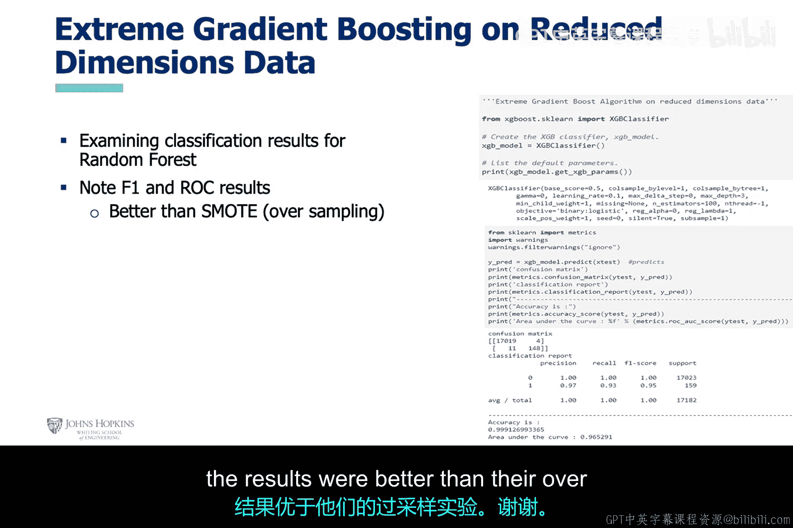

# 017：IBM Watson信用卡反欺诈案例研究 💳

在本节课中，我们将学习如何使用IBM Watson平台来实施信用卡欺诈检测与预防的机器学习解决方案。我们将探讨该平台如何通过提供多种资源（如采样技术、装袋法、提升法和堆叠法算法）来实现预测性集成学习。

## 概述

在开始之前，请注意，本讲涉及动手操作部分，需要您设置一个IBM Watson账户。这需要一张您名下的信用卡，但**不会产生任何费用**。此步骤并非强制要求，因为幻灯片和提供的虚拟机中第7章的Jupyter笔记本已包含所有输出结果。

## 账户与项目设置

上一节我们介绍了课程目标，本节中我们来看看如何设置环境。

对于愿意设置账户的学习者，请按照以下步骤操作：

1.  访问幻灯片中提供的链接。
2.  按照步骤设置账户，并为您的信用卡欺诈检测项目创建Jupyter笔记本和数据的存储位置。

在开始本步骤前，请先下载Jupyter笔记本和信用卡欺诈数据集，其位置已在幻灯片中给出。下载完成后，请将这些文件上传到您在上一步创建的信用卡欺诈项目的资产位置。请确保您的屏幕界面与幻灯片中的截图完全一致。

## 运行分析与理解数据

此时，您可以像在本地虚拟机中一样运行Jupyter笔记本。随后，您将看到笔记本中的单元格开始填充Python代码的输出结果。

请注意，数据集的摘录会显示在此处。您可以看到数据集中31个特征的示例。幻灯片中列出了对这些特征的说明。需要指出的是，大部分特征是由经过PCA算法转换的机密客户信息组成。这很可能用于降低原始特征集的维度，同时也有助于掩盖数值，使其不易被识别。

接下来，我们查看一个特征子集。其中，合法交易以绿色显示，欺诈交易以红色显示。合法交易的数量远多于欺诈交易，但这在一定程度上反映了现实情况。这是一个不平衡的数据集，但此处的要点是，存在相当数量的欺诈数据点。

## 机器学习开发流程

在查看随机森林算法的结果之前，让我们先回顾一下此欺诈预防解决方案的机器学习开发流程。

以下是该流程的主要步骤：

1.  **加载数据**：首先，加载欺诈检测数据集。
2.  **数据探索**：随后，进行数据统计和可视化。这些步骤有助于数据科学家确定需要对数据应用何种数学变换以提取模式，并判断数据集在标签类别上是否不平衡（即某一类别的样本量显著大于另一类别）。即使这种情况反映了现实，出于提升机器学习性能等考虑，仍可能尝试重新平衡数据集，您将在后面的幻灯片中看到相关示例。
3.  **数据分割与模型训练**：接着，作者为数据创建了训练集和测试集，并训练了随机森林算法。他还对模型应用了优化参数。
4.  **性能评估**：最后，使用多种指标评估分类器的性能。基于F1分数和ROC指标，结果表现尚可。

## 不同算法与处理方法的实验

上一节我们介绍了基础开发流程，本节中我们来看看使用不同算法和处理方法的效果对比。

### 实验一：极端梯度提升算法

在此幻灯片中，遵循了相同的分析开发流程，但使用了**极端梯度提升**机器学习算法。该算法使用数据集中加权的样本，其权重会根据误差进行调整以减少偏差。

1.  **加载数据**：首先，加载欺诈检测数据集。在此示例中，作者没有对数据应用任何数学变换，因为PCA算法已应用于必要的特征。
2.  **数据分割与模型训练**：接着，作者从数据中创建了训练和测试数据集，并训练了极端梯度提升机器学习算法。他也对模型应用了优化。
3.  **性能评估**：最后，使用多种指标评估分类器的性能。基于F1分数和ROC指标，结果优于随机森林算法。

### 实验二：随机森林算法（使用较少特征）

在此幻灯片中，遵循了相同的分析开发流程，但使用了**随机森林**机器学习算法。

1.  **加载数据**：首先，加载欺诈检测数据集。然而，与之前的幻灯片相比，此处使用的特征数量**少得多**。这是本次使用随机森林算法与第一次使用的关键区别。
2.  **数据分割与模型训练**：同样，作者没有应用数学变换。接着，他从数据中创建了训练和测试数据集，并训练了随机森林机器学习算法。他也对模型应用了优化参数。
3.  **性能评估**：最后，使用多种指标评估分类器的性能。基于F1和ROC指标，结果比之前的随机森林结果更差。

### 实验三：随机森林算法（使用欠采样）

在此幻灯片中，遵循的开发流程与上一张使用随机森林算法的幻灯片相同。

1.  **加载数据**：首先，加载了包含所有特征的欺诈检测数据。然而，数据集经过了**随机欠采样**，通过减少合法交易实例的数量来降低欺诈实例的不平衡性。此处的关键区别在于对数据集进行了随机欠采样以处理不平衡问题。
2.  **数据分割与模型训练**：作者没有应用数学变换。接着，他为数据创建了训练和测试数据集，并训练了随机森林机器学习算法。他也对模型应用了优化参数。
3.  **性能评估**：最后，使用多种指标评估分类器的性能。基于F1和ROC指标，结果是我们讨论过的所有实验中最优的。

### 实验四：随机森林算法（使用过采样）

在此幻灯片中，遵循的分析开发流程与上一张使用随机森林机器学习算法的幻灯片相同。

1.  **加载数据**：首先，加载了包含所有特征的欺诈检测数据集。此处我们没有减少特征数量，而是加载了所有特征。同时，我们进行了**随机过采样**，通过使用合成数据增加欺诈实例的数量来减少欺诈实例的不平衡性。因此，这里的重大区别是：第一，我们使用了所有特征；第二，在此特定场景中，我们进行了过采样。
2.  **数据分割与模型训练**：作者没有应用数学变换。接着，他为数据创建了训练和测试数据集。
3.  **性能评估**：最后，使用多种指标评估分类器的性能。基于F1和ROC指标，结果优于使用不平衡数据集的分类器，但不如使用欠采样的分类器。

### 实验五：极端梯度提升算法（使用较少特征）

在此幻灯片中，遵循了相同的分析开发流程，但使用了**极端梯度提升**机器学习算法。

1.  **加载数据**：首先，加载了欺诈检测数据集。然而，与之前的幻灯片相比，此处使用的特征数量**少得多**。
2.  **数据分割与模型训练**：作者没有应用数学变换。接着，他从数据中创建了训练和测试数据集，并训练了极端梯度提升算法。他也对模型应用了优化参数。
3.  **性能评估**：最后，使用多种指标评估分类器的性能。基于F1和ROC指标，结果优于他们的过采样实验。

## 总结

本节课中，我们一起学习了如何利用IBM Watson平台实施信用卡反欺诈的AI解决方案。我们详细探讨了从数据加载、探索性分析到模型训练与评估的完整机器学习开发流程。通过对比随机森林与极端梯度提升等不同算法，以及欠采样、过采样等处理不平衡数据集的技术，我们观察到**适当的采样技术（如欠采样）结合有效的算法（如随机森林）可以显著提升欺诈检测模型的性能**。这为在实际网络安全场景中构建高效的欺诈预防系统提供了宝贵的实践见解。