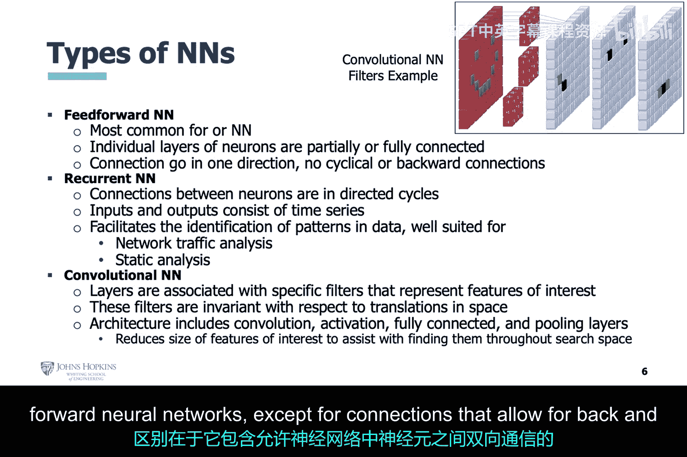

# 018：生成对抗网络(GAN)基础入门 🧠⚔️

在本节课中，我们将开始讨论生成对抗网络，简称GAN。完整的讨论将跨越两个模块。重申一下，本课程的目标是以一种让你理解其网络安全应用性的方式介绍人工智能方法。因此，这绝不是对GAN的详尽研究。

让我们从GAN的一些背景知识开始讨论。

## 背景介绍

GAN的理论提出至今大约已有十年。Ian Goodfellow在十年前发表了他的论文《生成对抗网络》。据我所知，目前还没有针对其使用的“杀手级应用”。黑帽黑客们仍在探索。然而，其潜力确实存在，这就是我们研究它的原因。我指出这一点是为了帮助你理解我为何采用这种方式来呈现这些信息。

在之前的模块中，有使用AI应对我们每天都知道和听到的威胁的明确例子。而在本模块中，我们将主要关注做一些具体的事情，向你展示这项技术的能力。在讨论结束前，我会谈谈理论如何应用于现实世界的情况。

回到幻灯片。关于GAN，最核心的一点是：本质上，你有两个相互竞争的神经网络。它们会一直竞争，直到达到一个平衡状态，这一点我们稍后会详细讨论。

继续这个核心观点，GAN提醒我们：**AI可以被用来攻击AI**。

## 神经网络回顾

既然我在上一张幻灯片提到了神经网络，请允许我澄清一下，我们指的是深度神经网络。再次强调，深度学习是机器学习的一个子集，旨在专门模仿大脑的架构。它建立在人工神经元的概念之上，以至于我们可以将深度学习视为层层相连的神经元，或者简单地说，是深度连接的神经元。

这些人工神经元的深层连接，赋予了深度学习创建自身特征、甚至组合这些自定义特征的能力，最终使其能够获得比机器学习方法更好的准确性。然而，一个缺点是深度学习本身不具备可解释性。换句话说，没有清晰的推理来说明它是如何获得那些优于机器学习的结果的，这主要是由于其复杂性。

现在让我们回顾一下之前讨论过的一个话题：感知机。单个感知机或罗森布拉特感知机只能解决线性可分问题，这非常有限。随后它被多层感知机（MLP）改进，MLP本质上是感知机的层叠。这种新的感知机可以解决非严格线性可分的问题。事实上，由于MLP的激活函数，只要有足够的感知机，它可以近似任何连续的数学函数。

回想一下，一旦感知机的刺激超过阈值，其激活函数就会提供响应。常见的激活函数是修正线性单元（ReLU）及其变体，称为泄漏修正线性单元（Leaky ReLU）。这些激活函数能够将线性关系转换为非线性响应，从而实现了前面提到的近似行为。

请耐心听我继续回顾人工神经元的背景知识，作为更详细讨论GAN的前奏。你可以创造性地将神经网络视为重建数学函数的一种不同方法。本质上正在发生的就是这样。神经网络的输入层接收输入数据，激活函数在被刺激后，会向下一层感知机提供响应，这基本上在整个神经网络中引发连锁反应。在这个过程中，神经网络正在从数据集中重建关键方面或特征，并可能创建新的特征来帮助分类数据。

我们之前提到的这个微小反应，在神经网络内部都是正向发生的。在神经网络内部，或者简单地说，存在**前向传播**，这与**反向传播**不同。在本次讨论中，我们谈论的是训练神经网络，而不是数据流。

## 前向与反向传播

让我们继续这个思路：反向传播用于训练。它发生在获得初始输出响应之后，并且该输出与期望值存在显著差异时。我们知道期望是什么，因为训练数据中有我们应该看到的示例。现在，如果你戴着人工智能的“帽子”，这个讨论可能会很快变得非常复杂。然而，正如我之前所说，我们戴着网络安全的“帽子”。因此，我们只想深入探究AI，直到足以理解如何用它来帮助网络安全分析师完成威胁分类和处置工作。

既然如此，我们将坚持对反向传播进行高层次的讨论，只需知道它是用来训练神经网络的，目的是在给定神经网络中神经元数量和其他性能参数的情况下，使输出结果在数学上尽可能接近训练数据集。这是通过基于误差函数的偏导数（该误差函数基于神经网络输出与训练数据之间的差异）来重新调整神经网络的权重实现的。因此，你可能会注意到，在教材中，作者在谈论反向传播时似乎有点混淆。所以，让我们坚持幻灯片以及我们刚刚进行的讨论，它们为你提供了关于反向传播、其用途以及在此上下文中所指含义的非常好的高层次理解。

现在，让我们重新审视前向传播和反向传播的讨论。在上一张幻灯片中，我小心地区分了数据流和训练。在那个讨论中，我谈论的是最常见的神经网络形式，即**前馈神经网络**，其数据流仅沿正向传播。从技术上讲，卷积神经网络也是一种前馈神经网络，因为数据流仅沿正向传播。然而，它确实有一些使其特殊的细微差别，例如，其特定层或内核的过滤器允许它专注于数据集中的特定特征。

在之前提到的幻灯片中，我确实提到了反向传播。但再次强调，仅从训练神经网络的角度，而非数据流的角度。在这一点上，我准备讨论另一种允许数据反向流动的神经网络类型。这就是**循环神经网络**。循环神经网络的架构类似于前馈神经网络，但其神经元之间的连接允许在网络内部进行前后通信。

---

**本节课总结**

本节课我们一起学习了生成对抗网络（GAN）的基本概念及其在网络安全领域的潜在应用。我们回顾了神经网络的基础知识，包括感知机、多层感知机、激活函数（如ReLU）以及深度学习的核心思想。我们区分了神经网络中的**前向传播**（数据流动）和**反向传播**（训练过程），并简要介绍了允许信息双向流动的**循环神经网络**。这些知识为我们下一节深入探讨GAN的工作原理奠定了坚实的基础。