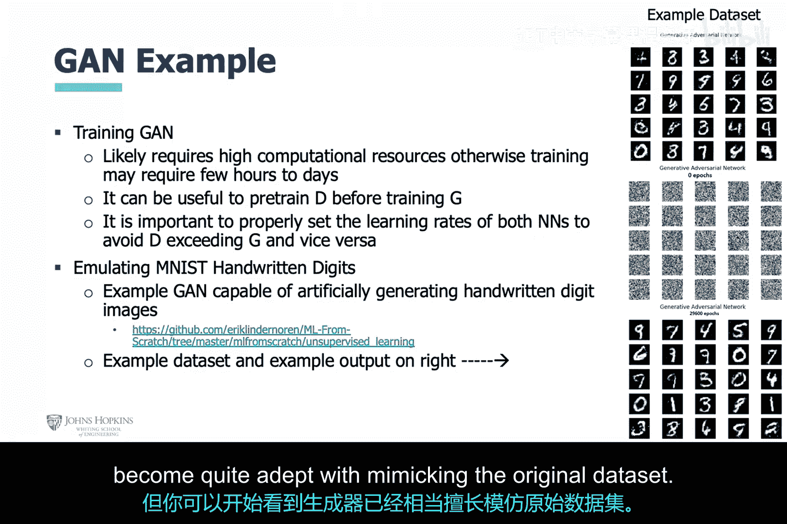

# 019：生成对抗网络技术剖析 🧠

在本节课中，我们将深入学习生成对抗网络。这是一种由两个相互竞争的神经网络组成的独特架构，在网络安全等领域有广泛应用。

## 概述

上一节我们介绍了神经网络的基础知识，本节中我们将深入探讨生成对抗网络。GAN的核心在于两个神经网络——生成器和判别器——相互竞争、共同学习，以达到一种平衡状态。

## GAN的高层概念

正如之前提到的，GAN的核心理念是两个相互竞争的神经网络协同工作，以达到一个平衡的结果。

这两个神经网络分别被称为**生成器**和**判别器**。

*   **生成器**的目标是创建或生成人工数据，这些数据与原始数据极其相似，以至于另一个神经网络（即判别器）无法区分人工生成的数据和真实数据。
*   与我们之前讨论的神经网络不同，生成器并不关心减少训练误差。相反，它专注于试图“欺骗”判别器。
*   **判别器**则专注于尝试辨别或区分人工生成的数据与真实数据之间的差异。

## 生成器与判别器的深入解析

现在，让我们更深入地探讨生成器和判别器的概念。它们以不同的方式相互学习。我们暂时不展开这一点，而是将讨论置于一个网络安全问题的框架中。

考虑我们在之前课程中讨论过的垃圾邮件和正常邮件。这里的目标不是区分垃圾邮件和正常邮件，而是双重的：
1.  区分垃圾邮件和**伪造的**垃圾邮件，这是判别器的目标。
2.  创建与真实垃圾邮件无法区分的**伪造**垃圾邮件，这是生成器的目标。

在尝试优化其目标函数时：
*   判别器基于可疑词汇的出现，计算给定电子邮件是垃圾邮件的**概率**。
*   生成器计算给定的垃圾邮件**包含**可疑词汇的概率。

生成器希望通过最小化其生成数据与原始数据之间的相似性，来最小化其目标函数。而判别器则希望通过最大化其对生成数据与原始数据的辨别能力，来最大化其目标函数。

这反过来被称为**零和博弈**，即一方的损失是另一方的收益，反之亦然。当两种策略都达到最优时，两者就达到了**纳什均衡**。

以下是Goodfellow提出的著名公式，用于描述判别器和生成器目标函数之间的最小-最大关系：

`min_G max_D V(D, G) = E_{x~p_data(x)}[log D(x)] + E_{z~p_z(z)}[log(1 - D(G(z)))]`

再次说明，判别器希望**最大化**这个方程，这意味着它最大化与真实数据相关的输出，并最小化与伪造数据相关的输出。另一方面，生成器希望最小化与创建伪造数据相关的误差，并最大化与判别器能够辨别真实数据相关的误差。

当判别器只有大约50%的信心区分真实数据和伪造数据时，就达到了理想的平衡状态。

## GAN的训练过程

如前所述，训练GAN与训练单个神经网络进行数据分类不同。这里有两个具有竞争性目标函数的神经网络，因此你不仅仅是输入数据、产生输出并应用反向传播算法来最小化误差。这个过程更加复杂和相互交织。

达到均衡所需的计算资源通常相当高，因此训练可能需要数小时到数天。你可能需要先对判别器进行**预训练**，让它了解真实数据的样子，并将两个神经网络的学习率设置为适当的值，以便它们能够轻松匹配。

以下是训练步骤：
1.  向生成器输入随机噪声加上一点原始数据的“一瞥”。
2.  生成器将结合噪声和真实数据的“一瞥”，尝试生成与真实数据无法区分的副本。
3.  判别器将继续在真实数据上训练，并产生自己的损失函数，以试图越来越地学习真实数据。
4.  同时，判别器会将生成器生成的数据副本与真实数据进行比较，并向生成器**提供损失函数**，希望这能帮助生成器下次生成更好的数据副本。

这个过程持续进行，直到达到均衡状态。

## 实战示例：手写数字生成

以上是训练理论，现在让我们使用一个实际的GAN来尝试复现手写数字，数据集是MNIST手写数字数据集（右上角是数据集的摘录）。

在中间，我们输入带有一些原始数据特征的噪声数据。将其输入生成器。现在，在训练几个小时后，可以在右下角看到输出。GAN尚未达到均衡，但你可以开始看到生成器在模仿原始数据集方面已经变得相当熟练。

## 通过分析开发流程看GAN示例

整体上，让我们尝试通过分析开发流程的视角来看这个例子。

我们从**数据工程**开始。这是一个大型数据集，称为MNIST手写数字数据集。这些数据已经为GAN的使用做好了准备。

接下来是**特征工程**。然而，我们已经了解到深度学习会创建自己的特征，因此我们真的不知道或不清楚这里使用了哪些特征。

然后是**模型工程**。在这里，我们可以调整性能参数以尝试改进GAN。但我们必须小心，确保没有让两个神经网络能力失衡，即确保它们具备同等能力来执行各自的任务。注意，这两个神经网络都使用了**Leaky ReLU激活函数**。

接下来是**训练**。我们在上一张幻灯片中深入讨论了训练，因此我们只对训练进展说几句。我们看到了一张生成器初始状态的图片，以及几小时后的更新图片。我们可以很容易地看到，在早期阶段，判别器很容易区分真实数据和伪造数据。

请注意，在幻灯片右下角的图中，判别器的损失函数被**最小化**，而生成器的损失函数被**最大化**。这与博弈的期望状态相反。但随着GAN训练的进行，在后面的周期中，判别器越来越难区分真实数据和伪造数据。到那时，生成器的损失函数将最小化，而判别器的损失函数将最大化。

## 总结

本节课中，我们一起学习了生成对抗网络的核心原理。我们了解到GAN由生成器和判别器两个神经网络组成，它们通过对抗性训练达到动态平衡。我们探讨了其目标函数的数学表达、独特的训练过程，并通过手写数字生成的实例，观察了GAN从初始噪声到生成逼真数据的演变过程。理解GAN是掌握现代人工智能生成能力的关键一步。