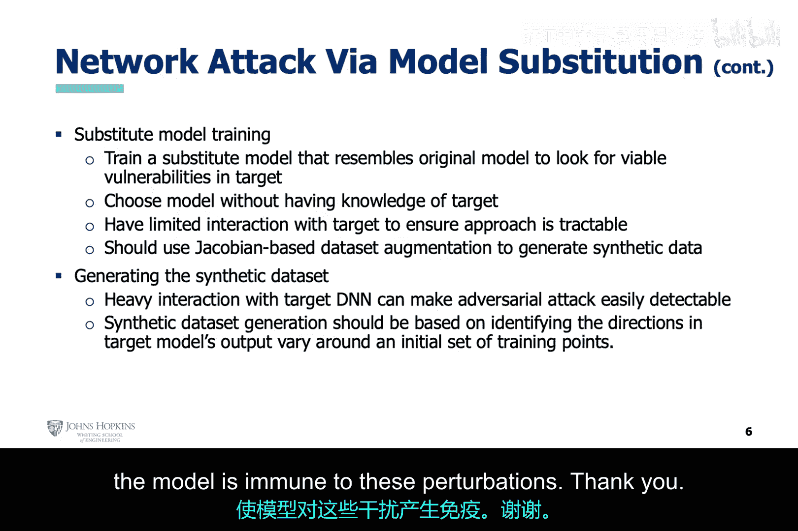

# 020：对抗性攻击原理详解 🛡️

在本节课中，我们将开始讨论基于生成对抗网络理论的对抗性攻击。我们将主要探讨这些攻击的理论基础，并在下一讲中通过实际例子进行动手操作。

## 概述

上一讲我们提到，生成对抗网络提醒我们，人工智能可以被用来攻击人工智能。本节我们将更深入地探讨这个概念。神经网络容易受到生成对抗网络的攻击，或者至少，容易受到其理论思想的攻击。这意味着，生成对抗网络可以创建出与真实数据无法区分的合成数据，从而欺骗神经网络。这种方法可用于欺骗在3D医学成像等应用中使用的神经网络。

然而，一些对抗性攻击甚至不需要一个实际的生成对抗网络，只需要运用其背后的逻辑。例如，人类可以对图像进行微小的扰动，导致神经网络将图像错误分类为其他东西，而这些扰动对人眼来说几乎无法察觉。在这种情况下，人类扮演了生成器的角色，而神经网络则扮演了判别器的角色，无法区分被扰动的图像和真实图像。

这些论述非常有力，它让我们所有关于人工智能的创新和应用都受到了质疑。我们刚刚讨论了将人工智能用于生物特征认证，而我也刚买了一辆具备自动驾驶功能的电动汽车。突然间，将这些人工智能技术用于此类应用似乎不再是个好主意。使用人工智能处理关键基础设施，其风险可能不亚于当年使用联网计算机来运行美国的关键基础设施。

问题的核心在于，网络安全问题始于在关键基础设施中使用易受攻击的计算机。而当我们试图赋予这些计算机模拟人类智能的能力时，问题变得更加严重，因为这项技术本身也容易受到攻击。这是一种观点。

另一种观点是，计算机的发展及其在关键基础设施中的应用，使我们的文明实现了飞跃式发展。计算速度、能力和数据可用性的新进展，为我们带来了全新的未来潜力。本质上，我们面对的是一把双刃剑。技术一方面为我们提供了更广阔的未来，另一方面也带来了在任何时候都可能因网络攻击而遭受破坏的巨大风险。

在结束本讲之前，我们将讨论如何保护人工智能免受此类攻击。

## 攻击类型

对抗性攻击可以分为两类。

*   **白盒攻击**：攻击者完全了解目标人工智能模型的内部参数、输入和输出。
*   **黑盒攻击**：攻击者只能访问目标模型的输入和输出。

不幸的是，针对人工智能的攻击类型有很多。在接下来的幻灯片中，我们仅列举几种最常见的攻击。在下一讲中，我们将通过动手实践来讨论快速梯度符号法攻击和投影梯度下降攻击。

### 白盒攻击示例

这两种攻击都是白盒攻击，并且基于生成对抗网络的理论，即人类攻击者扮演生成器，试图欺骗作为判别器的神经网络。

以下是两种具体的白盒攻击方法：

*   **快速梯度符号法攻击**：这种方法相对简单。攻击者利用深度神经网络的反向传播算法，获取能最大化损失函数的梯度方向信息。然后，攻击者根据这个方向对图像的每个像素进行微小修改。最终结果是生成一个对抗性图像，该图像在人眼看来与原始图像无异，但深度神经网络会将其错误分类为其他类别的图像。
*   **投影梯度下降攻击**：这种攻击与快速梯度符号法攻击类似，但它是迭代进行的，缓慢地修改每个像素。这类攻击的一些变体甚至可以指定深度神经网络最终错误分类的类别。

## 黑盒攻击原理

现在，我们将转向讨论针对人工智能的黑盒攻击。

假设我们的模型部署在网络的某个地方，攻击者可以向模型发送输入并获取其输出。攻击者向目标模型发送合成生成的数据，并观察其分类结果。这为攻击者提供了一个带有标签的数据集，他可以用这个数据集来训练一个本地模型。

本质上，这个带有目标深度神经网络标签的合成生成数据集，将目标深度神经网络的决策逻辑转移到了新训练的本地人工智能模型中。

对抗性样本是指那些经过FGSM或PGD等方法修改过的图像，它们对人来说看起来像是一类东西，但会被目标深度神经网络错误分类为另一类东西。因此，这些对抗性样本可以使用本地人工智能模型来创建，并且也应该会被目标深度神经网络错误分类。

论文《针对机器学习的实用黑盒攻击》的作者通过成功使用这种攻击方法攻击了几个知名的托管模型，证明了对抗性攻击的可迁移性原理。

## 黑盒攻击的最佳实践

为了使黑盒模型替换攻击有效进行，应遵循一些最佳实践。

本质上，在构建目标标签数据集时，应尽可能减少与目标模型的交互。这意味着只应向目标深度神经网络发起少量查询。关键在于选择最少数量的目标模型输入，以正确捕获目标深度神经网络的决策逻辑。

## 防御策略

现在，让我们来谈谈如何防御这些攻击。

作者讨论了三种不同类型的防御方法。

*   **统计防御**：尝试利用已知图像的统计知识来检测对抗性样本。
*   **梯度掩蔽防御**：试图通过将真实的梯度信息隐藏在随机噪声中，来阻止攻击者利用反向传播算法。
*   **对抗训练**：这是一种“如果无法击败他们，就加入他们”的方法。数据科学家会提前生成对抗性样本，并用这些样本来训练他们的模型。这样，如果模型后来遇到这些样本，它就能对这些扰动免疫。

## 总结

本节课我们一起学习了对抗性攻击的基本原理。我们了解到，基于生成对抗网络的理论，人工智能系统可能被精心设计的输入所欺骗。我们探讨了白盒攻击和黑盒攻击的区别，并简要介绍了快速梯度符号法攻击和投影梯度下降攻击这两种白盒攻击方法。我们还分析了黑盒攻击中通过查询构建替代模型的核心思想。最后，我们了解了统计防御、梯度掩蔽和对抗训练这三种主要的防御策略。理解这些攻击与防御机制，对于构建更安全、更健壮的人工智能系统至关重要。