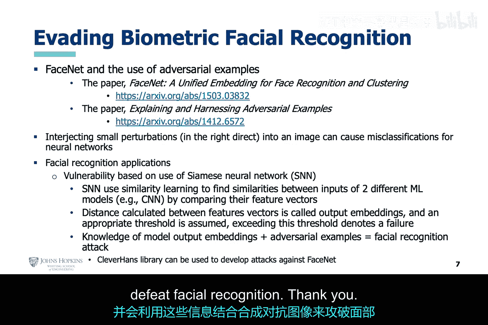

# 021：对抗性攻击实战演练 🛡️💻

在本节课中，我们将学习对抗性攻击的实战演练。我们将探讨几种具体的攻击方法，理解其背后的逻辑，并观察它们如何导致深度学习模型做出错误判断。

## 概述

上一节我们介绍了对抗性攻击的基本概念。本节中，我们来看看几种具体的攻击方法，包括FGSM、PGD和对抗性补丁攻击，并探讨如何将GAN的逻辑应用于攻击恶意软件检测器和面部识别系统。

## FGSM攻击实战

FGSM攻击本质上利用了反向传播算法的梯度信息。攻击者使用此信息，沿着最大化模型错误的方向修改图像的每个像素，试图导致深度神经网络对图像进行错误分类，尽管在人眼看来图像并未改变。

从逻辑上看，这类似于GAN的架构。攻击者充当生成器，而深度神经网络则充当判别器。

以下是此攻击的各个层面：
*   攻击者提供数据，这些数据本质上是合成的对抗性数据。
*   攻击者运用GAN逻辑，充当生成器。虽然GAN本身未被直接使用，但其背后的逻辑被应用了。
*   创建扰动图像的实际代码位于幻灯片右上角。

这种合成的对抗性图像被应用于已经训练好的深度神经网络。该网络是一个经过优化的分析器，用于识别一组图像。它从图像中提取自己的特征，并利用这些信息，根据其训练结果决定将图像归入哪个类别。

在GAN逻辑下，深度神经网络就像判别器，试图判断图像是否是真实数据。如果攻击成功，深度神经网络将错误分类图像，攻击者（生成器）就成功地欺骗了判别器做出了错误判断。此处的逻辑与标准GAN不完全相同，但总体目标相似，即生成器要欺骗判别器。

现在，让我们看看A列中的图像及其相关结果。训练好的分析器在攻击前，对识别这四张图像表现出非常高的置信度。

在B列中，合成的对抗性图像被创建并提交给训练好的分析器后，可以看到该分析器已无法准确识别正确的图像。在至少一个案例中，训练好的分析器有超过80%的把握认为自己的判断是正确的，然而在人眼看来，它显然犯了错误。

## PGD攻击实战

接下来是PGD攻击的实战示例。我们定义PGD攻击与FGSM攻击类似，但它以迭代和缓慢的方式修改像素，与FGSM的单步攻击形成对比。

你甚至可以在左下角看到PGD代码中包含一个循环，该循环会迭代指定的次数，而在FGSM代码中则没有这样的循环。

我们在上一张幻灯片中详细讨论了FGSM攻击的细节。为了避免重复，我们仅说明这里同样使用了GAN逻辑，攻击者（生成器）能够欺骗深度神经网络（判别器）。

如果我们查看幻灯片中的实战结果，在A列中，预训练的分析器能够正确识别提交给它的18张手写数字图像中的17张。

在B列中，PGD攻击发动后，预训练的分析器只能识别出提交的18张手写数字图像中的8张。在这个例子中，虽然你仍然可以清楚地看到攻击图像中的数字，但也能观察到其中的扰动。

## 对抗性补丁攻击

另一种技术，同样与FGSM攻击类似，但将扰动局限于目标图像的一小片区域，这被称为对抗性补丁攻击。梯度的计算方式与FGSM攻击相似，但仅针对补丁区域。此外，生成的补丁需要在大量图像上进行训练才能有效。

这种攻击可能比FGSM和PGD攻击构成更大的威胁，因为它可以应用于目标的一小部分，并且该补丁可以强制模型将图像错误分类到指定的类别。

设想有人在汽车后部放置一个红色交通灯或停车标志的补丁。如果你的汽车中用于自动驾驶功能的深度神经网络容易受到这种攻击，那么事故就迫在眉睫了。

请看A列中的图像，这些是不同分辨率的补丁示例。如果仔细观察，有些补丁可能看起来像它们的标签。

现在看B列中的图像，注意这些补丁只占大图像的很小一部分，但在每种情况下，补丁都以非常高的置信度驱使模型错误分类到特定的类别。

## GAN在攻击企业系统中的应用

我们已经讨论了使用GAN逻辑对深度神经网络发动对抗性攻击。现在让我们转回实际的GAN，看看它如何被用于攻击企业系统。

题为《生成对抗性恶意软件示例以进行针对GAN的黑盒攻击》的论文揭示了GAN如何被用来击败恶意软件检测器。这是一种针对深度神经网络恶意软件检测器的黑盒攻击，类似于我们之前讨论的针对深度神经网络图像检测器的黑盒攻击。

一个替代的本地恶意软件深度神经网络检测器，在由GAN创建并由目标深度神经网络恶意软件检测器标记的合成恶意软件示例上进行训练。生成器和替代的深度神经网络检测器共同学习创建难以检测的对抗性图像。

同样，GAN也可用于规避网络异常检测器。这里也使用了黑盒对抗性攻击策略。在这种方法中，没有替代模型，而是判别器由来自目标异常检测器的标记流量进行训练。

生成器从噪声和恶意流量的指示开始。然后，合成的恶意流量以及正常流量被输入到目标入侵检测系统深度神经网络中，产生的标记流量用于训练判别器。一旦判别器学会了目标深度神经网络入侵检测系统的决策逻辑，它就可以指导生成器产生能够规避目标深度神经网络入侵检测系统的网络流量。

## 针对面部识别系统的攻击

我们本讲的最后讨论将围绕如何对深度神经网络发动对抗性攻击以击败面部识别技术。

在开始之前，请允许我介绍孪生神经网络的概念。这些网络被用于面部识别系统。本质上，孪生神经网络使用相似性学习，来找出该网络中使用的两个不同神经网络的输入之间的相似性。

接下来，计算面部特征（称为输出嵌入）之间的距离。最初会创建一个基线。如果输出嵌入超过某个阈值，则认为面部识别失败。

白盒对抗性攻击需要知道输出嵌入，并会利用这些信息，结合合成的对抗性图像来击败面部识别。

## 总结

本节课中，我们一起学习了多种对抗性攻击的实战方法。我们探讨了FGSM、PGD和对抗性补丁攻击的原理与效果，并了解了如何将GAN的逻辑应用于攻击恶意软件检测器、网络异常检测器乃至面部识别系统。理解这些攻击手段对于认识和构建更健壮的AI安全防御至关重要。