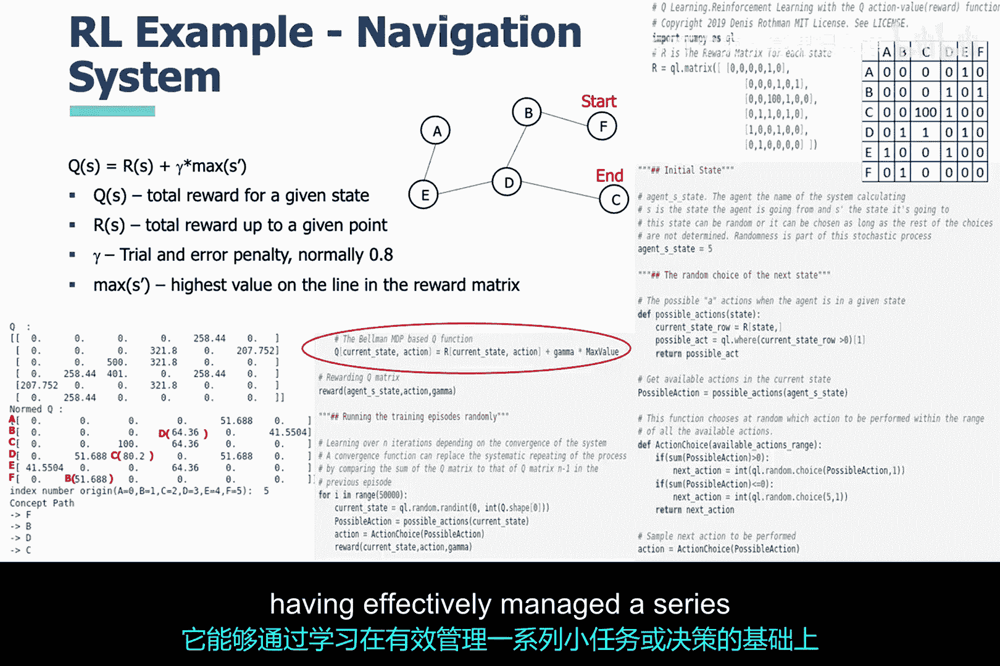

# 022：强化学习技术原理 🧠

在本节课中，我们将对强化学习进行一次非常实用的讨论。我们将了解其核心概念、工作原理，以及它如何通过与环境互动来学习最优策略。

---

## 概述

机器学习主要分为三种类型：**监督学习**、**无监督学习**和**强化学习**。在监督学习中，算法使用带标签的训练数据进行学习；在无监督学习中，算法则从数据的内在特征（如点之间的距离）中学习。这两种学习方式的共同主题是**数据**。然而，强化学习则完全不同，它采用了一种全新的范式。

## 强化学习的基本范式

上一节我们提到了机器学习的不同类型，本节中我们来看看强化学习的独特范式。它主要包含以下几个核心概念：

*   **智能体**：一个在环境中执行动作的实体。
*   **环境**：智能体所处并与之交互的世界。
*   **动作**：智能体在特定状态下可以采取的操作。
*   **奖励/惩罚**：环境对智能体动作的反馈。推动智能体接近目标的动作会获得**正反馈（奖励）**，而使其远离目标的动作会获得**负反馈（惩罚）**。

智能体最初并不知道如何正确行动，它通常通过**试错**或**随机**的方式开始探索。强化学习方法非常适用于解决迷宫问题或玩积分制游戏。事实上，最近有很多关于使用强化学习来精通经典雅达利2600风格游戏的激动人心的成果。

## 状态、奖励矩阵与目标

在上一节中，我们描绘了智能体随机与环境交互的图景。本节中，我们尝试将这个场景公式化，使其更清晰。

我们可以将环境视为一系列**状态**的集合。当智能体执行一个动作时，它实际上是在不同的状态之间**转移**。智能体会因到达特定状态而获得奖励，或因远离特定状态而受到惩罚。

智能体的目标是赢得游戏，而赢得游戏意味着它必须学会一个制胜策略。这个策略本质上就是**最大化其获得的总奖励**。

让我们用一个迷宫的例子来具体说明。迷宫有各种状态，其中最重要的状态是**出口**。为了量化智能体在状态间转移时获得的反馈，我们引入**奖励矩阵**的概念。

奖励矩阵有多种表达方式，但其最基本的功能是覆盖环境的状态空间，并标明状态之间的连接以及相应的奖励或惩罚值。在课程幻灯片的示例中，奖励矩阵使用数字来表示：
*   `1` 表示状态间存在连接（通常是一个小的正奖励或中性奖励）。
*   `0` 表示惩罚或无效转移。
*   `100` 表示到达目标状态（如出口）时获得的高额奖励。

这个奖励矩阵本身并不偏好任何通往出口的具体路线。例如，出口节点C显示有两个连接（到D和到A），奖励都是100。因此，需要依靠强化学习算法的内部机制，来正确利用奖励矩阵找到能获得最大奖励的路径。

## Q学习与策略收敛

现在，是时候将奖励、惩罚和智能体的学习过程联系起来了。智能体的目标是**通过最大化奖励来获胜**。它如何做到这一点呢？这依赖于一个核心的**目标函数**，通常称为 **Q函数**。

**状态转移表**（或称Q表）是应用Q函数到奖励矩阵后产生的结果。这个表包含了智能体在特定状态下采取特定动作所能获得的**预期未来总奖励（Q值）**。

以下是智能体利用Q表进行决策的步骤：
1.  智能体从初始状态（如节点F）开始。
2.  查看Q表中对应状态（F）的那一行，选择**Q值最大的动作**所指向的下一个状态。
3.  移动到该状态（如节点B），并重复步骤2。
4.  持续此过程，最终将引导智能体沿着Q值最高的路径走向出口（节点C）。

随着智能体不断尝试，Q学习算法会迭代更新Q表中的值。当这个算法开始**收敛**时，就意味着它已经学会了如何最大化其奖励，从而能够赢得它正在进行的“游戏”。我们可以在幻灯片左下角的两个矩阵中看到这种收敛现象——经过学习后，最优路径上的Q值会显著高于其他路径。

## 强化学习的网络安全应用视角

我们已经讨论了强化学习的基本原理，目的是为了能够理解并将其用于解决网络安全问题。我鼓励大家从**编排器**或**任务管理器**的角度来思考强化学习。

这样一个智能体可以负责一系列较小的任务（例如，检查系统日志、分析网络流量模式、评估漏洞扫描结果），但它并不亲自执行这些任务。相反，它通过在不同的“状态”（如“初始扫描”、“深度分析”、“威胁确认”）间转移，并根据接收到的“奖励”（例如，成功识别威胁）或“惩罚”（例如，产生误报）来检查所有任务是否有效完成。

智能体可以负责做出一系列小决策，并且只有在**以特定顺序做出了每个最佳决策**时才会获得奖励。基于这种逻辑和一点创造力，我们可以创建一个智能体，让它学会在有效管理一系列较小任务或决策的基础上，完成更大的任务或做出更复杂的决策。这里的可能性实际上是无穷的。

---

## 总结

本节课中，我们一起学习了强化学习的核心原理。我们了解到强化学习不同于依赖数据集的监督或无监督学习，它通过智能体与环境的交互来学习。核心机制包括基于奖励和惩罚的反馈，以及通过Q学习等算法来迭代优化策略，最终目标是最大化累积奖励。我们还探讨了如何将这种“试错-优化”的范式，类比为网络安全的智能任务编排器，为解决复杂安全挑战提供了新的思路。