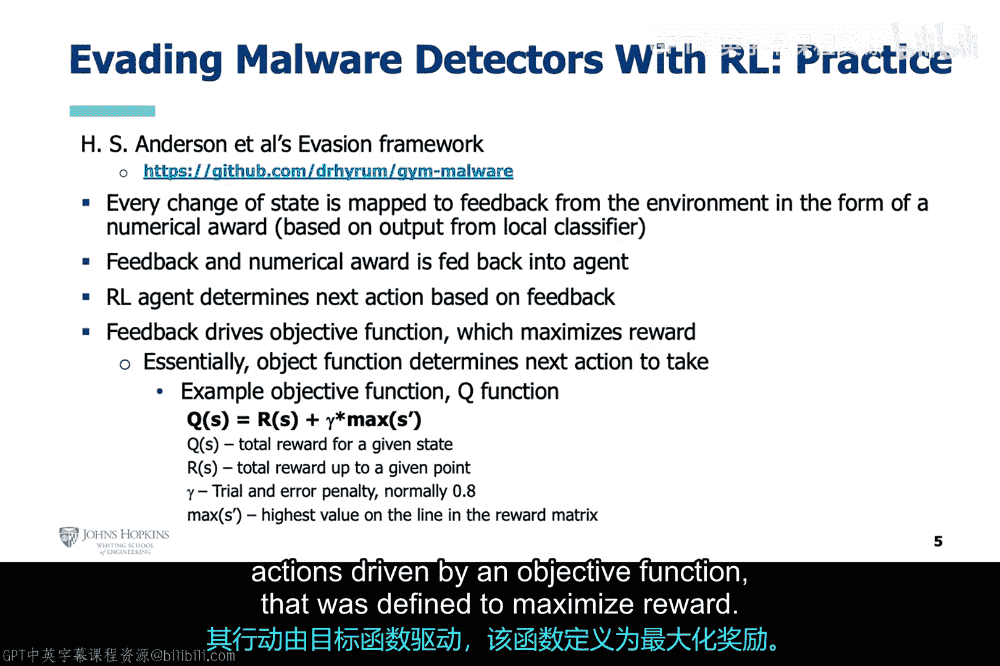

# 023：使用强化学习绕过恶意软件检测器 🚀

在本节课中，我们将要学习一种不同于监督神经网络的攻击方式——基于强化学习的对抗攻击。我们将探讨其原理、优势，并通过一个具体的研究案例，了解如何利用强化学习来生成能够逃避恶意软件检测器的新型恶意软件。

## 概述

上一节我们介绍了基于神经网络的对抗攻击。本节中我们来看看另一种强大的攻击范式：基于强化学习的对抗攻击。与需要了解目标模型内部信息的神经网络攻击不同，强化学习攻击者可以在对目标模型一无所知的情况下，通过与环境交互来学习如何有效规避检测。

## 强化学习攻击的优势

监督神经网络并非针对人工智能模型的唯一攻击来源。在某些情况下，强化学习已被证明是更具挑战性的对手。

回想之前关于针对AI模型的对抗攻击的讨论，攻击者都是基于神经网络的，因此属于监督机器学习。但在这里，我想介绍基于强化学习的对抗攻击的概念。

正如我们之前提到的，基于神经网络的对抗攻击有两种类型：白盒攻击和黑盒攻击。白盒攻击需要完全访问目标模型，而黑盒攻击虽然需要的访问权限较少，但仍需要获取目标模型的一些信息，特别是攻击模型必须学习目标模型的特征空间。

由于强化学习的设置方式，使其能够与环境随机交互，接收奖励和惩罚，同时试图最大化奖励，因此它能够学会如何规避一个从未见过的模型检测器，而无需了解其结构或特征空间。

## 理论到实践：案例研究

上一张幻灯片我们**从高层次**讨论了基于强化学习的攻击者，在无需神经网络攻击者所需信息的情况下，规避其他AI检测模型的潜力。

这里我们希望将理论付诸实践。HS Anderson及其合著者提出了一种基于强化学习的对抗攻击方法，将这一理论付诸实践。他们甚至制作了一个开源环境，允许其他人能够试验这种方法。

让我们首先关注他们在Black Hat（黑帽大会）上的演示。这是一篇非常有趣的论文，其成果与基于神经网络的对抗攻击相当，在某些情况下甚至更好。

## 攻击方法详解

如果你回想一下我们之前关于Windows PE文件格式及其内部所有适用头部和章节的讨论，这些头部和章节中的某些字段通常被用作特征来构建AI恶意软件检测器。因此，这是创建Windows恶意软件检测器的典型方法。

给定这样一个模型作为目标，HS Anderson及其合著者并未与目标模型直接交互。相反，他们使用一个大型数据集训练了一个本地恶意软件检测模型，并将其用作强化学习智能体的环境。但在这样做之前，他们为特定的恶意软件片段开发了一组**功能保持性修改**。

本质上，这些是对恶意软件代码的修改，不会改变恶意软件的实际功能，但会改变其PE文件格式。这组功能保持性修改成为了强化学习环境的允许状态。

因此，强化学习智能体与此环境交互，基本上每次都在构建新的恶意软件。这些恶意软件具有相同的功能，但其PE文件格式在某些方面是新的。每个新构建的恶意软件都会被提交给本地恶意软件检测器，强化学习智能体会根据本地模型的检测水平获得相应的奖励。

强化学习智能体的目标是最大化其奖励，这意味着它需要构建与旧恶意软件功能相同，但PE文件格式足够不同以逃避目标恶意软件检测器检测的新恶意软件。如果本地恶意软件检测器构建得足够好，它将能代表目标检测器，甚至更好。规避本地恶意软件检测器也就意味着能够规避目标恶意软件检测器。

作者通过能够使用此过程最终规避公开托管的恶意软件检测器，验证了这一点。

## 开源框架与影响

作者不仅在Black Hat上展示了他们的发现，还向公众发布了他们自己的强化学习恶意软件规避框架。他们工作的影响可以更广泛地被认可，因为任何用户都可以下载并使用这个框架。

这也使用户能够更具体地理解强化学习环境的状态空间范围。例如，状态空间可以是PE头部、PE节、导入和导出表或ASCII字符串中的位置。而强化学习智能体可以采取的行动，例如，可以是向导入地址表添加新函数、修改现有节的名称、添加新节或在节末尾添加空间。

同样，这个规避框架也需要允许环境为强化学习智能体在遍历环境状态空间时所采取的行动提供反馈。同样，智能体在正确的状态空间中采取正确的行动应该获得适当的奖励。这回到了我们之前关于智能体行动由定义为最大化奖励的目标函数驱动的讨论。

## 总结

本节课中，我们一起学习了基于强化学习的对抗攻击方法。我们了解到，强化学习智能体通过与环境（一个本地恶意软件检测模型）交互，学习如何对恶意软件进行功能保持性修改，从而改变其PE文件特征以逃避检测。这种方法无需了解目标检测器的内部结构，展示了强化学习在生成对抗性样本方面的强大能力和灵活性。通过开源框架，这一研究不仅推动了攻击技术的发展，也促进了防御策略的进步。