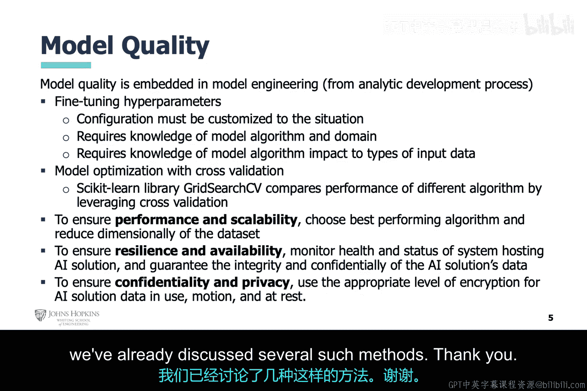

# 024：人工智能在网络安全应用中的挑战 🛡️🤖

在本节课中，我们将探讨使用人工智能解决网络安全问题时面临的一些主要挑战。

## 概述

我们最初的设想是，人工智能可以通过协助处理入侵检测系统产生的警报，来减轻网络安全分析师的工作负担。随后，我们也将其应用扩展到了系统和网络检测的几乎各个方面。本讲旨在讨论在推广这种应用方法时所伴随的挑战。

## 无人工智能辅助的警报处理流程

首先，我们来看看在没有人工智能辅助的情况下，警报处理工作是如何进行的。

一名初级网络安全分析师会在其安全信息与事件管理平台中收到警报。这些警报来自遍布网络和机构内各系统的传感器，例如：
*   基于网络的入侵检测系统，如 Snort。
*   基于主机的入侵检测系统，如 Symantec Endpoint Protection。
*   主机应用程序白名单或黑名单系统，如 Bit9（现称为 Carbon Black）。
*   以及其他许多可能的传感器。

我们假设这些传感器都不是基于人工智能的，而是基于统计或签名规则的。这意味着分析师清楚，基于签名的工具对已知威胁有效，但会完全漏掉未知威胁；而统计工具则存在一定程度的误报和漏报。因此，每一条警报都需要分析师进行人工核查，以确定其实际有效性。

其工作范围如下：
1.  分析师对每条警报最初都没有建议的调查路径，必须完全依赖警报本身的元数据。
2.  分析师需要对几乎每一条警报，都遵循自己制定的警报验证流程。
3.  分析师必须承认，未知威胁是完全无法检测的，甚至没有调查此类潜在威胁的建议路径。
4.  分析师需要制定长期计划以防范未来的威胁，并制定内部及外部的信息沟通计划。

## 人工智能辅助警报验证

现在，考虑使用人工智能来辅助网络安全分析师完成其警报验证流程。

在这种情况下，网络安全分析师无需独自完成所有工作。人工智能会使用其自身选择的流程，对网络警报进行初步验证。例如，如果有一条来自 Snort 的网络警报，分析师可以将相关的网络流量数据包或标记输入人工智能工具。该工具将对流量及其包含的任何文件进行分析，并给出判断。这可能包括工具对网络流量进行异常检测，或对附件进行多种不同类型的恶意软件分析。

随后，网络安全分析师仍需对人工智能完成的初步分类进行自己的验证，但希望这比原先完全手动的流程工作量要小。

## 前端集成人工智能的传感器

接下来是人工智能被集成到所有前端传感器中的情况。

如果采用这种方式，前述的所有分析工作很可能都在前端完成。当警报到达网络安全分析师时，人工智能执行各步骤所产生的元数据都可以包含在警报信息中。

因此，现在网络安全分析师对每条警报都有了建议的调查路径。分析师不再需要完全依赖自己的验证流程，但可以选择性地使用。此外，前端已经完成了一定程度的未知威胁分析，并为进一步调查未知威胁提供了建议路径。最后，人工智能的反馈可用于快速生成行动计划及内部或外部报告。

上一节我们探讨了人工智能在警报处理流程中的不同集成方式，本节中我们来看看它在网络传感器中的具体应用与挑战。

## 人工智能与网络传感器

在网络传感器中使用人工智能的一个基本方式是通过异常检测器。

正如之前提到的，误报和漏报是任何人工智能工具都面临的问题，异常检测器也不例外。这说明了人工智能工具的一个局限性。然而，这并不意味着这些工具做出的所有判断都不可信，它只表明人工智能无法完全取代人类网络安全分析师。相反，分析师的工作性质发生了变化。

正如上一张幻灯片详细讨论的，人工智能可以极大地帮助网络安全分析师提高生产力、简化工作。但是，引入人工智能后的工作内容是不同的，因为现在分析师需要有能力验证人工智能的发现。

## 异常检测器的可解释性

现在，让我们更深入地讨论异常检测器的可解释性方面。

正如前面提到的，在传感器前端使用人工智能工具（如异常检测器）的好处是，能为网络安全分析师提供关于警报中潜在威胁的元数据。这里指的是那些采用人工智能的初始工具。此类工具利用人工智能识别异常行为，并基于支持性技术（如统计分析、入侵指标、捕获的专家领域知识等）创建分析结果，这形成了一种制衡机制，有助于验证人工智能的原始判断。

因此，人工智能模型本身的决策可能是一个“黑箱”。然而，诸如网络流量可视化图、警报通知、威胁情报集成信息、策略违规记录等分析结果，都是网络安全分析师可以用来验证潜在威胁的具体依据，直到他们对工具建立起足够的信心。尽管如此，可解释性以及误报和漏报问题仍然是局限性和挑战。

我们研究可解释的自主网络安全，其目标就是提供更低的误报率和漏报率，达到可以对威胁采取主动响应有意义的程度，并提高人工智能模型决策的透明度。

## 人工智能模型的通用挑战

在网络领域之外，人工智能也可用于其他方面来帮助网络安全分析师，例如系统级检测器、后端警报验证器或其他用途。尽管如此，让我们泛泛地关注一下人工智能模型及其相关挑战。

回顾一下，我们在讨论分析开发过程中的“人工智能模型工程”步骤时，曾从高层次提到：在这里，应选择适合分类问题的人工智能算法，并且必须对该算法进行优化。这部分可能很复杂，更像一门艺术而非精确的科学。我这么说，是因为没有一套确切的流程能保证在任何情况下都完美完成这一步。相反，专业知识才是关键。这不仅包括对人工智能算法的了解，还包括对特定领域的知识，以及特定算法如何处理或解释不同类型数据的理解。

此外，还需要确保人工智能模型的性能和可扩展性适合其应用场景，并确保托管人工智能模型的系统在机密性、完整性和可用性方面得到妥善保护，免受攻击。

## 数据质量的重要性

最后，我们来谈谈数据质量。这是模型质量的关键，因为二者密不可分。尽管流行的观点认为，拥有优质数据比拥有非常优秀的模型更重要。避免数据质量问题的方法之一是避免各种类型的偏差。另一种方法是避免错误标记的数据、不平衡的数据集和缺失值。当这些情况发生时，应使用适当的方法来缓解。我们已经讨论过几种这样的方法。

## 总结

本节课中，我们一起学习了人工智能在网络安全应用中的主要挑战。我们从无AI的警报处理流程出发，探讨了AI在辅助验证和前端集成中的不同角色。我们分析了网络传感器中异常检测器的局限性与可解释性问题，并概述了AI模型在算法选择、优化、性能及安全方面的通用挑战。最后，我们强调了数据质量对于构建可靠AI模型的根本性作用。理解这些挑战，是有效部署和利用人工智能增强网络安全防御能力的重要前提。