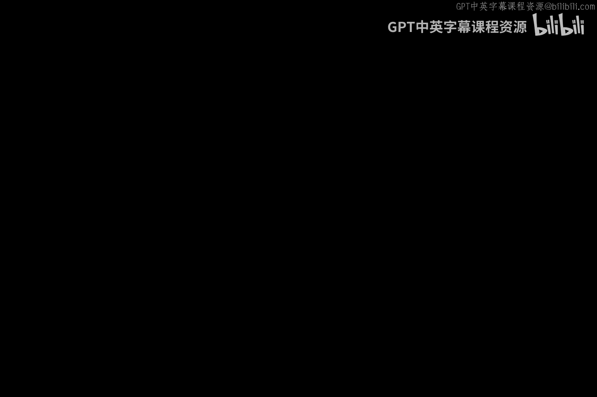
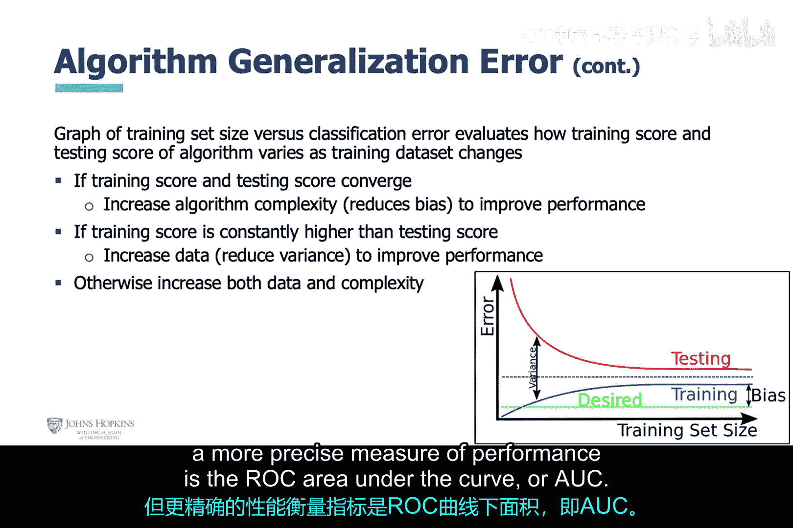

# 025：人工智能模型评估方法 🧠

在本节课中，我们将学习分析开发流程中各个步骤的评估方法，特别是如何正确使用数据训练AI模型，以及如何通过特征工程和模型工程来优化模型性能。

## 数据准备与模型训练 📊

上一节我们介绍了分析开发流程的整体框架，本节中我们来看看如何使用数据来训练AI模型。这听起来简单，但要做得恰到好处，需要考虑很多因素。

你可以训练模型，但可能会训练过度，导致模型在训练数据上表现良好，而在未见过的数据上表现糟糕。这种情况被称为**过拟合**，可能是由于训练数据过少或包含过多不必要特征导致的。

为了正确训练AI模型，通常需要采取以下方法：
*   取一个足够大的数据集，将其分成两部分。其中约70%至80%的数据用于训练AI模型，剩余的20%至30%用于测试模型。
*   如果数据集不够大，可以使用**K折交叉验证**来正确训练模型。其核心思想是：将数据分成K份，每次用其中K-1份（约90%）训练，用剩余的1份（约10%）测试，重复K次。最后，将K次测试的性能结果取平均值，以评估算法在未知数据上的表现。

最后请注意，在获取更多数据和选择更好算法之间，多数情况下，获取更可靠的**更多数据**可能是更好的选择。

## 特征工程 🔧

我们已经学习了数周课程，内容可能有些令人困惑。别担心，分析开发流程是指引我们的明灯。这个流程将所有部分联系起来，并建立了各部分之间的关系。因此，可以说，这个流程中的任何单一环节本身都不是完全有用的。

没有算法和特征的数据（当然，如果你不使用深度学习）是无用的，反之亦然。机器学习算法需要特征来有效利用数据集。那么，特征到底是什么呢？

之前提到，特征工程是开发数学变换以从数据中提取模式的过程。这在大多数情况下是正确的。然而，在某些情况下，特征可能只是数据中的列标题，无需数学变换。这通常由数据科学家根据情况决定。

假设需要数学变换，以下是构建特征的三种基本方法：
*   **数据二值化**：最可能适用于图像处理，因为它本质上将原始数据转换为二进制数，随后可被可视化为图像。
*   **数据分箱**：一种将数据分组到一定范围集合中的方法，可用于缩小数据的尺度。
*   **对数变换**：也可用于缩小数据的尺度，同时能凸显较小值相对于较大值的贡献。

## 特征缩放与编码 🔄

延续特征工程的主题，一旦确定了从数据中提取必要模式的合适特征，接下来该怎么办？你可能需要考虑某些特征相对于其他特征的尺度。如果你认为所有已识别的特征都重要，可能需要想办法防止某些特征被其他特征掩盖。实现这一点的一种方法是通过**特征归一化**。

本幻灯片提到了两种不同的归一化方法：
*   **最小-最大缩放**
*   **Z分数标准化**

并非所有数据集都由数值数据组成。如果你想使用需要数值数据集的AI算法，那么有以下选择。本幻灯片列出了研究选项，具体使用哪种选择取决于数据集本身。

## 模型工程与泛化误差 ⚙️

现在，我们从特征工程的讨论转向模型工程的讨论。开始讨论时，先谈谈学习过程及其相关的误差。

这里我们讨论AI算法的**泛化误差**，即它在尝试分类未见数据时可能遇到的误差。这种误差由三部分组成：偏差、方差和噪声。

噪声是你总想消除的东西，但由于某些原因，部分噪声总是存在并残留下来。因此，让我们关注偏差和方差。
*   算法参数中的假设错误越多，由于偏差导致的泛化误差就越大。
*   算法对数据变化越敏感，由于方差导致的泛化误差就越大。

模型复杂度也会影响偏差和方差误差。你总是在寻找一个中间地带，如下图所示。模型工程步骤的主要目标，即分析开发流程的一部分，是找到具有适当复杂度、正确假设以及对所讨论数据具有适当敏感度的优化模型。

## 模型性能评估 📈

说到AI模型性能，如前所述，使用指标来评估AI模型性能。本幻灯片提到了几个这样的指标。

我们将重点关注**接收者操作特征曲线**或**ROC曲线**。该曲线说明了真阳性率与假阳性率之间的关系，但更精确的性能衡量指标是**ROC曲线下面积**或**AUC**。

---

本节课中我们一起学习了如何评估AI模型开发的关键步骤。我们了解了避免过拟合的数据拆分方法（如训练集/测试集、K折交叉验证），认识了特征工程的基本技术（二值化、分箱、对数变换）以及特征缩放的重要性。最后，我们探讨了模型工程中偏差与方差的权衡，并介绍了使用ROC曲线和AUC来评估模型性能的核心指标。掌握这些评估方法是构建有效、可靠AI模型的基础。