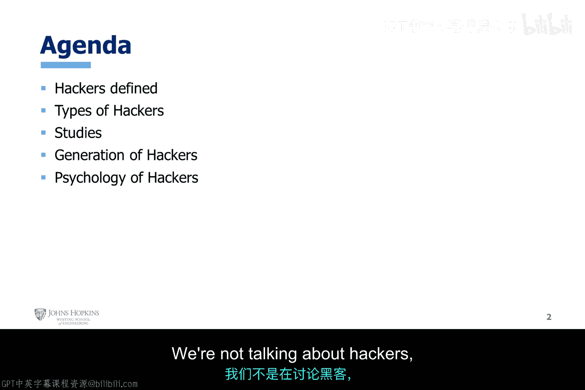
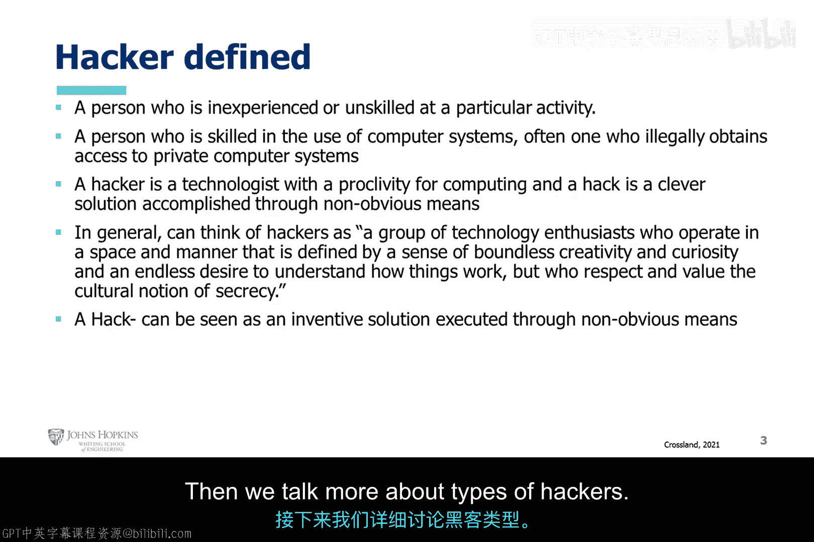
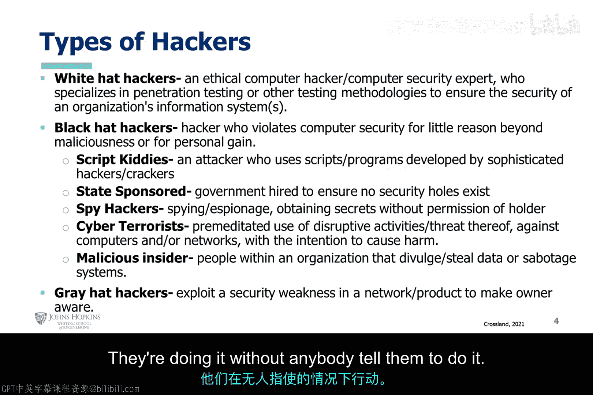
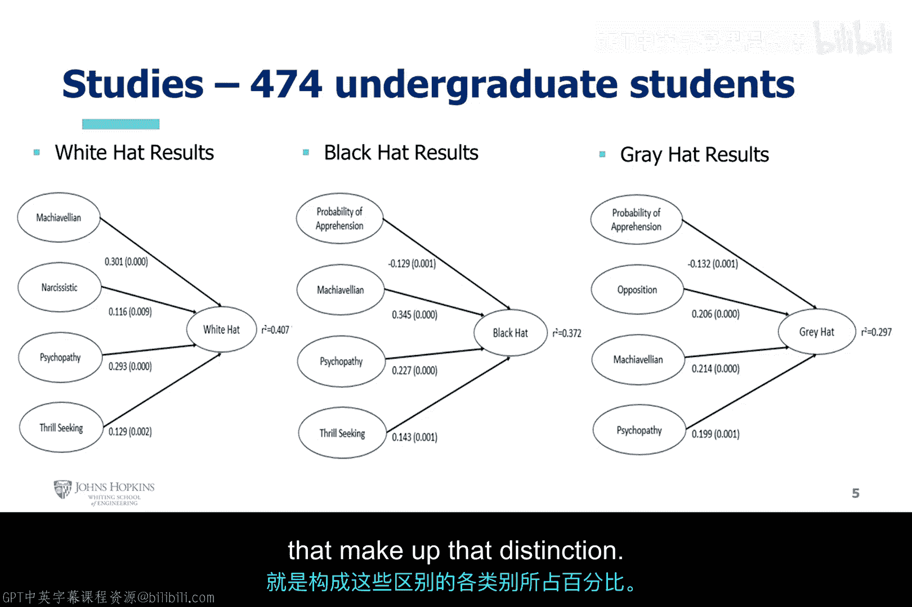

# 002：黑客群体综合研讨 🕵️

在本节课中，我们将要学习黑客的定义、黑客的世代划分、不同类型的黑客以及相关的研究。我们将探讨黑客的心理特征，帮助你理解这个复杂群体的多样性。

---

## 黑客的定义

首先，我们来明确“黑客”一词的定义。它包含多个层面的含义。

以下是几种常见的定义：

1.  **经验不足或技能不熟练的人**：指新手或入门级人员。他们利用公开可用的信息，这些信息通常来自聊天网站、论坛或地下网络。他们使用他人提供的攻击方法、工具、命令和技巧，自身并未掌握太多额外知识。
2.  **具备一定计算机知识的人**：这类人需要拥有一些计算机知识。他们可能通过自学、学术环境或实践经验获得这些知识，并不断成熟其攻击流程。
3.  **对计算有特殊倾向的技术专家**：这类人显然对此领域有浓厚兴趣。而“黑客行为”本身，指的是通过非显而易见的方式实现的巧妙解决方案。
4.  **在特定空间和方式下运作的技术爱好者群体**：他们通常被定义为具有边界创造力、好奇心和无尽探索事物工作原理欲望的人。但他们也尊重并重视“保密”这一文化观念。这通常对应着“白帽黑客”。
5.  **一种行动**：“黑客行为”也可以被视为通过非显而易见方式执行的创新解决方案。这涉及到跳出常规思维，利用逆向工程或他人不具备的知识，寻找并利用编码实践、软件漏洞、硬件集成错位或安全疏忽（如开放端口、弱密码等）中的弱点。

上一节我们探讨了黑客的多种定义，本节中我们来看看黑客群体是如何随着时间演变的。

---

## 黑客的世代划分

黑客活动随着技术和动机的变化，已经历了数代发展。

以下是主要的黑客世代：

*   **第一代（1960s-1970s）**：电话飞客。他们利用电话系统的漏洞进行免费长途通话或其他操作。
*   **第二代（1980s）**：个人计算机黑客。随着PC普及，黑客开始编写病毒和蠕虫。
*   **第三代（1990s）**：网络攻击兴起。互联网的发展催生了针对网络和网站的攻击。
*   **第四代（2000s至今）**：高级持续性威胁与工具普及。攻击变得更有组织性、目标性，且自动化攻击工具使得技术门槛降低。

了解了黑客的演变历程后，接下来我们根据其行为和动机，对当代黑客进行分类。

---

## 黑客的类型

根据行为和道德准则，黑客主要分为三类。

以下是主要的黑客类型：

*   **白帽黑客**：他们是道德、专业的黑客，旨在帮助提升安全性。其工作包括渗透测试等，目的是确保信息系统的安全，并尊重数据和用户的隐私。
*   **黑帽黑客**：他们违反计算机安全规定，动机通常是恶意破坏或个人利益。这个类别下还包括脚本小子、国家资助的黑客、网络恐怖分子和恶意内部人员等。
*   **灰帽黑客**：他们介于白帽与黑帽之间。例如，他们会利用产品或网络中的安全弱点，但目的并非攻击，而是让所有者意识到问题所在。他们通常未经授权，也没有明确的测试范围或规则。

为了更深入地理解不同类型黑客的特征，学术界也进行了一些研究。

---

## 黑客心理学研究

一项针对474名本科生的研究试图分析不同类型黑客的心理特征。

研究的关键发现如下：

*   **分布比例**：在受访者中，约 **40.7%** 的人被认为具有白帽黑客的倾向，约 **37%** 具有黑帽黑客倾向，约 **30%** 具有灰帽黑客倾向。
*   **心理特征关联**：研究还测量了与各类黑客相关的心理特质概率，例如：
    *   **白帽黑客** 与特定的意识形态和心理特征关联。
    *   **黑帽黑客** 则与较高的 **自恋**、**马基雅维利主义**（权术主义）和 **精神病态** 倾向概率相关。
    *   **灰帽黑客** 与较高的 **对抗性** 和 **被逮捕的预期概率** 相关。

---

本节课中我们一起学习了黑客的多种定义，回顾了黑客从电话飞客到现代APT的世代演变，并详细区分了白帽、黑帽和灰帽黑客在动机与行为上的核心差异。最后，我们通过一项研究了解了不同类型黑客潜在的心理特征分布。理解这些基础概念是步入道德黑客领域的第一步。