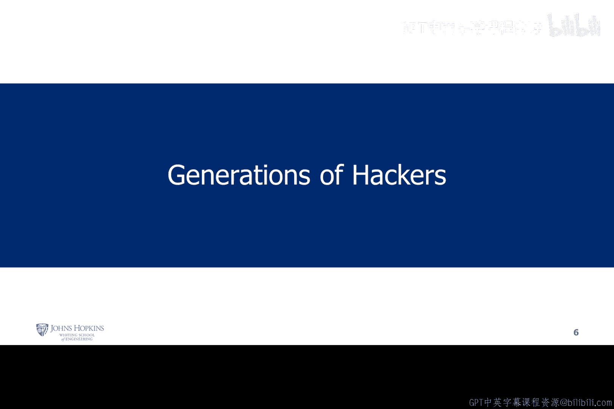
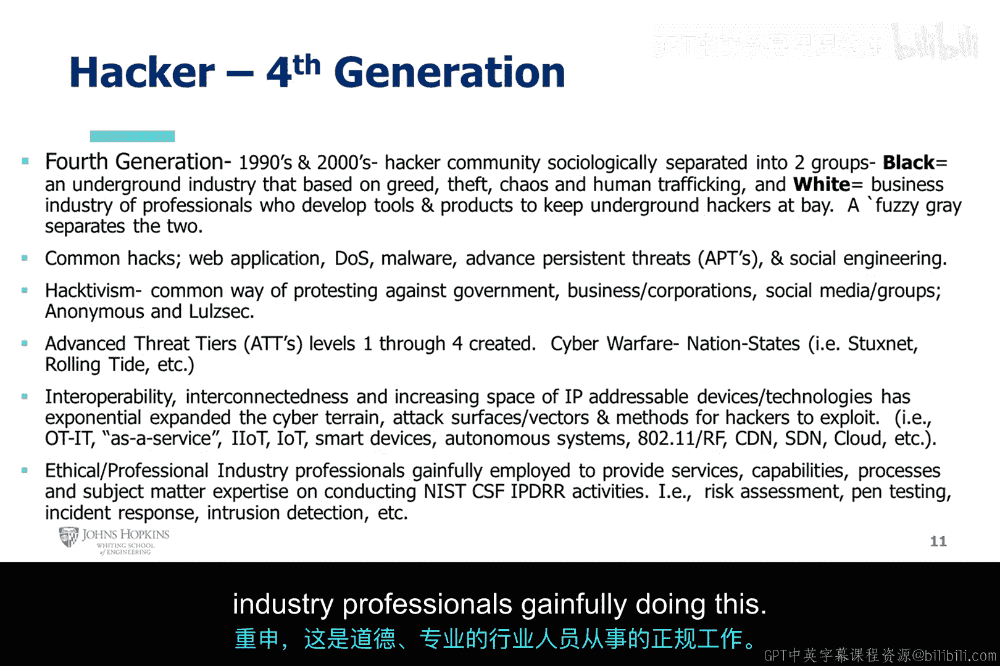

# 003：黑客世代划分 🧑‍💻

在本节课中，我们将学习黑客文化的演变历史，了解其从学术研究到现代网络安全产业的四个关键发展阶段。我们将探讨每一代黑客的核心特征、动机及其对技术发展的深远影响。

---

## 第一代：学术先驱 (1960年代) 🎓

上一节我们了解了黑客的广义定义，本节中我们来看看黑客文化的起源。第一代黑客活动始于1961年，其核心环境是学术机构。

麻省理工学院（MIT）引入了程序数据处理机PDP-1，这被认为是首批计算机之一，并在MIT催生和传播了早期的黑客文化。

第一代黑客完全专注于学术环境，例如大学、附属研究中心或联邦资助的研究中心。他们的动机纯粹是出于**创造力**、**开放学习**和**持续改进**。

他们的目标涵盖代码优化、计算技术发展、互联与通信。整个OSI（开放系统互联）模型和TCP/IP协议栈的创建都源于此，旨在让系统运行得更好、更高效。

PDP-1是首个接受“黑客”这一术语的设备。ARPANET（高级研究计划局网络）作为一种数字通信网络，将各地的黑客连接起来。此时的“黑客”一词本质上是纯粹、诚实且非恶意的。

ARPANET连接了全美多所大学。50、60年代的黑客文化是开放的学术环境，大学校园里的人们寻求公开分享、创造性思维和社会情境感知，并通过ARPANET进行开放式交流。

他们鄙视政府希望将数据保密的行为。这种对政府保密倾向的反感，促使MIT等大学社区实验室的黑客取得了更多重大进展。

他们的动机并非恶意攻击、破坏系统或窃取数据，而是因为当时的政府试图垄断并保密这些数据，黑客们认为这是一种过度控制。

在50、60年代的学术环境中，黑客们开始进行各种探索，例如“飞客”（电话盗用）和锁具破解。

以下是当时的一些创造性活动：
*   **投币电话与假币**：发明了利用假币（slugs）操作付费电话的方法。
*   **信息自由交换**：整个活动的核心是鼓励创造性进步和持续的开放学习对话。

这种环境催生了巨大的整体创造力。第一代黑客在学术环境中的目标是：找到修改他人代码的方法，但目的不是窃取、竞争或保密，而是像在教室里一样学习如何让程序运行更快、更优雅、更高效。

与此同时，军事工业复合体（MIC）成为黑客文化的主要资助者之一。随着学术环境和ARPANET的发展，信息在全美各大学间共享，影响力扩大，并与学术界之外产生了更多互动。这为60年代末硅谷时代的核心思维奠定了基础。

---

## 第二代：硅谷与产业竞争 (1970年代) 💼

从第一代开放协作的环境，黑客文化在硅谷地区逐渐演变为第二代。

第一代是开放学习、协作和创造性思维，旨在让事物变得更好。随着这种思维在硅谷的过渡，并结合我们刚才提到的军事工业复合体的影响，第二代黑客文化基本形成了产业运营模式，不再局限于MIT、哈佛等大学。

硅谷的增长导致了公司组织的创建，同时也催生了对60年代那种“纯粹创造与分享代码以改进事物”黑客精神的反叛。这演变为一种更具硅谷特色的协作与竞争并存的思维模式：如何发展、如何扩张，从而在组织间形成了真正的竞争。

黑客文化从开放学习环境，更多地转向了竞争和市场营销的盈利层面。这真正开启了今天我们熟知的计算机产业，成为个人电脑普及于世的主要催化剂。

许多人认为，如果没有第二代黑客，我们今天在个人电脑、智能设备、手机以及从大型机到轻薄PC的技术进步，可能不会如此迅速。

比尔·盖茨、史蒂夫·乔布斯、史蒂夫·沃兹尼亚克等人在使PC成为家喻户晓的名字方面发挥了重要作用。第二代黑客为我们今天拥有个人电脑奠定了基础。

有趣的是，苹果公司的创始人最初销售用于入侵电话系统的设备。史蒂夫·乔布斯和史蒂夫·沃兹尼亚克利用了约翰·德拉普（“嘎吱上尉”）的发现，即通过一个2600赫兹的音频（来自“嘎吱上尉”麦片盒的赠品哨子）可以绕过长途电话的付费控制系统。

苹果公司复制了约翰·德拉普的方法，制造并销售了一种名为“蓝盒子”的设备，用于入侵电话系统。这是第一代黑客创新（如“飞客”）向商业化产品的过渡，并引向了第二代的竞争思维。

此外，比尔·盖茨和保罗·艾伦采用了一种名为BASIC的计算机语言（原本主要用于大型机）。这款BASIC软件最初是由爱好者编写并在计算机俱乐部会议上免费分发的，这类似于ARPANET的开放共享精神。

信息共享是第二代黑客伦理的核心要素。其核心思想是：当你构建并分享代码、传递信息以提高效率时，你就在改进代码使其更高效。

他们将这种精神扩展到一个竞争环境中，与市场上的同行（如保罗·艾伦、比尔·盖茨、史蒂夫·乔布斯）展开竞争。

随着竞争加剧和盈利、市场营销成为重点，保密意识也随之增强。从60年代自由开放分享、不计较竞争、只为改进事物的“旧学派”，到70年代因竞争而产生的保密心态，这为80、90年代的黑客文化埋下了伏笔。

---

## 第三代：白帽与黑帽的分野 (1980-1990年代) ⚖️

第二代黑客（如史蒂夫·乔布斯、比尔·盖茨）及其创立的公司（微软、苹果）成为了催生第三代的催化剂。

第三代黑客首次与“黑客行为即犯罪”的观念相关联，并由此引出了**黑帽黑客**和**白帽黑客**的区分。

钱德勒在1996年将黑客行为定义为“破解版权保护代码，从而使游戏程序能够被修改或简单地促进游戏盗版”，这指向了**黑帽黑客**。

同时，钱德勒也指出，第三代黑客有时也指那些花费大量时间编写复杂程序、调试自制代码的人，这指向了**白帽黑客**。他注意到了两者在意识形态上的分野。

黑帽黑客倾向于犯罪和恶作剧，为个人利益而行动，探索并突破系统边界。白帽黑客则更接近于第一代的精神，倾向于开源、协作学习，可以视为更纯粹的、以帮助为目的的行为。

许多电影描绘了这种动态和复杂性。黑客文化的转折点，即向“不道德黑客”的转变，真正发生在第三代。这是将黑客划分为两大群体的关键累积点。

1988年，康奈尔大学学生罗伯特·莫里斯释放了第一个互联网蠕虫病毒“莫里斯蠕虫”。该蠕虫的复制速度超出了预期。

他是第一个根据《计算机欺诈与滥用法案》被起诉的人，也是第一个制造出在互联网上广泛传播的蠕虫病毒的人。

莫里斯声称其动机是：通过利用他发现的安全缺陷，来证明当时计算机网络安全措施的不足。仔细想想，这正是**渗透测试**和**道德黑客**所做的事情。

他这样做并非 necessarily 出于恶意，只是为了揭示安全设计中的不足。莫里斯蠕虫事件首次引发了社会对黑客影响的恐惧和辩论，也引发了人们对这项新技术如何被用于犯罪目的的担忧。

这是区分白帽与黑帽的一个巨大转折点。莫里斯蠕虫的发布真正开始让人们担忧黑客文化的走向。

第二代黑客的贡献在于将计算机技术带给大众，提高了社会效率。例如微软、谷歌、苹果、IBM的创始人，他们推动技术发展是为了帮助社会进步，让人们更强大、生活更便利。

第三代黑客的贡献，正如莫里斯所展示的，在于**探索技术的边界与局限**。他们通过寻找软件/硬件设计、配置中的漏洞和弱点，并展示如何利用它们，来揭示安全架构中的脆弱性。

有些人认为，第四代黑客（我们稍后会讲到）表现出不成熟的、负面的社会态度，并将黑客行为从集体探索的使命，退化为了自我放纵的冲击。

---

## 第四代：专业化与动机多元化 (2000年代至今) 🌐

第三代黑客探索了边界，而第四代黑客则更侧重于社会学和心理学的行为动机，并在黑帽、白帽之外，出现了界限模糊的**灰帽黑客**。

常见的攻击类型包括：Web应用攻击、拒绝服务攻击、社会工程学等。

以下是第四代黑客的一些动机类型：
*   **黑客行动主义**：出于意识形态原因抗议政府或企业政策。
*   **报复行为**：对雇主或现状不满而采取行动。
*   **社会媒体团体**：例如“匿名者”组织，他们属于典型的**灰帽黑客**。他们揭露漏洞和问题，但不像殖民管道攻击那样进行勒索，也不像受雇的专业白帽那样在约定范围内进行渗透测试。他们通过论坛等方式公开讨论问题。

此外，互联性、IP可寻址设备技术的爆炸式增长，都在扩大网络空间、攻击面、攻击向量和方法。黑客技术变得更加多样化、复杂和先进，因为嵌入了更多技术，设备间互联性更强。

最后，**道德黑客**本身已发展为一个专业产业。行业专业人士受雇提供服务，形成了各种能力指南、标准和渗透测试框架。

渗透测试、风险评估、事件响应等，都属于向第四代——即专业的、受雇的、道德的黑客产业——的演进。

---

## 总结 📝

本节课中，我们一起学习了黑客文化的四个世代演变：
1.  **第一代（1960年代）**：起源于学术环境，核心是开放、协作、纯粹的技术改进。
2.  **第二代（1970年代）**：随着硅谷兴起，转向产业竞争与商业化，推动了个人计算机的普及。
3.  **第三代（1980-1990年代）**：出现白帽与黑帽的明确分野，开始探索和利用安全边界与漏洞。
4.  **第四代（2000年代至今）**：动机多元化，出现灰帽黑客，攻击技术高度复杂化，道德黑客发展成为一个专业的网络安全产业。

理解这段历史有助于我们把握黑客文化的本质及其与现代网络安全领域的联系。