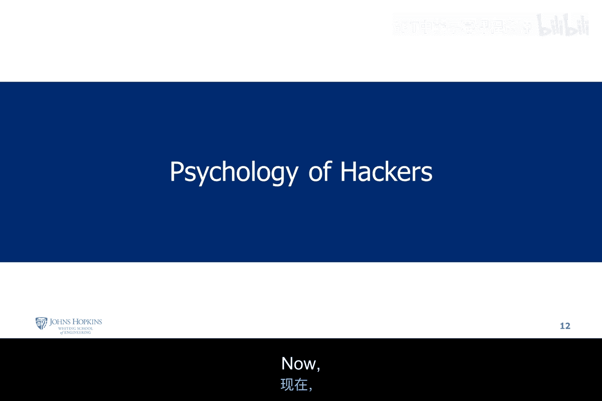
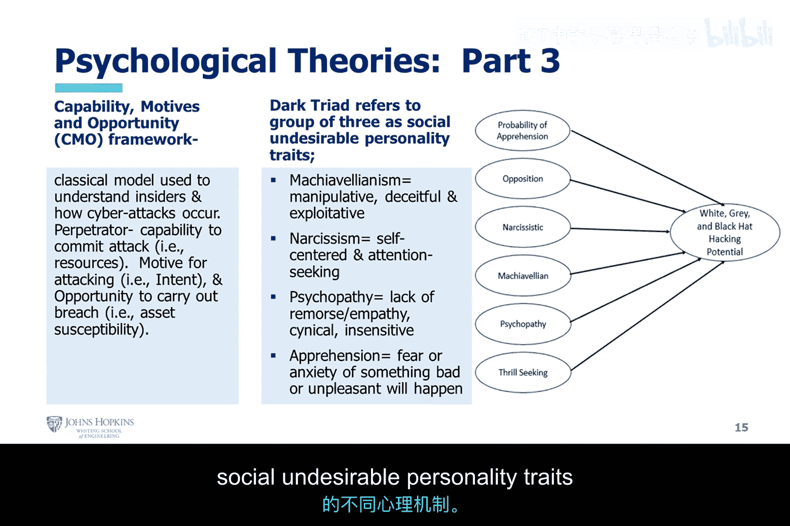
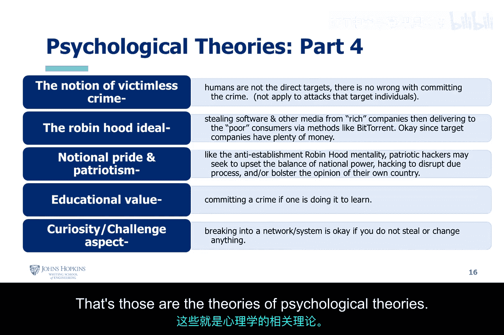

# 004：黑客心理学研究 🧠

在本节课中，我们将探讨黑客行为背后的心理学理论。理解这些理论有助于我们分析黑客的动机，无论是出于恶意还是善意。我们将从经典的精神分析理论开始，逐步深入到更具体的认知行为框架。

## 心理学理论概述

上一节我们讨论了黑客的基本分类，本节中我们来看看驱动这些行为的潜在心理因素。课程中提到了几个关键的心理学理论。

### 弗洛伊德的三我结构

弗洛伊德的精神分析理论将人格结构分为三个部分：**本我（Id）**、**自我（Ego）**和**超我（Super Ego）**。这三者的平衡关系会影响一个人的行为倾向。

*   **本我（Id）**：代表最原始的本能和欲望。
*   **自我（Ego）**：在现实世界中协调本我与超我的需求。
*   **超我（Super Ego）**：代表内化的社会道德、价值观和伦理规范，通常由父母或权威人物的教导形成。

理论指出，**黑帽黑客通常与较弱的超我相关联**。这意味着他们可能较少认同社会规范、伦理价值或来自父母、亲友的教导。因此，他们可能更倾向于进行恶意行为，而不太考虑系统或用户的安全。

### 科尔伯格的道德发展阶段

劳伦斯·科尔伯格提出了道德认知发展的阶段理论。他认为，人们会依次发展出更复杂的推理能力。

**核心观点是：缺乏这种逐步发展的道德推理能力，个体实施犯罪行为时可能不会考虑后果。** 如果一个人没有建立起强大的道德指南针或逻辑性的超我推理来分析自身行为，他们就更容易不计后果地行动，从而滑向黑帽黑客的阵营。

### 自卑情结

阿尔弗雷德·阿德勒提出的自卑情结理论也与此相关。当一个人在社交中被视为“书呆子”或受到排斥时，他们可能会产生自卑感。

为了补偿这种自卑感并证明自己的价值，他们可能会采取显示支配地位的行为。有时，**为了展示能力并寻求归属感，这类个体可能会被黑帽黑客社区吸引**，以此证明自己有价值，并补偿在社会交往中被排斥的经历。

## 认知行为心理学理论

接下来，我们转向认知行为心理学，它研究人类行为并寻求改善方法。以下是该领域的四个关键概念：

以下是四个关键的行为学习概念：

1.  **操作性条件反射**：指行为受其导致的后果控制的学习过程。例如，小孩触摸热炉子被烫伤后，就不会再触摸。在黑客行为中，**如果一个人认为进行黑客攻击能获得他想要的结果（如报复、宣扬观点、经济利益或补偿自卑感），他就会重复该行为**。公式可以简化为：`行为 -> 期望的后果 -> 行为强化`。
2.  **经典条件反射（巴甫洛夫）**：涉及条件刺激与非条件刺激的关联。黑客行为有时与此类似，例如，**某些黑客在发现漏洞后，会持续进行渗透测试，即使他们从中无法获得任何实际利益或报酬**。这种行为可能源于一种固有的、被“条件化”的冲动。
3.  **社会学习**：强调通过观察和模仿他人来学习行为。黑客行为也可能是**通过与社区的协调行为和认知互动**习得的，这适用于白帽、灰帽或黑帽黑客。
4.  **盗窃癖**：指的是一种无法克制盗窃冲动的心理状态，其目的并非为了个人使用或经济利益。这同样可以类比到某些黑客行为中，**有些人进行黑客攻击是出于一种无法抗拒的心理冲动，而非理性的目的**。

## 能力-动机-机会框架与黑暗三联征

课程中还提到了“能力-动机-机会”框架，并引用了对474名本科生的研究。该框架用于分析犯罪行为，其中“黑暗三联征”指的是三种反社会的人格特质：

以下是“黑暗三联征”包含的三种特质：

*   **马基雅维利主义**：善于操纵他人，冷酷无情。
*   **自恋**：极度自我中心，渴望钦佩。
*   **心理变态**：缺乏共情，行为冲动，漠视他人。

需要指出的是，**某些特质（如寻求刺激）可能同时存在于道德黑客和不道德黑客身上**。这个框架的意义在于，它从心理学角度解释了为什么一些人会表现出这些社会不欢迎的人格特质，并可能因此从事黑客活动。

## 其他心理动机

最后，我们快速浏览其他几种常见的心理动机，这些动机同样可能驱动好坏两种行为：

以下是几种常见的黑客行为心理动机：

*   **受害者无罪论**：认为攻击没有直接伤害具体的人，因此不算犯罪。
*   **罗宾汉理想**：劫富济贫的心态，认为从富有的公司窃取无所谓，因为他们损失得起，甚至应该分给穷人。
*   **好奇与挑战**：纯粹想测试自己的技能，“我能不能做到？”。
*   **意识形态与爱国**：出于政治或意识形态原因，反对现有体制或国家政策。
*   **教育价值**：认为只要是为了学习，犯罪也可以接受。

## 总结

本节课中，我们一起学习了多种心理学理论，从弗洛伊德的人格结构到认知行为概念，再到具体的动机框架。这些理论帮助我们理解，黑客行为背后往往是复杂的心理动因在起作用，而不仅仅是技术能力的问题。理解这些有助于我们更全面地认识网络安全中“人”的因素。