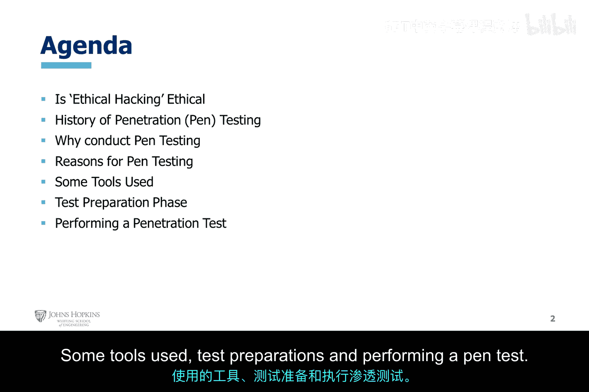
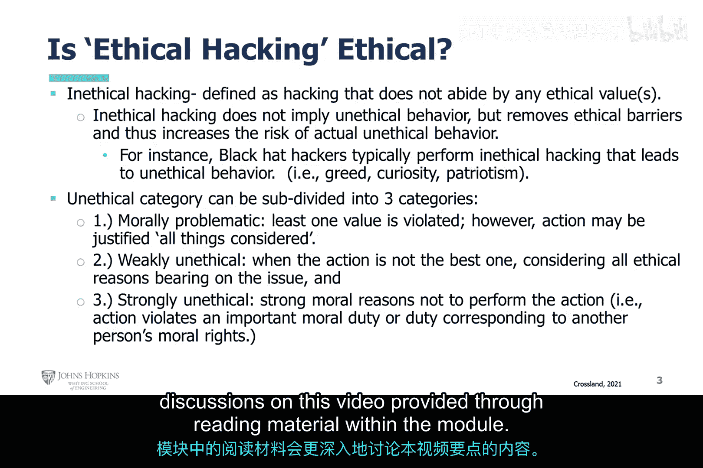
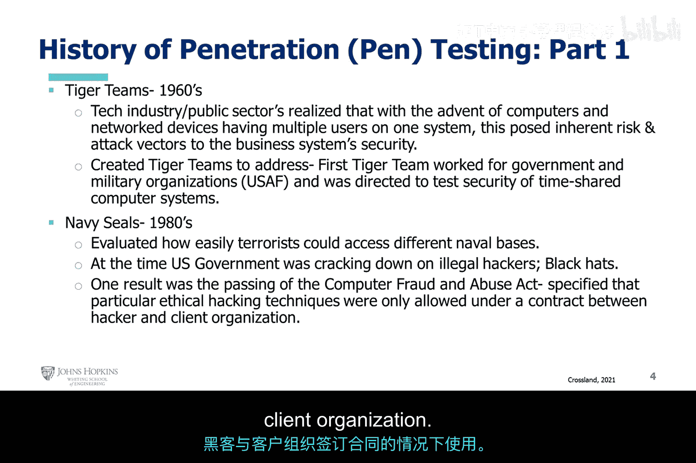
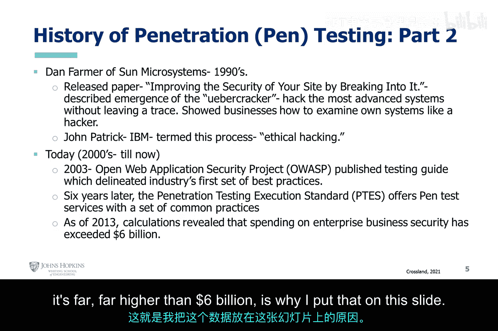

# 005：渗透测试全面探讨 🔍

在本节课中，我们将全面探讨渗透测试。我们将了解其历史、实施原因、常用工具以及执行流程。通过本节学习，你将建立起对渗透测试的系统性认识。

---

## 非道德黑客行为

上一节我们讨论了道德黑客的定义，本节中我们来看看其对立面——非道德黑客行为。

非道德黑客行为被定义为不遵守任何道德价值观的黑客行为。非道德黑客行为并不直接等同于不道德行为，但它移除了道德屏障，从而增加了实际不道德行为发生的风险。

之所以提及这一点，是因为当你遇到黑帽黑客时，这些个体通常出于恶意或个人利益行事，他们的动机不符合道德或职业规范。黑帽黑客通常进行非道德的黑客活动，这会导致不道德的行为。

例如，我们之前讨论过的爱国主义、好奇心、贪婪、罗宾汉情结、理想主义、自我、超我、自恋行为、精神病态等，都是驱动非道德黑客行为的动机或意识形态。他们进行非道德的黑客活动，是因为他们没有遵循诸如“不应偷窃”等道德准则，也没有遵守符合道德的行为规范。显然，这会导致他们基于自认为合理的动机、意识形态和理由去实施非道德的黑客活动。

非道德黑客行为基本上可以分为三个子类别：

以下是三个子类别的具体说明：
*   **道德问题型**：至少违反了一项道德价值观，但综合考虑后，其行为可能被证明是合理的。这反映了黑帽黑客的部分心态和意识形态。
*   **弱非道德型**：所采取的行动并非最佳选择，但行为人考虑了所有相关的道德因素后，仍然执行了该行动。黑帽黑客的行为常属此类。
*   **强非道德型**：有更多理由不应执行该行动。该行为违反了重要的道德责任、伦理准则或对应于他人道德权利的责任。

这大致区分了道德黑客行为的“道德性”，以及非道德和不道德黑客在态度与行为上的差异。本幻灯片的内容更多是阅读材料，关于这些要点的更深入讨论，可以在模块内的阅读材料中找到。

---

## 渗透测试的历史

了解了非道德黑客行为后，我们来看看渗透测试（Penetration Testing， Pen Testing）的发展历程。

在20世纪60年代，随着计算机和网络设备的出现，以及单系统多用户模式的普及，技术行业和公共部门意识到，这给业务系统的安全带来了固有的风险和攻击途径。我们讨论过的莫里斯蠕虫事件，其初衷虽非恶意，但揭示了现有安全边界不够强大，未能全面涵盖计算机加固和网络安全的所有方面，从而存在可利用的硬件、软件配置错误和开发漏洞。

从20世纪60年代起，政府和公共部门创建了“老虎团队”。第一个老虎团队受雇于美国政府军事组织，特别是美国空军，用于直接测试分时计算机系统的安全性。这正是出于对计算机系统固有风险和攻击途径的应对。

到了第二代黑客时期，计算机开始大规模普及。第三代黑客则试图超越常规范围，思考如何扩展与计算机相关的典型边界，并测试其背后架构配置的极限。老虎团队的出现，正是为了找出测试系统安全性的方法，其目的并非恶意，类似于今天道德黑客和渗透测试员所做的工作。

20世纪80年代，美国海军海豹突击队曾参与评估恐怖分子渗透不同海军基地的难易程度。当时，美国政府正在打击黑帽黑客（即第三代黑客，此时白帽与黑帽的区分已很明确）。如今第四代黑客时期，黑客能力带来的恐惧因素持续增长，黑客社区也在不断壮大。

其中一个结果是《计算机欺诈与滥用法案》的通过。莫里斯蠕虫的制造者成为首个依据该法案被定罪的人。该法案明确规定，特定的道德黑客技术只能在黑客与客户组织签订合同的情况下才被允许使用。

---

## 历史延续与标准化

随着时间推移，渗透测试逐渐走向规范化和标准化。

20世纪90年代，太阳微系统公司的丹·法默发布了一篇题为《通过入侵来提升其站点的安全性》的论文。他描述了“超级破解者”的出现，即克里斯·贝林沃特所说的，能够入侵最先进系统且不留痕迹的“Ubercracker”。他向企业展示了如何像黑客一样检查自己的系统。

IBM的约翰·帕特里克借鉴了丹·法默的思想，首次将这一过程正式称为“道德黑客”。因此，20世纪90年代是道德黑客过程、哲学及白帽黑客思维模式首次被明确界定的时期，涵盖了如何进行道德黑客攻击的过程、工具和方法。他基于“超级破解者”向企业展示如何像黑客一样检查自身系统的理念，正式提出了“道德黑客”这一过程。

这一点对防御方也至关重要。许多从事网络防御工作的人员，如果能够理解黑客的思维模式、观察角度和方法，通常会成为更出色的防御者。因此，防御人员有时也参与攻击演练，攻击人员也可能参与防御，以相互促进。

进入21世纪直至现在：
*   **2003年**：开放Web应用程序安全项目发布了测试指南，首次详细阐述了行业最佳实践的第一套集合，至今仍被广泛且严格地遵循。
*   **六年后**：渗透测试执行标准出台。我们将在第二和第三个模块中详细讨论并使用PTES。它为渗透测试服务提供了一套通用实践标准，本课程中将大量使用。
*   **截至2013年**：统计显示企业在业务安全上的支出已超过60亿美元。需要说明这是2013年的数据，如今已过去多年，考虑到近年来层出不穷的网络安全事件，当前的安全支出远高于这个数字。

---

## 为何进行渗透测试

了解了渗透测试的历史后，我们来看看组织实施渗透测试的核心原因。

进行渗透测试的主要原因包括：
*   **技术原因**：确定技术漏洞、错误配置或设计缺陷。
*   **组织与运营原因**：评估安全策略、程序、培训的有效性及人员的安全意识。
*   **合规性与报告原因**：满足法规要求，并向管理层、客户或合作伙伴提供独立的安全状况评估报告。

渗透测试的核心目标在于，通过模拟真实攻击者的技术、工具和流程，主动发现并验证系统中存在的安全弱点，从而在真正遭受攻击前进行修复，提升整体安全防护能力。

---

## 渗透测试工具简介

明确了测试原因，接下来我们简要了解一些常用的渗透测试工具。

渗透测试人员会使用多种工具，以下是一些主要类别：
*   **侦察与信息收集工具**：用于收集目标系统信息，例如 `nmap`（网络扫描）、`theHarvester`（邮箱、子域名收集）。
*   **漏洞扫描器**：自动识别已知漏洞，例如 `Nessus`、`OpenVAS`。
*   **渗透利用框架**：提供漏洞利用模块、Payload生成等功能，例如 **Metasploit Framework**。
*   **密码破解工具**：用于测试密码强度，例如 `John the Ripper`、`Hashcat`。
*   **无线网络测试工具**：用于评估无线网络安全，例如 `Aircrack-ng`。
*   **Web应用测试工具**：专门用于发现Web应用漏洞，例如 `Burp Suite`、`OWASP ZAP`。

工具的使用必须严格在授权和法律允许的范围内进行。

---

## 测试准备与执行流程

最后，我们来看看执行一次渗透测试需要经历哪些关键阶段。

一次完整的渗透测试通常遵循结构化的流程，主要阶段包括：
1.  **前期交互与规划**：明确测试范围、目标、规则、时间线，并获得正式的书面授权。
2.  **情报收集**：被动和主动地收集关于目标组织、网络、系统、人员的信息。
3.  **威胁建模与漏洞分析**：基于收集的信息，分析潜在攻击路径，识别和评估可能的漏洞。
4.  **漏洞利用**：在授权范围内，尝试安全地利用已识别的漏洞，获取访问权限或验证其影响。
5.  **后渗透与横向移动**：在成功渗透后，评估其在系统内部进一步访问关键资产或数据的能力（模拟攻击者后续行为）。
6.  **报告与结果分析**：记录所有发现、利用过程、风险等级，并提供清晰的修复建议。
7.  **清理与恢复**：移除测试期间植入的任何工具、后门或修改，将系统恢复至测试前状态。

每个阶段都需要细致的规划和记录，最终的报告是渗透测试价值的核心体现。

---

## 总结

本节课中，我们一起学习了渗透测试的多个方面。我们区分了非道德黑客行为及其类别，回顾了渗透测试从20世纪60年代“老虎团队”至今的发展历史与标准化进程。我们探讨了组织实施渗透测试的技术、运营及合规性原因，简要介绍了常用的测试工具类别，并概述了一次标准渗透测试从规划、侦察、利用到报告与清理的完整流程。理解这些基础知识，是成为一名道德黑客和合格渗透测试员的重要起点。